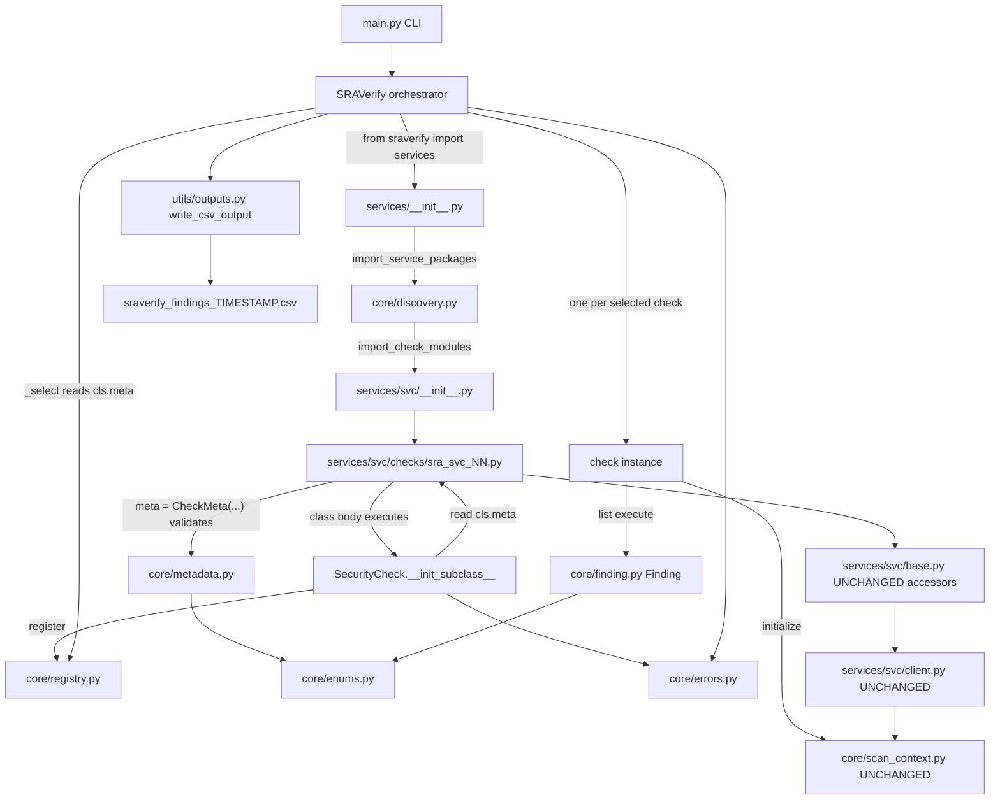
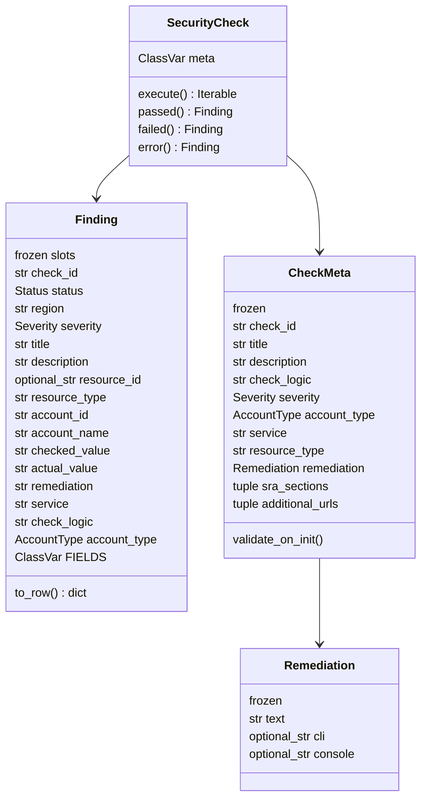
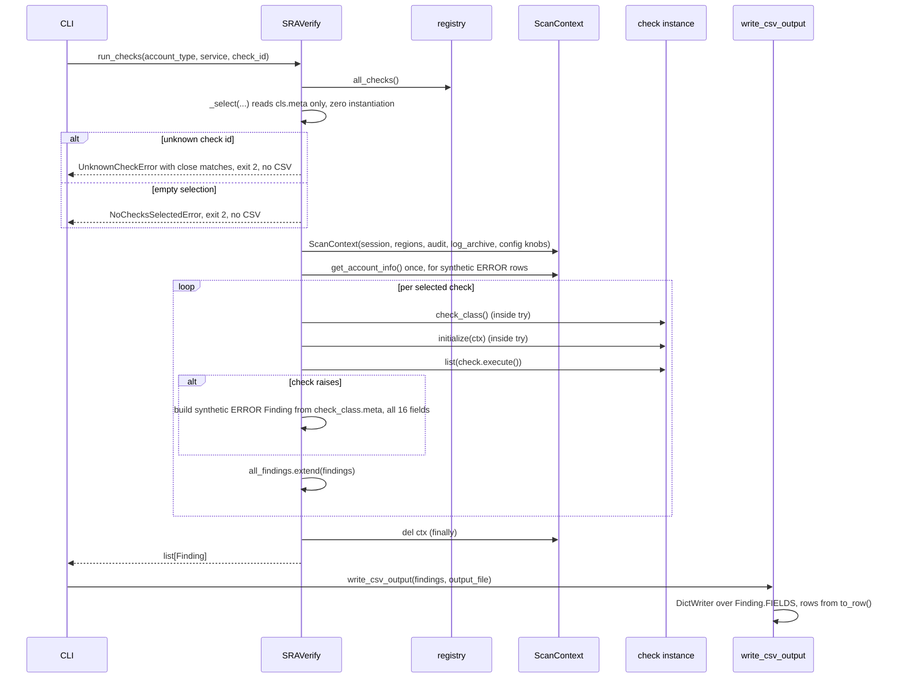

# Design Document: Check Contract Formalization

## Overview

The scanner's check layer is held together by convention rather than by contract. A check is any class that happens to subclass a service base class, sets a handful of instance attributes in `__init__`, and is remembered in two hand-maintained dictionaries. Findings are raw `dict` objects assembled by a base-class helper, and the 16-column CSV schema those dicts feed is declared independently in a second module. Nothing in the code enforces that a check's ID matches its class name, that its file is registered, that its severity is one of four legal values, or that the finding it produced has all sixteen fields.

This design replaces those conventions with enforced contracts. Metadata moves out of `__init__` into a frozen, validated `CheckMeta` declared in the check's own class body and assigned to the class attribute `meta`. Registration becomes automatic through `__init_subclass__`, which also cross-checks four independent expressions of a check's identity and refuses to register a class whose file, class name, and metadata disagree. `SecurityCheck` becomes an `ABC` with a single abstract method, `execute()`, which yields `Finding` objects — a frozen, slotted, fully-typed dataclass that owns the CSV contract. Selection filters read class attributes instead of constructing objects.

The result is that four classes of failure that are silent today become loud at import time or at construction time: an unregistered check, an ID that disagrees with its file, an illegal severity or account type, and a finding missing a column. `ScanContext` is untouched — the per-scan isolation model established by the recent scan-context refactor is preserved in full.

All 158 checks across all 18 services migrate in this single change. GuardDuty's 25 are migrated first, as the reference implementation, so a reviewer has one complete service to read before the remaining 133 mechanical edits land. There is no per-service rollout and no transitional compatibility layer; the reasoning is in [Decision point 2](#decision-point-2--the-change-is-atomic-across-all-18-services).

---

## Motivation

Every figure below is measured against the current tree, not estimated.

### Findings are raw dicts with two competing accumulation paths

Of the 158 check files, 79 build a local `findings = []` and return it; 79 append to `self.findings`. None use both. Because `SecurityCheck.get_findings()` returns `self.findings`, it returns `[]` for exactly half the catalog — verified: `SRA_CLOUDTRAIL_01().get_findings() == []`.

The defect is latent because `run_checks` consumes the value `execute()` returns rather than calling `get_findings()`. `get_findings()` has zero call sites in the scanner, and the MCP server consumes `run_checks()`'s return value, so it can be deleted outright.

### Registration is a manual double-entry ledger

354 lines of mechanical boilerplate:

| Location                          | Lines | Content                                                     |
| --------------------------------- | ----- | ----------------------------------------------------------- |
| `main.py`                         | 38    | 18 service imports + an 18-way `**` splat into `ALL_CHECKS` |
| 18 × `services/<svc>/__init__.py` | 316   | 158 check imports + 158 `CHECKS` dict entries               |

Two edits are required per new check. Missing either means the check silently never runs: no error, no warning, exit code 0. A `CHECKS` key that disagrees with the class's own `check_id` causes findings and synthetic ERROR rows to report different IDs for the same check.

Registration happens to be consistent right now — 158 check files, 158 dict entries, `len(ALL_CHECKS) == 158`, zero duplicates, zero orphans — but nothing enforces it.

### Metadata is imperative instance state with illegal defaults

`SecurityCheck` is a plain class: verified *not* an ABC, and `execute` is *not* an `abstractmethod`. A misspelled `execute` registers cleanly and fails only when that check runs. The base declares `severity = "Unknown"` and `check_id = None`, neither of which is a legal value for its column.

Because metadata lives on instances, the orchestrator constructs checks purely to read it — **474 instantiations for a default scan, 161 for a single `--check`**, across seven sites in `main.py` (lines 114, 134, 163, 173, 185, 205, 240):

| Path                       | Banner inventory | Service grouping | Filters/validation | Actual run | Total |
| -------------------------- | ---------------- | ---------------- | ------------------ | ---------- | ----- |
| Default scan               | 158              | 158              | 0                  | 158        | 474   |
| `--check SRA-GUARDDUTY-01` | 158              | 1                | 1                  | 1          | 161   |

### Related metadata drift

- 0 of 158 checks pass `account_type` to `super().__init__()`. 90 assign `self.account_type` after the call; 68 inherit the service base default.
- `services/config/base.py:30` sets `account_type="account"` — not a legal `--account-type` value. Those checks can never be selected by `--account-type`, yet they do run under the default `all` and emit `AccountType=account` into the CSV.
- Severity distribution: HIGH 109, MEDIUM 46, CRITICAL 2, LOW 1.
- 468 literal `remediation=` arguments, of which 178 are semantically empty across three spellings: `"No remediation needed"` ×114, `""` ×45, `"No action needed"` ×19.
- `sra_guardduty_01.py`'s `description` uses backslash line continuations, rendering 14 consecutive spaces into the CSV `Description` column.

### The 16-column schema is defined twice

`create_finding` in `core/check.py` builds one key order; `REQUIRED_FIELDS` in `utils/outputs.py` declares another. `write_csv_output` reconciles them at write time by backfilling missing fields with `''` and migrating a legacy `CheckType` key. It also mutates the caller's finding dicts in place while doing so.

### Orchestration defects to fix in passing

- `main.py:245` calls `check.initialize(ctx)` *outside* the inner `try`. A broken `_setup_clients` or a failed `ec2:DescribeRegions` aborts the entire scan instead of degrading one row.
- The synthetic ERROR row (`main.py:256-271`) carries 15 keys, not 16. `AccountName` is absent and `AccountId` is hardcoded `None`, making those rows unattributable in a multi-account CodeBuild fan-out.
- `--check SRA-TYPO-99`, and real-but-empty filter combinations such as `--account-type audit --service CloudTrail`, log an error, `return []`, and still write a header-only CSV with exit code 0.

---

## Non-Goals

These are deliberate exclusions, each with its reasoning and its accepted cost.

### 1. Per-operation AWS error classification

The FAIL-vs-ERROR mapping is a function of `(operation, error_code)`, not of service. Evidence from within one service: `BadRequestException` is classified ERROR by `sra_guardduty_14` (which reaches it through `ListOrganizationAdminAccounts`) and FAIL by `sra_guardduty_15`, `16`, and `20`–`25` (which reach it through `DescribeOrganizationConfiguration`). Both are correct for their operation.

That judgment currently lives in 34 check bodies. Measured code occurrences: `ResourceNotFoundException` ×18, `BadRequestException` ×9, `AccessDeniedException` ×4, `PolicyTypeNotEnabledException` ×2, `AWSOrganizationsNotInUseException` ×1, `WAFNonexistentItemException` ×1.

Centralizing it would change check logic, which this phase forbids. Clients keep returning `{"Error": {"Code", "Message"}}`; checks keep their own classification; `error()` stays a public helper precisely because checks still author their own ERROR findings — 24 of the 25 GuardDuty checks do.

### 2. A base-driven region loop

No `evaluate(region)` hook and no `Scope` enum. Introducing one restructures all 158 check bodies.

Accepted consequences:

- The region loop stays duplicated. 96 checks iterate `self.regions`, 36 emit `region="global"`, 26 pin `us-east-1`.
- Shield keeps writing `Region=us-east-1` where the convention says `global`.
- Error isolation stays per-check, not per-region: one region's failure still costs the whole check.

Future migration lever: once `evaluate` becomes the hook, `__init_subclass__` can reject any subclass that defines `execute`, converting a silent loss of the base driver into an `ImportError`.

Complication to plan for: roughly 10 checks — Config 01–06 among them — loop regions *and* emit `region="global"` rows, aggregating across regions. They will not fit a per-region hook without reclassification.

### 3. Typed per-service resource models

No `Detector` model or equivalent. Accessor return types stay as they are.

Accepted cost: `sra_guardduty_05` treats a feature absent from the `Features` list and a feature present with `Status=DISABLED` identically, though only the latter is a finding.

### 4. Test harness and CI

A separate later phase. This design specifies the correctness properties so that phase has a target, and deletes one orphaned test file that breaks bare collection, but adds no harness.

### 5. `pyproject.toml` / packaging migration

Out of scope. Exactly one `setup.py` change is required and is in scope: the `python_requires` floor (see [Decision point 1](#decision-point-1--strenum-and-the-python-floor)). Because metadata is now Python rather than data files, no `package_data` entry is needed and there is no non-code artifact for a wheel to omit.

### 6. Any change to `core/scan_context.py`

Stated plainly: the scan-context refactor is preserved in full. Unchanged are the `Session`, the region list and lazy `get_enabled_regions()`, the audit and log-archive account lists, the bounded `Client_Config` and its four CLI knobs, the `(service, region)` client cache with its double-checked locking, the namespaced `_has`/`_get`/`_set` primitives, `get_account_info()`, `get_management_account_id()`, the single `threading.Lock`, and the fresh-per-`run_checks` lifecycle with `del ctx` in `finally`. No new context fields are required.

### 7. A generated machine-readable catalog

Emitting the catalog as a machine-readable artifact — JSON for a documentation site, or an SRA-section coverage report — is deferred. `sra_sections` and `additional_urls` are declared in metadata now, so the data exists; generating the artifact from the registry rather than hand-maintaining one file per check is the intended direction, because a generated artifact cannot drift from the code.

---

# Part I — High-Level Design

## Architecture



Two flows are worth separating in that picture. The left-hand spine — discovery → class body, where the `CheckMeta` is constructed and validated → `__init_subclass__` → registry — runs exactly once per process, at import time, touches no AWS API, and reads no file beyond the Python modules the import machinery loads anyway. The right-hand spine — select → instantiate → initialize → execute → write — runs per scan and is the only part that talks to AWS.

## Module inventory

### New modules

| Module              | Responsibility                                                                                          |
| ------------------- | ------------------------------------------------------------------------------------------------------- |
| `core/enums.py`     | `Status`, `Severity`, `AccountType`. The legal value sets, in one place.                                |
| `core/finding.py`   | `Finding` frozen dataclass, `FIELDS`, `to_row()`, `GLOBAL_REGION`. Sole owner of the CSV contract.      |
| `core/metadata.py`  | The `CheckMeta` type, its `Remediation` member type, and the validation rules both run on construction. |
| `core/registry.py`  | `_REGISTRY`, `register()`, `all_checks()`. No decorators.                                               |
| `core/discovery.py` | `import_check_modules()`, `import_service_packages()`. `pkgutil`-driven.                                |
| `core/errors.py`    | `SRAVerifyError` and its typed subclasses.                                                              |

`core/errors.py` is a minor structural choice not named in the settled design; the alternative was scattering exception classes across the four modules that raise them. One module keeps `except` clauses in `main.py` importable from a single place.

### Rewritten modules

| Module             | Change                                                                                                                                                                                  |
| ------------------ | --------------------------------------------------------------------------------------------------------------------------------------------------------------------------------------- |
| `core/check.py`    | `SecurityCheck(ABC)` with `meta: ClassVar[CheckMeta]`, `__init_subclass__`, abstract `execute()`, `passed`/`failed`/`error`. Deletes `create_finding`, `self.findings`, `get_findings`. |
| `utils/outputs.py` | `write_csv_output(findings: list[Finding], ...)`. Deletes `REQUIRED_FIELDS`, the backfill loop, and the `CheckType` migration.                                                          |
| `main.py`          | Registration imports replaced; `_select()` added; orchestration loop corrected.                                                                                                         |

### Untouched modules

`core/scan_context.py`, `core/logging.py`, `core/session.py`, `utils/banner.py`, `utils/progress.py`, every `services/<svc>/client.py`, and every `services/<svc>/base.py` accessor. Service base classes keep their `NAMESPACE` constant and their `_ctx._has` / `_get` / `_set` cached accessors verbatim. The only edit to `services/guardduty/base.py` is deleting its now-empty `__init__`.

## Components and Interfaces

The same modules read as an interface graph. Signatures and algorithms are in [Part II](#part-ii--low-level-design) and are not repeated here; this section states only each component's boundary, the names it exports, and who consumes it.

| Component                                                                 | Responsibility                                                                                       | Public interface                                                                                                                                                                                                                             | Depended on by                                                                                                                                                                            |
| ------------------------------------------------------------------------- | ---------------------------------------------------------------------------------------------------- | -------------------------------------------------------------------------------------------------------------------------------------------------------------------------------------------------------------------------------------------- | ----------------------------------------------------------------------------------------------------------------------------------------------------------------------------------------- |
| [`core/enums.py`](#coreenumspy)                                           | The legal value sets for the three constrained columns                                               | `Status`, `Severity`, `AccountType`                                                                                                                                                                                                          | `core/finding.py`, `core/metadata.py`, `core/check.py`, `main.py` (also as the `--account-type` choices)                                                                                  |
| [`core/finding.py`](#corefindingpy)                                       | The finding model, its construction-time validation, and sole owner of the 16-column CSV contract    | `Finding` (validating `__post_init__`), `Finding.FIELDS`, `Finding.to_row()`, `GLOBAL_REGION`                                                                                                                                                | `core/check.py` (helpers), `main.py` (`_synthetic_error`), `utils/outputs.py`, every check body's return annotation                                                                       |
| [`core/metadata.py`](#coremetadatapy)                                     | The `CheckMeta` type and its validation rules                                                        | `CheckMeta`, `Remediation`, `CHECK_ID_RE`, `RESOURCE_TYPE_RE`                                                                                                                                                                                | Every check module, each of which constructs a `CheckMeta` in its class body; `core/check.py` (`__init_subclass__` reads `cls.meta`); `main.py` and the helpers then read `meta.*` fields |
| [`core/registry.py`](#coreregistrypy)                                     | The one authoritative check catalog                                                                  | `register()`, `all_checks()`                                                                                                                                                                                                                 | `core/check.py` is the only writer; `main.py` is the only reader                                                                                                                          |
| [`core/discovery.py`](#corediscoverypy)                                   | Import-time traversal that turns a file's presence into a registration                               | `import_check_modules()`, `import_service_packages()`, `CHECK_MODULE_PREFIX`                                                                                                                                                                 | `services/__init__.py` and each `services/<svc>/__init__.py`                                                                                                                              |
| [`core/errors.py`](#coreerrorspy)                                         | Typed failures, so `except` clauses import from one place                                            | `SRAVerifyError`, `MetadataError`, `CheckIdentityError`, `DuplicateCheckIdError`, `UnknownCheckError`, `NoChecksSelectedError`                                                                                                               | `core/metadata.py`, `core/registry.py`, `core/check.py`, `main.py`                                                                                                                        |
| [`core/check.py`](#corecheckpy)                                           | The check contract: identity cross-check, registration, and the finding helpers                      | `SecurityCheck` (ABC) with `meta`, abstract `execute()`, `passed()` / `failed()` / `error()`, `initialize(ctx)`, the `_setup_clients()` subclass hook, `get_client()`, `get_management_accountId()`, and the read-only delegating properties | Every `services/<svc>/base.py` and therefore every check module; `main.py` constructs and initializes instances                                                                           |
| [`utils/outputs.py`](#utilsoutputspy)                                     | Render findings to the contract CSV with a pinned dialect, without side effects                      | `write_csv_output()`                                                                                                                                                                                                                         | `main.py` / the CLI                                                                                                                                                                       |
| [`main.py`](#mainpy)                                                      | Orchestration: filter selection, per-check isolation, inventory, CLI                                 | `SRAVerify.run_checks()`, `SRAVerify.get_available_checks()`, `SRAVerify.get_available_services()`, `main()`; internally `_select()` and `_synthetic_error()`                                                                                | The `sraverify` console-script entry point and the MCP server                                                                                                                             |
| `core/scan_context.py` ([untouched](#6-any-change-to-corescan_contextpy)) | All per-scan state: session, regions, account lists, bounded config, client cache, namespaced caches | `get_client()`, `_has` / `_get` / `_set`, `get_account_info()`, `get_management_account_id()`, `get_enabled_regions()` — all unchanged                                                                                                       | `core/check.py` via `initialize(ctx)`; every `services/<svc>/base.py` accessor and `services/<svc>/client.py`                                                                             |
| `services/<svc>/base.py` (untouched)                                      | `<Service>Check`: `NAMESPACE` plus the cached typed accessors                                        | Per-service accessors such as `get_detector_id(region)`                                                                                                                                                                                      | That service's check modules only                                                                                                                                                         |
| `services/<svc>/client.py` (untouched)                                    | Raw boto3 calls, pagination, error normalization                                                     | Per-service methods returning a named-key dict or `{"Error": {"Code", "Message"}}`                                                                                                                                                           | That service's `base.py` accessors only                                                                                                                                                   |

Five boundary properties hold across that table:

- **No `core` module statically imports a service package.** `core/discovery.py` receives the package name from its caller and resolves it through `importlib`, so the dependency edge from `core` toward `services` exists only at runtime.
- **The `check` ↔ `registry` cycle is type-only.** `core/registry.py` imports `SecurityCheck` under `TYPE_CHECKING` for annotations; at runtime the edge runs one way, from `__init_subclass__` into `register()`.
- **The registry is written once and thereafter read-only.** The import-time spine populates it; the scan-time spine only reads it, through the `MappingProxyType` that `all_checks()` returns. This is the same split drawn in [Architecture](#architecture).
- **The untouched boundary stays a single edge each way.** `initialize(ctx)` is the only path from a check to `ScanContext`; a service base accessor is the only path from a check to a client. `create_finding`, `self.findings`, and `get_findings` are absent from this table because they are deleted rather than adapted — see [Decision point 2](#decision-point-2--the-change-is-atomic-across-all-18-services).
- **Validation sits at each boundary, not after it.** Metadata is validated where it is declared, in `CheckMeta.__post_init__`, which runs while the check's class body executes; a finding is validated where it is constructed, in `Finding.__post_init__`; a check's identity is validated where the class is created, in `__init_subclass__`. No component downstream re-checks what an upstream component guaranteed, which is what lets `write_csv_output` drop the backfill loop and `to_row` declare no preconditions.

## Data models

### `Finding`



Design rationale, field by property:

- **`frozen=True`** — findings are immutable once created. Today a caller can rewrite `Severity` or `Status` on a returned dict, and `write_csv_output` in fact mutates the caller's dicts in place while backfilling. After this change, writing CSV is side-effect free.
- **`slots=True`** — 158 checks × N regions is the dominant object count in a scan; a slotted dataclass drops the per-instance `__dict__`.
- **Every field required** — there is no default and no `None`-able string field except `resource_id`. That is what makes `write_csv_output`'s backfill loop dead code, and it is why the loop is deleted rather than kept "just in case".
- **`FIELDS` + `to_row()`** — one expression of the 16-column contract, adjacent to the model it describes, replacing the split between `create_finding`'s key order and `REQUIRED_FIELDS`.
- **Enum-typed `status`, `severity`, `account_type`** — an illegal value fails at `Finding` construction, inside the check that produced it, instead of reaching the CSV. `"Unknown"` becomes unrepresentable.
- **Account identity captured by value** — `account_id` and `account_name` are plain strings copied at construction. A `Finding` holds no reference to the check, the client, or `ScanContext`, so a returned finding list cannot keep a scan's boto3 clients alive.

### `CheckMeta` and the inline declaration

Metadata is declared in the check's own class body, immediately above the `execute()` it describes:

```python
class SRA_GUARDDUTY_01(GuardDutyCheck):
    meta = CheckMeta(
        check_id="SRA-GUARDDUTY-01",
        title="A GuardDuty detector exists in every enabled Region",
        description=(
            "A detector is the resource that represents the GuardDuty service in an "
            "account and Region. A detector must be present in every member account "
            "and every enabled Region so that GuardDuty generates findings about "
            "unauthorized or unusual activity even in Regions that are not actively used."
        ),
        check_logic=(
            "Resolve the GuardDuty detector ID in each Region in scope. "
            "FAIL when no detector ID is returned for a Region."
        ),
        severity=Severity.HIGH,
        account_type=AccountType.APPLICATION,
        service="GuardDuty",
        resource_type="AWS::GuardDuty::Detector",
        remediation=Remediation(
            text="Enable GuardDuty in every enabled Region.",
            cli="aws guardduty create-detector --enable --region <region>",
            console="GuardDuty console, Get started, Enable GuardDuty. Repeat per Region.",
        ),
        sra_sections=("Security Tooling account", "Amazon GuardDuty"),
        additional_urls=("https://docs.aws.amazon.com/guardduty/latest/ug/guardduty_settingup.html",),
    )

    def execute(self) -> Iterable[Finding]:
        ...
```

Three properties of that shape are worth naming.

**The expression is evaluated once, by the language, when the module is imported.** There is no loader, no file read, and no cache to reason about — a class attribute is bound exactly once per process, which is the whole of what a metadata cache would buy. Two scans in one process necessarily observe the identical `CheckMeta` object.

**A wrong keyword, a missing required field, and an illegal enum value are static type errors.** `severity=Severity.HIGH` cannot be `"Unknown"`, `sevrity=` is a `TypeError` a type checker reports before the scanner runs, and a forgotten `check_logic=` is likewise caught statically. That is what leaves `__post_init__` responsible for *value* rules only — see [the validation rules](#__post_init__-validation-rules).

**The `description` above is the de-mangled form of today's backslash-continuation text**, written as parenthesized implicit string concatenation. A Python string literal admits a backslash continuation, so unlike a JSON string the format does not structurally prevent the 14-consecutive-spaces defect in `sra_guardduty_01.py`. Validation [rule 4](#__post_init__-validation-rules) is the sole defense against it, and it does catch it, because it operates on the rendered value rather than on the source. Parenthesized concatenation is the idiomatic form and is what every migrated check should use.

`remediation.cli`, `remediation.console`, `sra_sections`, and `additional_urls` are carried but **not** emitted to the CSV — the 16-column schema is frozen — and nothing in this phase consumes them. They are declared now so that the generated artifacts noted below have data to read when someone builds them.

### Downstream benefits (noted, not scoped)

Formalizing metadata makes `sraverify --list-checks` a full catalog validation pass: it imports all 158 check modules, each of which constructs and validates its `CheckMeta`, with no AWS API calls and no credentials. And because `sra_sections` is structured data rather than prose, an SRA-section coverage artifact becomes a pure read over the registry — and generated from the registry it cannot drift from the code. Neither is built in this phase.

## Check lifecycle

### Import time — discovery, registration, validation

```mermaid
sequenceDiagram
    participant M as main.py
    participant S as services/__init__.py
    participant D as core/discovery.py
    participant P as services/guardduty/__init__.py
    participant C as sra_guardduty_01.py
    participant B as SecurityCheck.__init_subclass__
    participant MD as core/metadata.py
    participant R as core/registry.py

    M->>S: from sraverify import services
    S->>D: import_service_packages("sraverify.services")
    D->>P: importlib.import_module (18 packages, sorted)
    P->>D: import_check_modules("...guardduty.checks")
    D->>C: importlib.import_module (25 modules, sorted)
    Note over C: class SRA_GUARDDUTY_01 body executes
    C->>MD: CheckMeta(check_id="SRA-GUARDDUTY-01", ...)
    MD->>MD: __post_init__ applies every rule of R3
    MD-->>C: CheckMeta, bound to cls.meta
    Note over C: class object is created
    C->>B: __init_subclass__(cls)
    B->>B: stem = "sra_guardduty_01"; starts with "sra_" so continue
    B->>B: expected_id = "SRA-GUARDDUTY-01"
    B->>B: meta = cls.__dict__["meta"], or CheckIdentityError
    B->>B: cross-check 4 identities
    B->>R: register("SRA-GUARDDUTY-01", cls)
    R-->>B: ok, or DuplicateCheckIdError
```

Any failure on that path — an illegal severity, an un-normalized description, a misspelled or missing `CheckMeta` keyword, a check declaring no `meta` at all, an ID that disagrees with the file name, a duplicate ID — raises during import and takes the process down before a single AWS call is made. That is the intended behavior: a catalog defect is a build failure, not a runtime surprise.

Note the ordering: `CheckMeta.__post_init__` runs *before* `__init_subclass__`, because the class body must finish evaluating before the class object exists. So a metadata value error is always reported as a metadata error, never as an identity error, regardless of which would have been noticed first.

### Scan time — selection through CSV



The `list()` call in that loop is load-bearing and is explained in [Materializing the generator](#materializing-the-generator-and-why).

---

# Part II — Low-Level Design

## `core/enums.py`

```python
"""Legal value sets for finding and metadata fields."""

from enum import StrEnum


class Status(StrEnum):
    PASS = "PASS"
    FAIL = "FAIL"
    ERROR = "ERROR"


class Severity(StrEnum):
    CRITICAL = "CRITICAL"
    HIGH = "HIGH"
    MEDIUM = "MEDIUM"
    LOW = "LOW"


class AccountType(StrEnum):
    APPLICATION = "application"
    AUDIT = "audit"
    LOG_ARCHIVE = "log-archive"
    MANAGEMENT = "management"
```

`AccountType`'s values are exactly the `--account-type` choices, so `argparse` is fed `[t.value for t in AccountType] + ["all"]` and the CLI surface stops being a separate literal list (9.10). `"account"` — the illegal value in `services/config/base.py:30` — raises `ValueError` at metadata load.

Because both `StrEnum` and the `class X(str, Enum)` fallback are `str` subclasses, `cls.meta.account_type == "audit"` compares correctly in `_select` without an explicit `.value`.

That `str`-subclass convenience is also exactly why [`Finding.__post_init__`](#why-validation-is-a-component-and-not-an-annotation) has to exist. The same property that makes comparison ergonomic makes a bare `"Unknown"` indistinguishable from a member to every `isinstance(x, str)` test downstream, so membership has to be checked once, explicitly, at construction.

### Decision point 1 — `StrEnum` and the Python floor

`enum.StrEnum` is 3.11+. Three facts bear on this:

- The CodeBuild image runs Python 3.11.
- The MCP server requires `>=3.10`.
- `setup.py` currently declares `python_requires>=3.8`, which is already inaccurate for this design for two independent reasons: `@dataclass(slots=True)` is 3.10+, and the runtime-evaluated `str | None` annotations in the given signatures are 3.10+.

So the floor moves to at least 3.10 regardless of this choice, and `setup.py` must be updated either way.

| Option           | Change                                               | Consequence                                                                                                                                                          |
| ---------------- | ---------------------------------------------------- | -------------------------------------------------------------------------------------------------------------------------------------------------------------------- |
| **A (resolved)** | `enum.StrEnum`, `python_requires>=3.11`              | Matches the build image. Cleanest semantics: `str(Severity.HIGH) == "HIGH"`. Drops 3.10, which the MCP server currently allows.                                      |
| B                | `class Severity(str, Enum)`, `python_requires>=3.10` | Keeps the MCP server's declared floor. Costs a subtlety: for a plain `str`-mixin enum, `str(x)` and `f"{x}"` are version-dependent and can render `"Severity.HIGH"`. |

**Resolved: Option A**, on the grounds that the only environment that actually executes a scan at scale is the 3.11 CodeBuild image, and the MCP server's `>=3.10` is a declaration rather than a tested target.

Either way, `to_row()` renders enums with an explicit `.value` (see below) so the CSV output is byte-identical under both options and the version-dependent `__str__` / `__format__` behavior is kept out of the public schema.

#### The accepted consequence for the MCP server

`python_requires` becomes **exactly `>=3.11`**, and the MCP server's declared floor is **left unchanged at `>=3.10`**. Verified in `sra-verify-mcp/pyproject.toml`, which declares:

```toml
requires-python = ">=3.10"
dependencies = ["boto3>=1.26.0", "loguru>=0.7.0", "mcp[cli]>=1.6.0", "sraverify>=0.1.4", ...]
```

Those two facts together produce a consequence worth stating plainly rather than discovering at install time: **no compliant version of this distribution resolves on Python 3.10.** A resolver running under 3.10 and asked for `sraverify>=0.1.4` will reject every release carrying `python_requires>=3.11` and either fail outright or silently pick an older pre-change release. So the MCP server's declared 3.10 support becomes unsatisfiable against this distribution.

This is **accepted, not reopened.** The reasoning is unchanged from Option A above: 3.10 support in the MCP server is a declaration, not a tested target, and the environment that actually runs scans is the 3.11 image. Two things follow from recording it here rather than leaving it implicit:

- The failure mode is a resolver error or a silent downgrade, neither of which reads as "wrong Python version". Naming it now means the next person to hit it recognizes it.
- The fix is a one-line change to `sra-verify-mcp/pyproject.toml`, in a separate repo and outside this change's scope. It is not blocked by anything here; it simply is not this change's to make.

## `core/finding.py`

```python
"""The formalized finding model and the CSV column contract."""

from __future__ import annotations

from dataclasses import dataclass
from typing import ClassVar, Final

from sraverify.core.enums import AccountType, Severity, Status

GLOBAL_REGION: Final = "global"

#: The three enum-typed fields, paired with their enum. Drives coercion.
_ENUM_FIELDS: Final = (
    ("status", Status),
    ("severity", Severity),
    ("account_type", AccountType),
)

#: Every field that must hold a str. ``resource_id`` is excluded: it is the
#: one nullable field. The three enum fields are excluded: they are coerced.
_STR_FIELDS: Final = (
    "check_id", "region", "title", "description", "resource_type",
    "account_id", "account_name", "checked_value", "actual_value",
    "remediation", "service", "check_logic",
)


@dataclass(frozen=True, slots=True)
class Finding:
    """One row of scanner output. Immutable once constructed."""

    check_id: str
    status: Status
    region: str
    severity: Severity
    title: str
    description: str
    resource_id: str | None
    resource_type: str
    account_id: str
    account_name: str
    checked_value: str
    actual_value: str
    remediation: str
    service: str
    check_logic: str
    account_type: AccountType

    #: The public CSV contract. An immutable sequence, and the single
    #: declaration of the sixteen column names. Order is parsed by
    #: sra-verify-dashboard.html and sra-verify-comparison-dashboard.html.
    #: Do not reorder.
    FIELDS: ClassVar[tuple[str, ...]] = (
        "AccountId", "AccountName", "Region", "CheckId", "Status", "Severity",
        "Title", "Description", "ResourceId", "ResourceType", "CheckedValue",
        "ActualValue", "Remediation", "Service", "CheckLogic", "AccountType",
    )

    def __post_init__(self) -> None:
        """Coerce the enum fields and reject anything that cannot be a cell.

        A dataclass field annotation performs no run-time check, and both
        ``StrEnum`` members and plain strings are ``str``. Without this method
        ``Finding(status="pass", severity="Unknown", ...)`` constructs happily
        and renders straight into a CSV cell.

        Runs after every field is bound, so it validates a fully constructed
        instance and can compare fields against one another.
        """
        # Coercion on a frozen dataclass must bypass the blocked __setattr__.
        # This works under slots=True as well: object.__setattr__ writes the
        # slot descriptor directly.
        for name, enum_cls in _ENUM_FIELDS:
            raw = getattr(self, name)
            if isinstance(raw, enum_cls):
                continue
            try:
                object.__setattr__(self, name, enum_cls(raw))
            except ValueError:
                raise ValueError(
                    f"Finding.{name}: {raw!r} is not a member of "
                    f"{enum_cls.__name__} nor one of its values "
                    f"{[m.value for m in enum_cls]}"
                ) from None

        for name in _STR_FIELDS:
            value = getattr(self, name)
            if not isinstance(value, str):
                raise TypeError(
                    f"Finding.{name} must be str, got "
                    f"{type(value).__name__}: {value!r}"
                )

        if self.resource_id is not None and not isinstance(self.resource_id, str):
            raise TypeError(
                f"Finding.resource_id must be str or None, got "
                f"{type(self.resource_id).__name__}: {self.resource_id!r}"
            )

        if not self.title.startswith(f"{self.check_id} "):
            raise ValueError(
                f"Finding.title must begin with check_id and one space: "
                f"title={self.title!r}, check_id={self.check_id!r}"
            )

    def to_row(self) -> dict[str, str]:
        """Render this finding as one CSV row, keyed by FIELDS in FIELDS order.

        Enum fields are rendered with an explicit ``.value`` so the output does
        not depend on enum ``__str__`` / ``__format__`` behavior, which varies
        by Python version for str-mixin enums. ``resource_id=None`` renders as
        the empty string, matching what ``csv.DictWriter`` already writes today.
        """
        return {
            "AccountId": self.account_id,
            "AccountName": self.account_name,
            "Region": self.region,
            "CheckId": self.check_id,
            "Status": self.status.value,
            "Severity": self.severity.value,
            "Title": self.title,
            "Description": self.description,
            "ResourceId": self.resource_id if self.resource_id is not None else "",
            "ResourceType": self.resource_type,
            "CheckedValue": self.checked_value,
            "ActualValue": self.actual_value,
            "Remediation": self.remediation,
            "Service": self.service,
            "CheckLogic": self.check_logic,
            "AccountType": self.account_type.value,
        }
```

### Why validation is a component and not an annotation

The single most important thing to understand about this dataclass is that **the annotations enforce nothing**. `@dataclass(frozen=True, slots=True)` generates `__init__`, `__eq__`, `__hash__`, and a `__setattr__` that raises; it generates no type check whatsoever. And because `Status`, `Severity`, and `AccountType` are `StrEnum` — that is, `str` subclasses — a plain string is not merely accepted, it is *indistinguishable* from a member by any `isinstance(x, str)` test downstream.

So without `__post_init__`, all of the following construct successfully and render into a report:

| Call                          | Renders as                           | Requirement violated |
| ----------------------------- | ------------------------------------ | -------------------- |
| `status="pass"`               | `Status` cell reading `pass`         | 1.8                  |
| `severity="Unknown"`          | `Severity` cell reading `Unknown`    | 1.8                  |
| `actual_value=None`           | `ActualValue` cell reading `None`    | 1.16                 |
| `title="GuardDuty detector…"` | `Title` cell missing its ID prefix   | 1.12                 |
| `account_type="account"`      | `AccountType` cell reading `account` | 1.8                  |

The last row is not hypothetical: `"account"` is the value `services/config/base.py:30` sets today. Rejecting it at `Finding` construction is the second of two independent gates on that defect, the first being metadata load.

Two mechanics are worth stating because they are non-obvious and a reader will otherwise assume the coercion in the code above is impossible:

- **`frozen=True` blocks normal assignment, so a coercing `__post_init__` must go through `object.__setattr__`.** `self.status = Status(raw)` raises `FrozenInstanceError` — inside `__post_init__` as much as anywhere else, because the dataclass-generated `__setattr__` has no notion of being "still in the constructor". `object.__setattr__(self, "status", ...)` bypasses that override. This is the documented idiom for frozen-dataclass normalization, and it continues to work under `slots=True`: the generated slot descriptor is a normal data descriptor, and `object.__setattr__` writes it directly. What `slots=True` *does* forbid is inventing an attribute name that is not a declared field.
- **`__post_init__` runs after every field is bound.** That is what makes the `title` / `check_id` cross-field rule (1.12) expressible here at all — the check needs both values, and both are present. It also means validation always sees a fully constructed instance, never a partial one.

The upshot for the rest of the design: **a `Finding` that exists is a `Finding` that is renderable.** Every guarantee `to_row`, `write_csv_output`, and the dashboards rely on is established once, at construction, inside the check that produced the row.

### Requirement 1.4 — `FIELDS` and the column↔field correspondence

`FIELDS` is a `tuple`, therefore immutable, which is what 1.4 asks for; a `list` would let a caller reorder the published contract in place. It is written as an explicit literal rather than derived from a mapping, because the column order is a published contract and should be readable at a glance in exactly one place.

The correspondence rule is mechanical and total: **each `FIELDS` entry is the upper-camel rendering of exactly one field name, and each field name is the lower-snake rendering of exactly one `FIELDS` entry.** `AccountId` ↔ `account_id`, `CheckedValue` ↔ `checked_value`, `CheckLogic` ↔ `check_logic`, and so on for all sixteen. There is no column without a field and no field without a column. The two orders differ — `FIELDS` leads with `AccountId` while the dataclass leads with `check_id` — and that is deliberate: `FIELDS` order is the dashboards' contract, field order is what reads well in a constructor. The risk that the literal and `to_row` drift is covered by [property 6](#property-6-to_row-yields-exactly-fields-in-order).

**Formal specification — `__post_init__`**

- Preconditions: all sixteen fields are bound to the values the caller supplied, unvalidated and uncoerced.
- Postconditions: either `status`, `severity`, and `account_type` each hold a member of their enum; every field in `_STR_FIELDS` holds a `str`; `resource_id` holds a `str` or `None`; and `title` starts with `check_id` followed by one space — **or** an exception was raised and no instance escapes to the caller. Coercion is idempotent: a second `__post_init__` over the result would change nothing.
- Loop invariants: for the enum loop — every field inspected so far holds a member of its enum. For the string loop — every field inspected so far holds a `str`.

**Formal specification — `to_row`**

- Preconditions: none, and this is now a guarantee rather than an assumption. `__post_init__` has already established that every field holds a renderable value, so there is no partially-initialized or ill-typed state for `to_row` to guard against. Field arity alone never gave this: sixteen required fields prevent a *missing* value, not a wrong-typed one.
- Postconditions: `tuple(result) == Finding.FIELDS`; `len(result) == 16`; every value is a `str`; no value is `None`; the receiver is unmodified.
- Loop invariants: N/A.

`to_row` applies **no quoting, no escaping, and no truncation** (1.15). A `Description` containing a comma, an `ActualValue` containing an embedded double quote, a `Remediation` containing a line break — each is returned exactly as stored. Delimiter handling belongs solely to the [CSV_Writer](#utilsoutputspy), and splitting it across both layers is how values get escaped twice.

`Finding.title` carries the **composed** value — `f"{meta.check_id} {meta.title}"` — mirroring today's `Title` column exactly. `CheckMeta.title` carries the bare statement. This distinction matters because the dashboards parse `Title`, and it is what the 1.12 prefix rule enforces: the composition happens in exactly one place, `_finding()`, and any other path that tries to build a `Finding` by hand is caught.

## `core/metadata.py`

```python
"""The validated check metadata type."""

from __future__ import annotations

import re
from dataclasses import dataclass
from typing import Final

from sraverify.core.enums import AccountType, Severity
from sraverify.core.errors import MetadataError

# re.ASCII on both, so a non-ASCII digit cannot satisfy \d and a
# full-width letter cannot satisfy [A-Z]. Anchored with fullmatch at
# the call site rather than relying on $ tolerating a trailing newline.
CHECK_ID_RE: Final = re.compile(r"SRA-[A-Z0-9]+-\d{2}", re.ASCII)
RESOURCE_TYPE_RE: Final = re.compile(r"AWS::[A-Za-z0-9]+::[A-Za-z0-9]+", re.ASCII)

MAX_TITLE = 120
MAX_DESCRIPTION = 1200
MAX_CHECK_LOGIC = 400
MAX_SERVICE = 60
MAX_REMEDIATION_TEXT = 1000
MAX_REMEDIATION_EXAMPLE = 2000       # cli and console
MAX_SRA_SECTION = 200
MAX_URL = 500
MAX_SEQUENCE_ELEMENTS = 20           # sra_sections, additional_urls

#: Compared case-insensitively against the first token of title, with
#: trailing punctuation stripped. "Checkpoint" and "Ensured" are not members,
#: so they pass.
_FORBIDDEN_TITLE_TOKENS: Final = frozenset(
    {"ensure", "ensures", "check", "checks"}
)


@dataclass(frozen=True, slots=True)
class Remediation:
    """Remediation guidance for one check.

    Frozen, and holds only strings, which is what makes the enclosing
    CheckMeta hashable and deeply immutable (requirement 2.4).

    Deliberately declares NO __post_init__ -- see "Why Remediation does not
    validate itself" below.
    """

    text: str
    cli: str = ""
    console: str = ""


@dataclass(frozen=True, slots=True)
class CheckMeta:
    check_id: str
    title: str
    description: str
    check_logic: str
    severity: Severity
    account_type: AccountType
    service: str
    resource_type: str
    remediation: Remediation
    sra_sections: tuple[str, ...] = ()
    additional_urls: tuple[str, ...] = ()

    def __post_init__(self) -> None:
        """Apply every rule of requirement 3, in fixed order. Raises MetadataError."""
```

That is the whole module. It defines a type and validates it; it loads nothing, reads nothing, and caches nothing (2.7).

The two sequence fields are declared as `tuple[str, ...]` rather than `list[str]` so `CheckMeta` stays hashable and genuinely immutable — a frozen dataclass holding a `list` is only shallowly frozen, and a caller could still `meta.sra_sections.append(...)`. Combined with `Remediation` being itself a frozen dataclass of strings, the result satisfies 2.4 in full: no `list`, no `dict`, no `set` anywhere in a `CheckMeta`; `hash(meta)` succeeds; assignment to any field of either dataclass raises. A check author writing `sra_sections=["a", "b"]` is a static type error.

`cli` and `console` default to the empty string rather than `None` (2.2). That keeps `Remediation` holding nothing but `str`, which is what lets [property 4](#property-4-every-registered-check-declares-a-validated-meta) talk about value equality without a null case, and it means a consumer reading `meta.remediation.cli` never has to distinguish "absent" from "empty" for a field that is not emitted to the CSV anyway.

### Why `Remediation` does not validate itself

The reason is ordering. `Remediation(text=..., cli=..., console=...)` is evaluated as an *argument* to `CheckMeta(...)`, so a `Remediation.__post_init__` would run strictly **before** `CheckMeta.__post_init__`. A declaration carrying both a malformed `check_id` and an empty `remediation.text` would then report the remediation failure — but 3.10 fixes the report order as ascending criterion number, which makes rule 1 (`check_id` format) the required answer.

So every rule, including the three that concern `remediation`, lives in `CheckMeta.__post_init__`. `Remediation` stays a dumb frozen carrier. Requirement 3.11 asks for exactly this: validation runs during `CheckMeta` construction, and there is one place to read to know the whole rule set.

### `__post_init__` validation rules

Applied in the fixed order below — ascending criterion number, which is what makes a doubly-invalid declaration produce a deterministic error (3.10). The first failure raises `MetadataError` naming the field, the offending value, and the check ID together with the defining module file; no later rule is evaluated and no partially-validated instance escapes (3.11).

Every rule here is a **value** rule. Wrong types, misspelled keywords, and missing required fields are caught statically, before the scanner runs, because the declaration is typed Python. The formal specification below states that split.

| #   | Rule                                                       | Detail                                                                                                                                                                        | Why                                                                                                                                                                                                                                                                                              |
| --- | ---------------------------------------------------------- | ----------------------------------------------------------------------------------------------------------------------------------------------------------------------------- | ------------------------------------------------------------------------------------------------------------------------------------------------------------------------------------------------------------------------------------------------------------------------------------------------ |
| 1   | `check_id` format                                          | `CHECK_ID_RE.fullmatch`, ASCII-only, case-sensitive                                                                                                                           | Locks the two-digit zero-padded ID convention.                                                                                                                                                                                                                                                   |
| 2   | `resource_type` format                                     | `RESOURCE_TYPE_RE.fullmatch`, ASCII-only, case-sensitive                                                                                                                      | Keeps `ResourceType` a real CloudFormation type string.                                                                                                                                                                                                                                          |
| 3   | `title`, `description`, `check_logic`, `service` non-empty | `value.strip() != ""`                                                                                                                                                         | `None` and `""` were both reachable before. `service` joins the set because it feeds the `--service` filter and `checked_value`'s default.                                                                                                                                                       |
| 4   | Whitespace normalized                                      | `value == " ".join(value.split())` over `title`, `description`, `check_logic`, `service`, `remediation.text`, and each `sra_sections` element                                 | Turns `sra_guardduty_01`'s backslash-continuation defect into an import-time failure. **Now the sole defense against it** — see the note below. `str.split()` splits on Unicode whitespace, so this also rejects tabs, embedded newlines, NBSP runs, leading/trailing space, and runs of spaces. |
| 5   | `title` first token                                        | first whitespace-delimited token, trailing punctuation stripped, lower-cased, must not be in `_FORBIDDEN_TITLE_TOKENS`                                                        | A title states the control as a fact, so the same title reads correctly on both a PASS and a FAIL row. `"Check if GuardDuty is enabled"` reads wrong on a PASS. Token-level rather than prefix-level, so `"Checkpoint"` and `"Ensured"` are accepted.                                            |
| 6   | Length caps                                                | title ≤ 120, description ≤ 1200, check_logic ≤ 400, service ≤ 60, remediation.text ≤ 1000, remediation.cli ≤ 2000, remediation.console ≤ 2000; counted in Unicode code points | Keeps CSV cells and dashboard tables legible. The two 2000-character caps are generous because a `cli` example may legitimately be a multi-line command.                                                                                                                                         |
| 7   | `remediation.text` non-empty                               | `text.strip() != ""`                                                                                                                                                          | A FAIL's default remediation must be usable text — `failed()` falls back to it.                                                                                                                                                                                                                  |
| 8   | `additional_urls` elements                                 | each begins `https://`, has at least one character after it, contains no whitespace, ≤ 500 characters                                                                         | Cheap guard against a pasted internal link, a bare `https://`, or an `http` link.                                                                                                                                                                                                                |
| 9   | `sra_sections` elements                                    | each non-empty after stripping, ≤ 200 characters, and normalized by rule 4                                                                                                    | Keeps the future section-mapping artifact clean.                                                                                                                                                                                                                                                 |
| 13  | Sequence element counts                                    | `len(sra_sections) ≤ 20` and `len(additional_urls) ≤ 20`                                                                                                                      | Guards against a pasted block. Ordered **after** rules 8 and 9 as 3.10 specifies, so a 30-element list containing one bad URL reports the bad URL, not the count.                                                                                                                                |

`remediation.cli` and `remediation.console` are exempt from rule 4 (3.4). A command example needs its line breaks and its alignment, and neither field is emitted to the CSV, so normalizing them would destroy useful text to protect a cell that does not exist. They are still length-capped by rule 6.

**Rule 4 now carries the whitespace defect alone**, and that is the one place inlining metadata is weaker than externalizing it. A JSON string cannot contain a raw newline, so a JSON file format *prevented* a backslash continuation structurally and rule 4 was only catching the residue — a pasted double space. A Python string literal admits a continuation, so `sra_guardduty_01.py`'s 14-consecutive-spaces `description` is expressible again. Rule 4 still catches it, because it compares the *rendered* value against its normalized form rather than inspecting the source, and it therefore does not care how the string was spelled. What changes is that this is now one layer of defense rather than two. The mitigation is a convention rather than a mechanism: write multi-line text as parenthesized implicit concatenation, never as a backslash continuation.

Enum legality needs no rule of its own. `severity=Severity.HIGH` and `account_type=AccountType.APPLICATION` are enum members written literally, so an illegal value is a static type error rather than a run-time one, and by the time `__post_init__` runs both fields already hold members (2.3). A data-file form would have to buy the same guarantee with a loader-side `Severity(raw["severity"])` coercion step and an exception conversion.

**Formal specification — `CheckMeta.__post_init__`**

- Preconditions: all 11 fields are bound. `severity` and `account_type` hold enum members, `sra_sections` and `additional_urls` hold tuples of `str`, and `remediation` holds a `Remediation` — because the declaring class body says so in typed Python and a static type checker has already rejected a wrong type, a misspelled keyword, or a missing required field. A misspelled keyword or a missing required field also raises `TypeError` at class-body execution regardless (2.5), so the precondition holds at run time even where no type checker was run.
- Responsibility split, stated because it is why all thirteen rules survive: **static typing catches wrong types; `__post_init__` catches wrong values.** `severity: Severity` cannot admit `"Unknown"`, but nothing in the type system says a `str` title must be non-empty, normalized, under 120 characters, or free of a leading `"Ensure"`. Those are the rules in the table above, and they are unaffected by where metadata is declared.
- Postconditions: either the instance satisfies every rule in the table above, or `MetadataError` was raised and no instance escapes. The error names the first failing rule by ascending criterion number and no other. Frozen, so the validated state is terminal.
- Loop invariants: for the `sra_sections` / `additional_urls` loops — every element inspected so far satisfied its rule.
- Uses only the standard library: `re`, `str` methods, and `len` (3.12).

## `core/registry.py`

```python
"""The check registry. Populated by SecurityCheck.__init_subclass__."""

from __future__ import annotations

from types import MappingProxyType
from typing import TYPE_CHECKING, Mapping

from sraverify.core.errors import DuplicateCheckIdError

if TYPE_CHECKING:
    from sraverify.core.check import SecurityCheck

_REGISTRY: dict[str, type["SecurityCheck"]] = {}


def register(check_id: str, cls: type["SecurityCheck"]) -> None:
    """Add *cls* under *check_id*. Raises on a conflicting duplicate."""
    existing = _REGISTRY.get(check_id)
    if existing is not None and existing is not cls:
        raise DuplicateCheckIdError(check_id, existing, cls)
    _REGISTRY[check_id] = cls


def all_checks() -> Mapping[str, type["SecurityCheck"]]:
    """A read-only view of the registry, sorted by check ID."""
    return MappingProxyType(dict(sorted(_REGISTRY.items())))
```

No decorators: `__init_subclass__` already fires for every subclass, so a decorator would be a second thing to forget — the exact failure mode this design exists to remove.

`register` is idempotent for the same class object, which keeps a module imported twice under the same name harmless, but raises when two *different* classes claim one ID. `all_checks()` returns a `MappingProxyType` over a sorted copy: callers cannot mutate the registry, and iteration order is deterministic so `--list-checks` output and duplicate diagnostics are reproducible.

## `core/discovery.py`

```python
"""Import-time discovery of service packages and check modules."""

from __future__ import annotations

import importlib
import pkgutil

from sraverify.core.logging import logger

CHECK_MODULE_PREFIX = "sra_"


def import_check_modules(package_name: str) -> list[str]:
    """Import every ``sra_*`` module in *package_name*, sorted by name.

    Importing a check module executes its class body, which fires
    ``SecurityCheck.__init_subclass__`` and registers the check.
    """
    package = importlib.import_module(package_name)
    names = sorted(
        name
        for _finder, name, is_pkg in pkgutil.iter_modules(package.__path__)
        if not is_pkg and name.startswith(CHECK_MODULE_PREFIX)
    )
    imported = []
    for name in names:
        importlib.import_module(f"{package_name}.{name}")
        imported.append(name)
    logger.debug(f"Discovery: imported {len(imported)} check modules from {package_name}")
    return imported


def import_service_packages(package_name: str) -> list[str]:
    """Import every service subpackage of *package_name*, sorted by name."""
    package = importlib.import_module(package_name)
    names = sorted(
        name
        for _finder, name, is_pkg in pkgutil.iter_modules(package.__path__)
        if is_pkg
    )
    for name in names:
        importlib.import_module(f"{package_name}.{name}")
    logger.debug(f"Discovery: imported {len(names)} service packages")
    return names
```

`import_service_packages` is the sibling needed for the `services/` level; the settled design named only `import_check_modules`. Both return the imported module names, which is what the file↔registry bijection test consumes.

A service `__init__.py` collapses from 58 lines to 4:

```python
"""GuardDuty security checks."""
from sraverify.core.discovery import import_check_modules

import_check_modules(f"{__name__}.checks")
```

And `services/__init__.py` — today a bare docstring — becomes:

```python
"""Service packages. Importing this package registers every check."""
from sraverify.core.discovery import import_service_packages

import_service_packages(__name__)
```

### Tradeoff: discovery versus explicit imports

|                         | Explicit imports (today)                                                                        | `pkgutil` discovery                                                           |
| ----------------------- | ----------------------------------------------------------------------------------------------- | ----------------------------------------------------------------------------- |
| Static analysis         | Every check is a resolvable symbol; IDE "find references" works; `pyright` sees the whole graph | Checks are reachable only dynamically; a linter reports the modules as unused |
| Maintenance             | 2 edits per check, 316 lines to keep in sync                                                    | 0 edits per check                                                             |
| Silent-omission failure | The failure this design exists to remove                                                        | Structurally impossible — the file's presence *is* the registration           |
| Import errors           | Surface at the import line                                                                      | Surface inside `importlib.import_module`, one frame deeper                    |

**Recommendation: discovery**, paired with a file↔registry bijection test in the later test phase. Discovery removes the failure mode outright; the static-analysis loss is real but is confined to a directory whose only contents are check modules that nothing imports by name anyway. The bijection test recovers the one guarantee discovery cannot give on its own: that every file on disk produced exactly one registry entry and no entry lacks a file.

## `core/check.py`

### Class shape

```python
#: Attribute names removed by this change. Re-creating any of them would
#: silently restore the accumulator defect: `self.findings = []` followed by
#: `self.findings.append(...)` discards every appended row, because nothing
#: reads that attribute any more.
_REMOVED_ATTRS: Final = frozenset({"findings", "create_finding", "get_findings"})


class SecurityCheck(ABC):
    """Base class for all security checks.

    Metadata is a validated frozen ``CheckMeta`` declared in the subclass's
    own class body and assigned to ``meta``. Per-scan state is owned by an
    attached ``ScanContext`` and reached through read-only delegating
    properties.
    """

    meta: ClassVar[CheckMeta]

    def __init__(self) -> None:
        self._ctx: ScanContext | None = None
        self._clients: dict[str, Any] = {}

    def __setattr__(self, name: str, value: Any) -> None:
        """Reject the three attributes this change removed (6.11).

        Assignment, not just reading, has to fail. A migrated check that
        re-creates ``self.findings`` would append rows to a list nobody
        reads and report zero findings while exiting 0 -- the exact defect
        that made ``get_findings()`` return [] for 79 of 158 checks.
        """
        if name in _REMOVED_ATTRS:
            raise AttributeError(
                f"{type(self).__name__}.{name} was removed. "
                f"execute() must yield Finding objects; see core/finding.py"
            )
        super().__setattr__(name, value)

    def __getattr__(self, name: str) -> Any:
        """Reject reads of the three removed attributes with a real message.

        Only called when normal lookup fails, so this costs nothing on the
        hot path and cannot shadow a real attribute.
        """
        if name in _REMOVED_ATTRS:
            raise AttributeError(
                f"{type(self).__name__}.{name} was removed. "
                f"Use passed() / failed() / error() and yield the result"
            )
        raise AttributeError(name)
```

`__init__` now takes no arguments and does no work beyond initializing two empty containers (6.5). The `account_type` / `service` / `resource_type` parameters are gone — 0 of 158 checks passed them anyway. This is what allows `<Service>Check.__init__` bodies that only set metadata, `GuardDutyCheck.__init__` among them, to be deleted. Because `__init__` accepts nothing, a leftover `super().__init__(account_type=...)` in a migrated check raises `TypeError` naming the argument (6.11), which is what makes step 2 of the [Phase 3 edit list](#phase-3--migrate-all-158-check-bodies) self-verifying.

### Decision point 6 — how `self.findings = []` is made to fail

Requirement 6.11 asks that assigning to `findings`, `create_finding`, or `get_findings` raise rather than succeed. Deleting the members from the base class is not sufficient on its own: Python lets any instance grow a new attribute, so `self.findings = []` in an unmigrated check body succeeds silently and the check reports nothing. There are two ways to close it.

| Option                                     | Mechanism                                                                                | Cost                                                                                                                                                                                                                                                                                                                                                                                                                                                                                                                                                                |
| ------------------------------------------ | ---------------------------------------------------------------------------------------- | ------------------------------------------------------------------------------------------------------------------------------------------------------------------------------------------------------------------------------------------------------------------------------------------------------------------------------------------------------------------------------------------------------------------------------------------------------------------------------------------------------------------------------------------------------------------- |
| A — `__slots__`                            | Declare `__slots__` on `SecurityCheck`; any undeclared attribute raises `AttributeError` | Only works if **every** class in the MRO declares `__slots__`. One class without it reintroduces `__dict__` for the whole hierarchy and the protection silently evaporates. That means all 18 service base classes must declare their attributes, and `securityincidentresponse/base.py` assigns into `self._clients` from three of its accessors (lines 18, 41, 50), so its slot set has to be right or those accessors break. Blanket protection, but it forbids *all* ad-hoc attributes, and some service base classes legitimately hold per-scan scratch state. |
| **B — custom `__setattr__` (recommended)** | Reject a three-name denylist; allow everything else                                      | Targeted rather than blanket: only the three removed names are blocked. Costs one `frozenset` membership test per attribute assignment on a check instance, which is a handful of assignments per check per scan. Requires no change to any service base class, which matters because [Requirement 13.6](#preserved-unchanged) permits only one edit to those files.                                                                                                                                                                                                |

**Recommendation: Option B.** The requirement is specifically about three names that were deleted, not about freezing the check object generally, and B says exactly that. A is a broader restriction bought at the price of touching all 18 service base classes — files this change is otherwise committed to leaving alone apart from deleting a metadata-only `__init__`. `securityincidentresponse/base.py` is the concrete reason: it mutates `self._clients` lazily from its accessors, so under A its slot declaration becomes load-bearing for behavior rather than merely for protection, and getting it wrong breaks the check rather than the guard.

The paired `__getattr__` covers the read side of 6.11. It fires only after normal lookup fails, so it adds no cost to ordinary attribute access and cannot mask a real attribute. Both halves produce a message that names the replacement, because during Phase 3 these are the errors a migrator sees most.

Neither option protects against a check declaring `findings` as a *class* attribute — that is caught separately, by the `__init_subclass__` shadowing rule, which rejects a class attribute named `check_id`, `service`, `severity`, or `account_type` (6.12) and can be extended to `_REMOVED_ATTRS` at no cost.

### Metadata-delegating properties

```python
    @property
    def check_id(self) -> str: return self.meta.check_id

    @property
    def service(self) -> str: return self.meta.service

    @property
    def severity(self) -> Severity: return self.meta.severity

    @property
    def account_type(self) -> AccountType: return self.meta.account_type
```

These keep `checked_value`'s default (`f"{self.service} Configuration"`) working and keep the names check authors already use. They are read-only by design, matching the existing `ScanContext`-delegating properties — and that read-only-ness is load-bearing for the migration: the 90 checks that assign `self.account_type` after `super().__init__()` now raise `AttributeError` naming the property (6.7) at construction rather than quietly shadowing metadata.

A property with no setter raises `AttributeError` on assignment for free, so 6.7 needs no extra machinery. The custom `__setattr__` above runs first, but its denylist does not include these four names, so it delegates to `super().__setattr__`, which finds the data descriptor and raises. The two mechanisms compose without either knowing about the other.

### The context-delegating properties raise before `initialize`

The seven `ScanContext`-delegating properties — `session`, `regions`, `account_info`, `account_id`, `account_name`, `audit_accounts`, `log_archive_accounts` — read through `self._ctx`, which is `None` until `initialize(ctx)` runs. Today that surfaces as `AttributeError: 'NoneType' object has no attribute 'regions'`, which names neither the property nor the check and sends a reader into `ScanContext` looking for a bug that is not there.

Requirement 6.9 replaces it with a diagnosis:

```python
    def _require_ctx(self, accessor: str) -> ScanContext:
        """Return the attached context, or explain precisely what is missing."""
        if self._ctx is None:
            raise RuntimeError(
                f"{self.meta.check_id}.{accessor} was read before "
                f"initialize(ctx); a check must be initialized with a "
                f"ScanContext before it can be executed"
            )
        return self._ctx

    @property
    def regions(self) -> list[str]:
        return self._require_ctx("regions").regions
```

Every one of the seven routes through `_require_ctx`, and so do the three finding helpers (7.12), since `account_id` and `account_name` are what they need from the context. The check ID is available because `meta` is a `ClassVar` set at import — it does not depend on initialization, so the error message is always attributable.

This matters most in the orchestration loop, where construction, `initialize`, and `execute` now share [one guarded block](#the-orchestration-loop). Whichever of the three fails, the synthetic ERROR row's `ActualValue` carries a message that names the check and the accessor rather than a `NoneType`.

### `__init_subclass__`

```pascal
// ^sra_<service>_<NN>$ -- service segment must start with a lower-case
// letter; NN is 01..99. ASCII-only. Tighter than the obvious
// ^sra_([a-z0-9]+)_(\d{2})$ -- see "What the tightened regex closes" below.
CHECK_MODULE_RE ← compile(r"sra_([a-z][a-z0-9]*)_(0[1-9]|[1-9][0-9])", ASCII)

ALGORITHM __init_subclass__(cls)
INPUT:  cls — a freshly created subclass of SecurityCheck
EFFECT: cls is in the registry, OR an exception propagates

PRECONDITION:  none. A missing module entry or a missing __file__ is handled.
               cls.meta, where declared, is ALREADY a validated CheckMeta --
               the class body ran CheckMeta.__post_init__ before the class
               object existed -- so this hook validates identity, never values.
POSTCONDITION: IF cls is a check class THEN
                 all_checks()[cls.meta.check_id] is cls
                 AND metadata check_id = class name = file stem
                     = containing service package
               ELSE cls is unchanged and unregistered
               ON ANY FAILURE: the registry is byte-identical to its prior
                 state -- no partial entry (4.15)

BEGIN
  CALL super().__init_subclass__()

  // ---- Eligibility ------------------------------------------------------
  // A dynamically created class -- exec, type(), a REPL session, a doctest --
  // has no module record or no __file__. It is not a check. Silent, no error
  // (4.13): raising here would make SecurityCheck unusable in a test that
  // declares a throwaway subclass in memory.
  module ← sys.modules.get(cls.__module__)
  IF module = ∅ OR getattr(module, "__file__", ∅) = ∅ THEN
    RETURN
  END IF

  module_file ← Path(module.__file__)
  stem        ← module_file.stem                       // "sra_guardduty_01"

  // Service base classes (GuardDutyCheck, ShieldCheck, ...) live in base.py
  // and declare no metadata of their own. They must not be registered.
  IF NOT stem.startswith("sra_") THEN
    RETURN
  END IF

  // ---- Identity 3: the file name is the authority (4.3, 4.4) ------------
  match ← CHECK_MODULE_RE.fullmatch(stem)
  IF match = ∅ THEN
    RAISE CheckIdentityError("check module name is malformed", module_file)
  END IF
  service_segment ← match.group(1)                     // "guardduty"
  expected_id     ← "SRA-" + upper(service_segment) + "-" + match.group(2)

  // Reversibility (4.3). Asserted, not assumed: R5.4's file<->registry
  // bijection depends on the derivation being invertible, and an invariant
  // the bijection test relies on should fail here rather than there.
  ASSERT replace(lower(expected_id), "-", "_") = stem

  // ---- Metadata: read from the class body, never loaded (4.16) ---------
  // vars(cls), NOT getattr(cls, "meta"): getattr would find an inherited meta
  // on a service base class or on another check and let this class register
  // under an ID it does not own. A check that forgot to declare meta must
  // RAISE, not silently inherit one.
  IF "meta" ∉ vars(cls) THEN
    RAISE CheckIdentityError("check declares no meta of its own",
                             cls.__name__, module_file)
  END IF
  meta ← vars(cls)["meta"]
  // meta is already validated. CheckMeta.__post_init__ ran while the class
  // body executed, which is strictly before the class object existed.

  // ---- Identity 1: the metadata check_id (4.5) --------------------------
  // Still load-bearing with metadata inline: an author can perfectly well
  // write check_id="SRA-GUARDDUTY-02" inside sra_guardduty_01.py.
  IF meta.check_id ≠ expected_id THEN
    RAISE CheckIdentityError(meta.check_id, expected_id, module_file)
  END IF

  // ---- Identity 2: the class name (4.6) --------------------------------
  // Applies to EVERY SecurityCheck subclass created inside an sra_* module,
  // so a second or intermediate subclass declared there fails rather than
  // registering under an ID it does not own.
  IF cls.__name__ ≠ replace(expected_id, "-", "_") THEN
    RAISE CheckIdentityError(cls.__name__, expected_id, module_file)
  END IF

  // ---- Identity 4: the containing service package (4.14) ---------------
  // cls.__module__ is "sraverify.services.<svc>.checks.sra_<svc>_NN", so the
  // service package is the third component from the end.
  parts ← split(cls.__module__, ".")
  IF len(parts) < 3 OR parts[-2] ≠ "checks" THEN
    RAISE CheckIdentityError("check module is not in a service checks package",
                             cls.__module__, module_file)
  END IF
  containing_service ← parts[-3]                       // "guardduty"
  IF containing_service ≠ service_segment THEN
    RAISE CheckIdentityError("check module is filed under the wrong service",
                             service_segment, containing_service, module_file)
  END IF

  // ---- Shape rules (6.12) ----------------------------------------------
  // No check may inherit from another check: two classes would then answer to
  // one metadata lineage and a Finding would not be attributable to one ID.
  registered ← set of values of all_checks()
  FOR each base IN cls.__mro__ excluding cls DO
    IF base ∈ registered THEN
      RAISE CheckIdentityError("check inherits from another check",
                               cls.__name__, base.__name__, module_file)
    END IF
  END FOR

  // Identity and account type come only from metadata. A class attribute of
  // these names shadows the read-only property and silently wins.
  // Walk cls and every intermediate base below SecurityCheck, so a service
  // base class cannot smuggle one in either.
  FOR each klass IN cls.__mro__ up to but excluding SecurityCheck DO
    FOR each name IN ("check_id", "service", "severity", "account_type") DO
      IF name ∈ vars(klass) THEN
        RAISE CheckIdentityError("metadata field shadowed by a class attribute",
                                 name, klass.__name__, module_file)
      END IF
    END FOR
  END FOR

  // ---- Commit ----------------------------------------------------------
  // Register LAST. Every rule above raises before the registry is touched,
  // which is what gives 4.15 its "no partial entry" guarantee for free.
  // Nothing is assigned to cls: the class body already bound cls.meta.
  register(meta.check_id, cls)
END
```

**Four identities, cross-checked**: the metadata `check_id`, the class name with `-`→`_`, the module file stem — from which the expected ID is derived, reversibly, so the stem and the derived ID are one identity rather than two — and the service package the module is filed under. Validating the *file/module* identity, not just the metadata, is what removes the "check appears in `--list-checks` but silently never runs" failure mode: there is no longer a hand-written key that can disagree with the file, because the file name *is* the key.

The metadata `check_id` is cross-checked rather than trusted because an author can write `check_id="SRA-GUARDDUTY-02"` inside `sra_guardduty_01.py`, and nothing but this comparison catches it.

None of it issues an AWS API call (4.10), and none of it reads a file. Discovery, the class-body metadata declaration, and identity enforcement are pure import and string work, which is what makes `--list-checks` a credential-free catalog validation pass.

### What the tightened regex closes

The obvious looser shape, `^sra_([a-z0-9]+)_(\d{2})$`, has two holes, both of which produce a check that registers cleanly and looks correct:

| File name          | Under the looser shape                                       | Under `CHECK_MODULE_RE`                           |
| ------------------ | ------------------------------------------------------------ | ------------------------------------------------- |
| `sra_12_01.py`     | Registers as `SRA-12-01`. A numeric "service" in the catalog | `CheckIdentityError` — segment must start `[a-z]` |
| `sra_guardduty_00` | Registers as `SRA-GUARDDUTY-00`, a check numbered zero       | `CheckIdentityError` — `NN` is `01`–`99`          |
| `sra_guardduty_1`  | Rejected (needs two digits)                                  | Rejected                                          |

Requiring `[a-z]` first and `01`–`99` for the number means the derived ID is always a well-formed `SRA-<SERVICE>-NN`, which is what lets [property 1](#property-1-four-way-check-identity) compare against `CHECK_ID_RE` without a second range check.

**The `01`–`99` range caps one service at 99 checks.** That is a real ceiling and worth naming rather than discovering. The largest service today is GuardDuty at 25, so the nearest service is 74 checks from the limit; if one ever approaches it, the ID format itself has to change, and that is a schema change to the `CheckId` column, not a regex tweak.

### Why the fourth identity is not redundant

The first three identities validate that a check's metadata, class name, and file name agree. They say nothing about *where the file sits*. So `services/guardduty/checks/sra_shield_01.py` is fully self-consistent — file stem `sra_shield_01`, derived ID `SRA-SHIELD-01`, class `SRA_SHIELD_01`, matching metadata — and registers cleanly.

What it actually does is inherit `GuardDutyCheck`, so it runs against GuardDuty's `NAMESPACE`, GuardDuty's cached accessors, and GuardDuty's client, while reporting `Service=Shield` in every row it emits. The findings are wrong and nothing anywhere says so. Comparing the derived service segment against the name of the package containing the `checks` package (4.14) turns that into an import failure.

This is the one identity rule that catches a *filing* mistake rather than a *naming* mistake, which is why it needs the module's package path and cannot be derived from the file name alone.

### Other implementation notes

- **Skipping service base classes.** The discriminator is the module file name, not the presence of a `meta` attribute or an `__abstractmethods__` check (4.12). Absence of `meta` would also match a genuine check whose author forgot to declare metadata, converting a hard error into a silent skip — the opposite of the goal. Eligibility keyed on `meta` would conflate "this class is not a check" with "this check is broken", and those two must not share a code path. Filename is robust because `base.py` is a fixed convention across all 18 services and `checks/__init__.py` is never a check.
- **Ineligible versus invalid.** A class with no `__file__` returns silently (4.13); a class in an `sra_*` file that breaks any rule raises. The distinction is deliberate: "this is not a check" and "this is a broken check" are different facts and must not share a code path.
- **The `sra_([a-z][a-z0-9]*)_(NN)` shape** requires a single-token service segment. Every one of the 18 service directories satisfies this today (`securitylake`, `firewallmanager`, `securityincidentresponse`, `accessanalyzer`, ...). A future service directory containing an underscore would need the derivation rule extended — and would break the 4.3 reversibility assertion first; the regex failing loudly is the correct outcome until then.

### The abstract method

```python
    @abstractmethod
    def execute(self) -> Iterable[Finding]:
        """Evaluate the control and yield one Finding per row of output."""
```

`SecurityCheck` is an `ABC` and `execute` is an `abstractmethod`, so a misspelled or missing `execute` fails at **instantiation** — during the selection loop, on the first scan — rather than only when that particular check happens to run.

The return type is `Iterable[Finding]`, not `Iterator[Finding]`. Both a generator and a plain `return [...]` satisfy it. Generators are the convention: no accumulator variable exists in the check body, so the two accumulation paths that diverged for 79 checks cannot re-form. A bare `return` inside the generator is the documented early-exit idiom for guard clauses:

```python
    def execute(self) -> Iterable[Finding]:
        if not self.audit_accounts:
            yield self.error(
                region=GLOBAL_REGION,
                resource_id=None,
                actual_value="No audit account supplied",
                remediation="Re-run with --audit-account ACCOUNTID",
            )
            return                      # early exit; nothing further to evaluate
        ...
```

A check that yields nothing at all is legal and produces zero rows (6.4). The orchestrator records the empty list and synthesizes nothing — an empty result is not an error, and treating it as one would break every check whose control is legitimately not applicable in the scanned account. This is also why the [acceptance gate](#integration) has to compare key *sets* rather than only cells: "emitted nothing" is a valid outcome the code cannot distinguish from a regression, so the gate distinguishes it by comparing against the baseline.

One further constraint on the catalog, stated because it is a property of the 158 bodies rather than of the base class: **no check constructs, initializes, or calls `execute()` on another check** (6.13). Every `Finding` is then attributable to exactly one check ID, which is what makes the row key in the acceptance gate well-defined. No check does this today; the `__init_subclass__` rule forbidding a check from inheriting another check (6.12) closes the structural half of it, and the behavioral half is a review item during Phase 3.

### Finding helpers

```python
    def passed(self, *, region: str, resource_id: str | None, actual_value: str,
               checked_value: str | None = None) -> Finding: ...

    def failed(self, *, region: str, resource_id: str | None, actual_value: str,
               remediation: str | None = None,
               checked_value: str | None = None) -> Finding: ...

    def error(self, *, region: str, resource_id: str | None, actual_value: str,
              remediation: str, checked_value: str | None = None) -> Finding: ...
```

The helper is `passed()` rather than `pass()` because `pass` is a reserved keyword — `def pass` is a `SyntaxError`. `failed()` and `error()` follow the same past-tense naming for symmetry.

### Every parameter is keyword-only, and that is the point

The leading bare `*` makes `region`, `resource_id`, and `actual_value` required keyword-only in all three helpers (7.1, 7.3), with `checked_value` optional in all three and `remediation` varying by helper. `region` is keyword-only rather than positional, for one specific reason.

These are three near-identical signatures, and they are about to be called from 158 migrated check bodies in a single change. The failure they invite is a positional swap:

```python
# If positional arguments were allowed:
yield self.failed(region, "No detector in this Region", "Enable GuardDuty")
#                         ^ lands in resource_id      ^ lands in actual_value
```

That call is well-formed. It raises nothing. It produces a `Finding` whose `ResourceId` cell holds a sentence, whose `ActualValue` holds remediation advice, and whose `Remediation` holds the metadata default. The row is plausible enough to survive review and to render in a dashboard. `__post_init__` cannot catch it either — every value is a legal non-empty string in a legal field.

Keyword-only makes that call a `TypeError` at the call site (7.11). Given a mechanical 158-file migration, converting a whole class of silent wrong-cell defects into an immediate, unmissable failure is worth the extra keystrokes. It also means the parameter order above is not a contract anyone can depend on, so it can be reordered later without breaking a single caller.

`resource_id` is **required** in all three (7.3), though it accepts `None`. Optional-with-a-default would let it be forgotten; required-but-nullable forces the author to decide whether this row identifies a resource and to say so. `passed()` in practice always has one, since something passed.

Shared behavior, factored into one private builder:

```python
    def _finding(self, status: Status, *, region: str, resource_id: str | None,
                 actual_value: str, remediation: str,
                 checked_value: str | None) -> Finding:
        m = self.meta
        ctx = self._require_ctx(f"{status.value.lower()}()")   # 7.12
        info = ctx.get_account_info()
        return Finding(
            check_id=m.check_id,
            status=status,
            region=region,
            severity=m.severity,
            title=f"{m.check_id} {m.title}",     # composed, as today
            description=m.description,
            resource_id=resource_id,
            resource_type=m.resource_type,
            account_id=info["account_id"],        # by value, from ScanContext
            account_name=info["account_name"],    # by value, from ScanContext
            checked_value=(checked_value if checked_value is not None
                           else f"{m.service} Configuration"),
            actual_value=actual_value,
            remediation=remediation,
            service=m.service,
            check_logic=m.check_logic,
            account_type=m.account_type,
        )
```

The three public helpers differ only in how they resolve `remediation`:

```python
    def passed(self, *, region, resource_id, actual_value,
               checked_value=None) -> Finding:
        # 7.2: no remediation parameter exists, so the cell is always empty
        return self._finding(Status.PASS, region=region, resource_id=resource_id,
                             actual_value=actual_value, remediation="",
                             checked_value=checked_value)

    def failed(self, *, region, resource_id, actual_value,
               remediation=None, checked_value=None) -> Finding:
        # 7.4 / 7.5: fall back to metadata when omitted OR when supplied
        # blank, so no FAIL row can carry an empty Remediation cell.
        text = remediation if remediation and remediation.strip() else None
        return self._finding(Status.FAIL, region=region, resource_id=resource_id,
                             actual_value=actual_value,
                             remediation=text or self.meta.remediation.text,
                             checked_value=checked_value)

    def error(self, *, region, resource_id, actual_value,
              remediation, checked_value=None) -> Finding:
        # 7.6: required, and refused if blank. There is no safe fallback --
        # see the table below.
        if not remediation.strip():
            raise ValueError(
                f"{self.meta.check_id}: error() requires a non-empty "
                f"remediation describing how to fix the scan environment"
            )
        return self._finding(Status.ERROR, region=region, resource_id=resource_id,
                             actual_value=actual_value, remediation=remediation,
                             checked_value=checked_value)
```

Per-helper contracts:

| Helper     | `remediation`                                                             | `resource_id`         | Rationale                                                                                                                                                                                                                                                                                                                                                                                                           |
| ---------- | ------------------------------------------------------------------------- | --------------------- | ------------------------------------------------------------------------------------------------------------------------------------------------------------------------------------------------------------------------------------------------------------------------------------------------------------------------------------------------------------------------------------------------------------------- |
| `passed()` | **no parameter**; always `""`                                             | required, may be null | A PASS has nothing to remediate. Removing the parameter makes all 178 empty placeholder remediations — `"No remediation needed"` ×114, `""` ×45, `"No action needed"` ×19 — unrepresentable, and collapses three spellings of "nothing to do" into one canonical empty cell. Passing `remediation=` to it is a `TypeError` (7.11).                                                                                  |
| `failed()` | optional; falls back to `meta.remediation.text` when omitted **or blank** | required, may be null | The metadata default covers the common case and removes 468 literal `remediation=` arguments from check bodies. The override exists for genuinely dynamic text, e.g. GD-01's `f"Enable GuardDuty in {region}"`. The blank-value fallback (7.5) means a migrated check that passes `remediation=""` still emits usable advice rather than a hole.                                                                    |
| `error()`  | **required**; `ValueError` naming the check ID if blank                   | required, may be null | An ERROR's remediation concerns fixing the *scan environment* — grant a permission, pass `--audit-account` — not fixing the control. Falling back to `meta.remediation.text` would emit confidently wrong advice, which is why `error()` gets a hard failure (7.6) where `failed()` gets a fallback. `error()` stays public because checks still author their own ERROR findings; 24 of the 25 GuardDuty checks do. |

The asymmetry between `failed()` and `error()` on a blank remediation is deliberate, and it is the one place the three helpers diverge on principle rather than on convenience. For a FAIL, the metadata default is *by construction* the right advice — it is the remediation for this control. For an ERROR there is no such default: `meta.remediation.text` explains how to fix the control, and the row is reporting that the control could not be evaluated. Emitting "Enable GuardDuty in every enabled Region" against an `AccessDeniedException` is worse than emitting nothing, so a blank is refused outright.

`checked_value` keeps defaulting to `f"{self.service} Configuration"` in all three (7.7).

**Formal specification — the helpers**

- Preconditions: none that the caller must establish. `initialize(ctx)` having run is *checked*, not assumed: `_require_ctx` raises `RuntimeError` naming the check ID and the helper (7.12) rather than surfacing an `AttributeError` on `None`. `region` is expected to be a non-empty string, `GLOBAL_REGION` for non-regional checks, and `actual_value` a non-empty string describing what was observed; both are type-enforced by `Finding.__post_init__` rather than by the helper.
- Postconditions: returns exactly one `Finding` whose `status` is the helper's status; whose `check_id`, `severity`, `title`, `description`, `resource_type`, `service`, `check_logic`, and `account_type` derive from `self.meta` (7.8); whose `account_id` / `account_name` are copied by value from the context, so the finding holds no reference to `self` or to `ScanContext` (7.8); `passed()` guarantees `remediation == ""` (7.2) and `failed()` guarantees `remediation.strip() != ""` (7.5). `self` is unmodified (7.9). On any failure — a positional argument, a missing keyword, `remediation=` passed to `passed()`, a blank `remediation` passed to `error()`, or an uninitialized check — no `Finding` is returned (7.11, 7.12).
- Loop invariants: N/A.

### Deletions

`create_finding()`, `self.findings`, and `get_findings()` are all removed.

This fixes the 79/158 accumulator defect **by deletion rather than by adding machinery**. There is no correctness argument to make about which accumulation path wins, because with `execute()` yielding there is no list in the check body at all. Nothing can diverge from the yielded output because the yielded output is the only output.

Removal also makes migration fail loudly instead of silently: the 79 checks calling `self.findings.append(...)` raise `AttributeError` on the first append, and the 79 building a local list return `list[dict]`, which the CSV writer rejects at `to_row()`. Neither can be mistaken for success. That loudness has no graceful middle ground, which is why all 158 bodies migrate in the same change — see [Decision point 2](#decision-point-2--the-change-is-atomic-across-all-18-services).

### Preserved unchanged

`initialize(ctx)` as the single initialization path, `_setup_clients()`, `get_client()`, `get_management_accountId()`, and every read-only `ScanContext`-delegating property: `session`, `regions`, `account_info`, `account_id`, `account_name`, `audit_accounts`, `log_archive_accounts`.

## `core/errors.py`

```python
"""Typed errors for catalog and selection failures."""


class SRAVerifyError(Exception):
    """Base for every error this package raises deliberately."""


class MetadataError(SRAVerifyError):
    """A CheckMeta declaration carries a value that fails validation."""


class CheckIdentityError(SRAVerifyError):
    """A check's metadata, class name, and module file name disagree,
    or a check module declares a check with no metadata at all."""


class DuplicateCheckIdError(SRAVerifyError):
    """Two distinct classes claim the same check ID."""


class UnknownCheckError(SRAVerifyError):
    """--check named an ID that is not in the registry."""

    def __init__(self, check_id: str, suggestions: list[str]) -> None:
        self.check_id = check_id
        self.suggestions = suggestions
        hint = f" Did you mean: {', '.join(suggestions)}?" if suggestions else ""
        super().__init__(f"Unknown check '{check_id}'.{hint}")


class NoChecksSelectedError(SRAVerifyError):
    """The filter combination matched zero checks."""
```

The first three are import-time failures — a catalog defect. The last two are usage failures and are the ones `main()` catches to exit non-zero.

## `utils/outputs.py`

```python
"""CSV output for scan findings."""

from __future__ import annotations

import csv
from pathlib import Path

from sraverify.core.finding import Finding


def write_csv_output(findings: list[Finding], output_file: str) -> None:
    """Write *findings* to *output_file* as the 16-column contract CSV.

    The file is always created, even for an empty findings list, so a
    downstream consumer can distinguish "scan ran, nothing found" from
    "scan did not run". Column order comes from ``Finding.FIELDS`` and is a
    public contract parsed by sra-verify-dashboard.html and
    sra-verify-comparison-dashboard.html.

    Dialect is pinned explicitly -- encoding, line terminator, and quoting --
    so the emitted bytes do not vary with the host platform or locale.
    Raises OSError if the path cannot be opened; no directory is created.
    """
    with Path(output_file).open(
        "w",
        newline="",              # csv owns line endings; no universal-newline translation
        encoding="utf-8",        # explicit, NOT the locale default
        errors="strict",         # never silently substitute a character
    ) as handle:
        writer = csv.DictWriter(
            handle,
            fieldnames=Finding.FIELDS,
            lineterminator="\r\n",   # the csv module default, pinned
            quoting=csv.QUOTE_MINIMAL,
            quotechar='"',
            doublequote=True,        # an embedded " is written as ""
        )
        writer.writeheader()
        for finding in findings:
            writer.writerow(finding.to_row())
```

Deleted: the duplicate `REQUIRED_FIELDS` list, the missing-field backfill loop, and the legacy `CheckType` → `AccountType` migration. All three existed to reconcile dicts of uncertain shape; a `Finding` has no uncertain shape.

Preserved: the always-create-the-file behavior (8.3) and the exact 16-column order (8.5).

Behavioral improvement worth naming: the old backfill loop mutated the caller's finding dicts in place. `write_csv_output` is now side-effect free (8.4), which also means it is safe to call twice on the same list.

### The dialect, and the encoding defect it fixes

Requirements 8.7 and 8.8 pin four things that today's `write_csv_output` leaves to defaults. Three of the four are already what the `csv` module does, and stating them explicitly costs nothing and removes the question. **The encoding is not**, and it is a real defect today.

| Property        | Today                                  | After                     | Is this a change?                                                                                                                                                                                        |
| --------------- | -------------------------------------- | ------------------------- | -------------------------------------------------------------------------------------------------------------------------------------------------------------------------------------------------------- |
| Encoding        | `open(path, 'w')` → **locale default** | `utf-8`, no BOM           | **Yes, and it is a fix.** See below.                                                                                                                                                                     |
| Line terminator | `\r\n` (the `csv` module default)      | `\r\n`, pinned explicitly | No. Note this is *not* the platform line ending — `csv` writes CRLF everywhere, which is why `newline=""` is required on the `open` call to stop the text layer translating it a second time on Windows. |
| Quoting         | `QUOTE_MINIMAL` (the default)          | `QUOTE_MINIMAL`, pinned   | No.                                                                                                                                                                                                      |
| Embedded quotes | `doublequote=True` (the default)       | Pinned                    | No.                                                                                                                                                                                                      |

`open(path, 'w')` with no `encoding=` uses `locale.getpreferredencoding(False)`. On the CodeBuild image that is typically `UTF-8`, but under a bare `LANG=C` or `POSIX` locale — which is what a minimal container or a `docker exec` without environment inheritance gives — CPython resolves it to ASCII. Any non-ASCII byte in a `Description`, a `Remediation`, or an AWS error message carried in `ActualValue` then raises `UnicodeEncodeError` and the whole report fails to write, **after** the scan has completed and every API call has been paid for.

That failure is locale-dependent, so it does not reproduce on a developer machine and it does not reproduce on a correctly configured build image. Pinning `encoding="utf-8"` removes it. `errors="strict"` is deliberate over `errors="replace"`: silently substituting `?` for a character in a security report is worse than failing loudly, and with `utf-8` there is no input that can trigger it anyway.

`QUOTE_MINIMAL` with `doublequote=True` is what 8.7 describes: a cell containing a comma, a double quote, `\r`, or `\n` is wrapped in double quotes and each embedded double quote is doubled. This is the only layer that quotes — `Finding.to_row()` deliberately does none (1.15) — which is what makes [property 20](#property-20-csv-round-trip-fidelity) a meaningful round-trip rather than a test of double-escaping.

**Formal specification — `write_csv_output`**

- Preconditions: every element of `findings` is a `Finding`. No precondition on the path: an unopenable path is a specified outcome, not a contract violation.
- Postconditions on success: `output_file` exists, its previous content fully replaced (8.2); its first line is `",".join(Finding.FIELDS)` followed by CRLF; it has exactly `len(findings)` data rows in list order, each terminated by CRLF; every row has 16 fields; the bytes are valid UTF-8 with no BOM; `findings` holds the same objects in the same order and every field of every element is unchanged (8.4).
- Postconditions on failure (8.9): `OSError` — `FileNotFoundError` for a missing parent directory, `IsADirectoryError` for a path naming a directory, `PermissionError` otherwise — propagates carrying the path and the reason. No directory is created, and `findings` is unmodified. A partially written file may exist, which is why the caller [exits 1](#error-handling-at-the-cli-boundary) rather than reporting a scan summary.
- Loop invariant: after *k* iterations, exactly *k* data rows have been written, each derived from `findings[0..k-1]` in order.

## `main.py`

### Registration

38 lines of imports and splatting become:

```python
from sraverify.core.registry import all_checks
from sraverify.core.errors import NoChecksSelectedError, UnknownCheckError
import sraverify.services  # noqa: F401  side effect: registers all checks
```

The `noqa` and the inline comment are required — the import looks removable and is not.

`ALL_CHECKS` disappears as a module global. Every former reader goes through `all_checks()`.

### `_select`

```python
    def _select(self, account_type: str = "all", service: str | None = None,
                check_id: str | None = None) -> dict[str, type[SecurityCheck]]:
        """Resolve CLI filters to the checks to run. Instantiates nothing."""
```

```pascal
ALGORITHM _select(account_type, service, check_id)
INPUT:  account_type ∈ {application, audit, log-archive, management, all}
        service      — case-insensitive service display name, or ∅
        check_id     — a single check ID, or ∅
OUTPUT: selected — non-empty mapping of check_id to check class

PRECONDITION:  the registry is populated (import of sraverify.services completed)
POSTCONDITION: selected ≠ ∅
               AND ∀ (k, cls) ∈ selected:
                     (account_type = "all" ∨ cls.meta.account_type = account_type)
                     ∧ (service = ∅ ∨ ascii_lower(cls.meta.service)
                                       = ascii_lower(strip(service)))
                     ∧ (check_id = ∅ ∨ k = check_id)
               AND zero check classes were instantiated
               AND zero AWS API calls were issued
               OR UnknownCheckError / NoChecksSelectedError was raised

BEGIN
  registry ← all_checks()

  // --check NARROWS the set; it does not replace it (9.6). A check ID that
  // contradicts a supplied --account-type or --service therefore yields zero
  // matches and falls through to NoChecksSelectedError below.
  IF check_id ≠ ∅ THEN
    IF check_id ∉ registry THEN                        // exact, case-sensitive
      near ← difflib.get_close_matches(check_id, keys(registry), n=3, cutoff=0.6)
      RAISE UnknownCheckError(check_id, near)
    END IF
    candidates ← { check_id : registry[check_id] }
  ELSE
    candidates ← copy of registry
  END IF

  IF account_type ≠ "all" THEN
    // cls.meta.account_type is a str-subclass enum, so == against a plain
    // string is correct without .value
    candidates ← { k : c ∈ candidates | c.meta.account_type = account_type }
  END IF

  IF service ≠ ∅ THEN
    // Full-value comparison, ASCII-case-folded, locale-independent (9.3).
    // NOT lower() -- see the note below on why casefold() is wrong here.
    candidates ← { k : c ∈ candidates
                     | ascii_lower(c.meta.service) = ascii_lower(strip(service)) }
  END IF

  IF candidates = ∅ THEN
    RAISE NoChecksSelectedError(account_type, service, check_id)
  END IF

  RETURN candidates
END
```

Every filter reads `cls.meta.*`, a class attribute. No `check_class()` call appears anywhere in selection, inventory, or grouping.

### `--check` already intersects with the other filters

`--check` does not *replace* the filter set in `main.py` today, so 9.6 is not a behavior change. Reading the current code closely:

```python
# main.py:157-178, condensed
if account_type == 'all':
    checks_to_run = ALL_CHECKS.copy()
else:
    checks_to_run = {... if check_class().account_type == account_type}

if check_id:
    if check_id not in ALL_CHECKS: ...; return []
    check = ALL_CHECKS[check_id]()
    if account_type != 'all' and check.account_type != account_type:
        logger.error(...); return []          # <-- the conflict guard
    checks_to_run = {check_id: ALL_CHECKS[check_id]}

if service:                                    # <-- runs AFTER, over checks_to_run
    ...
```

The account-type conflict is caught by an explicit guard at line 174 *before* line 178 overwrites `checks_to_run`, and the service filter at line 181 then runs over the result. So today's semantics are already an intersection across all three filters. 9.6 **pins existing behavior** rather than changing it; what it changes is only the expression — one set intersection instead of a guard plus an overwrite plus a later filter, which is the same answer reached by a shape that cannot drift.

The one genuine behavioral change in this area: an empty result. Today each of the four dead ends — unknown ID, account-type conflict, no service match, empty after filtering — logs an error and `return []`, and `main()` then writes a header-only CSV and exits 0. After this change they raise and [exit 2](#error-handling-at-the-cli-boundary) with no file written.

### Service matching is ASCII-case-folded, not `casefold()`

9.3 requires the comparison to map only `A`–`Z` and to be locale-independent. `str.lower()` on ASCII input satisfies this; `str.casefold()` does not, and the difference is not academic for a `--service` value a user types or pastes:

- `casefold()` maps `ı` (dotless i, U+0131) and the Turkish `İ` in ways that make `"IAM"` and a pasted lookalike compare equal.
- `casefold()` maps `fi` → `fi` and `ß` → `ss`, so distinct service names could collide.

Neither is desirable for matching against a fixed set of 18 ASCII display names. `strip()` is applied to the supplied value only — a trailing space from a shell copy-paste is a user typo, whereas whitespace inside `meta.service` is already impossible, having been rejected by [metadata rule 4](#__post_init__-validation-rules). Matching is full-value: no prefix match and no substring match, so `--service Security` matches neither `SecurityHub` nor `Security Lake` and reaches `NoChecksSelectedError` rather than silently running a partial set.

| Path                       | Before | After | Note                                                                                                              |
| -------------------------- | ------ | ----- | ----------------------------------------------------------------------------------------------------------------- |
| Default scan               | 474    | 158   | The 158 that remain are the checks actually being run. Instantiations performed solely to read metadata: 474 → 0. |
| `--check SRA-GUARDDUTY-01` | 161    | 1     | The single check that runs.                                                                                       |
| `--list-checks`            | 158    | 0     | Reads `cls.meta` directly.                                                                                        |
| `--list-services`          | 158    | 0     | `{c.meta.service for c in all_checks().values()}`.                                                                |
| Banner `checks_count`      | 158    | 0     | `len(self._select(...))`.                                                                                         |

Seven instantiation sites become one: the construction of the check that is about to run.

`get_available_checks` and `get_available_services` are rewritten to read `cls.meta` and keep their existing return shapes, so `--list-checks` output format — and therefore `docs/checks.txt` — is structurally unchanged.

### Error handling at the CLI boundary

```python
    # Resolved before the scan so the path is known to the error paths below.
    # This is today's behavior in main(), restated here because it is easy to
    # drop: a timestamp is injected ONLY when --output was left at its
    # default, so an explicit --output is never rewritten (9.12).
    output_file = args.output
    if output_file == DEFAULT_OUTPUT:                  # "sraverify_findings.csv"
        stem, ext = os.path.splitext(DEFAULT_OUTPUT)
        stamp = datetime.datetime.now().strftime("%Y%m%d_%H%M%S")
        output_file = f"{stem}_{stamp}{ext}"

    try:
        findings = sra.run_checks(...)
    except (UnknownCheckError, NoChecksSelectedError) as exc:
        # Usage error. Log the filters as supplied and the suggestions, if any.
        logger.error(str(exc))
        sys.exit(2)                                    # no CSV is written

    try:
        write_csv_output(findings, output_file)
    except OSError as exc:
        logger.error(f"Could not write {output_file}: {exc}")
        sys.exit(1)                                    # no scan summary printed

    print_summary(findings)
    sys.exit(0)          # 0 even with FAIL and ERROR rows present
```

This replaces `log an error, return [], write a header-only CSV, exit 0`. The distinction that matters operationally: a header-only CSV with exit 0 is indistinguishable from a clean scan, and in the CodeBuild fan-out that silently under-reports an entire account.

### Three exit codes, and what each one means to the buildspec

| Code | Condition                                                                        | Output file       | Requirement |
| ---- | -------------------------------------------------------------------------------- | ----------------- | ----------- |
| 0    | The scan ran and the report was written, **regardless of FAIL and ERROR counts** | Written, complete | 9.13        |
| 1    | The report could not be written                                                  | Absent or partial | 9.14        |
| 2    | A usage error: unknown check ID, or a filter combination matching nothing        | Never created     | 9.7, 9.14   |

Exit 2 follows the argparse convention for usage errors, which is also what `argparse` itself already returns for a bad `--account-type`, so the CLI is internally consistent.

Exit 0 on a scan that found failures (9.13) is the load-bearing one, and it is worth being explicit because the instinct runs the other way. The buildspec fans `sraverify` out across every ACTIVE account with GNU `parallel`, and a non-zero exit from a member account would abort or degrade the fan-out. A FAIL is not a tool failure — it is the tool working. So a non-zero status means only "this invocation did not produce a usable report", which is precisely the signal the pandas consolidation step needs in order to distinguish a missing CSV from an empty one.

Separating 1 from 2 matters for the same reason: exit 2 means the arguments were wrong and re-running will not help, exit 1 means the scan itself succeeded and the write failed, which is often transient (a full disk, a stale working directory) and is worth retrying.

### The orchestration loop

```python
        ctx = ScanContext(...)   # unchanged construction
        try:
            # Resolved once so synthetic ERROR rows can be attributed. STS
            # failure here is not fatal: every real finding would fail too, but
            # we still want the ERROR rows to say which check broke.
            try:
                info = ctx.get_account_info()
                fallback_account = (info["account_id"], info["account_name"])
            except Exception as exc:
                logger.error(f"Could not resolve account identity: {exc}")
                fallback_account = ("", "")

            for service_name, checks in service_checks.items():
                if self.progress:
                    self.progress.update(service_name)

                for check_id, check_class in checks:
                    # Catch Exception, NOT BaseException. See below.
                    try:
                        check = check_class()
                        check.initialize(ctx)
                        # Materialize inside the try. See the comment below --
                        # this list() is load-bearing, do not make it lazy.
                        findings = list(check.execute())
                        all_findings.extend(findings)
                        logger.debug(f"Check {check_id} completed with {len(findings)} findings")
                    except Exception as exc:
                        logger.error(f"Error running check {check_id}: {exc}", exc_info=True)
                        try:
                            all_findings.append(
                                _synthetic_error(check_class, exc, fallback_account)
                            )
                        except Exception:
                            # Secondary failure (10.12): the ERROR row itself
                            # could not be built -- e.g. meta is absent because
                            # __init_subclass__ never completed. Log and move
                            # on; do not let error handling end the scan.
                            logger.error(
                                f"Could not build synthetic ERROR row for {check_id}",
                                exc_info=True,
                            )

                    if self.progress:
                        # Outside the except, so a broken check still advances
                        # the bar exactly once (10.2).
                        self.progress.increment()
            ...
            return all_findings          # a concrete list, never lazy (10.7)
        finally:
            del ctx
```

Four fixes in that block.

**1. `initialize` moved inside the `try`.** It joins `check_class()` construction and `execute()` in one guarded block per check (10.1). Construction is included because an `abstractmethod` violation (6.2), a metadata-property failure, or a rejected `self.findings` assignment raises there, and one broken check should still cost one row rather than the scan.

**1a. `except Exception`, not `except BaseException`.** This is a correctness requirement, not a style preference (10.1). `BaseException` catches `KeyboardInterrupt` and `SystemExit`, which are not check failures — they are the operator or the runtime asking the process to stop. Catching them per check would convert a single Ctrl-C into one synthetic ERROR row for that check followed by another for the next check, and so on through all 158, producing a full-looking report from an aborted scan and exiting 0. `except Exception` lets both propagate out of the loop, through the `finally: del ctx`, and terminate the process. The same reasoning excludes a bare `except:`.

**1b. The secondary-failure path.** `_synthetic_error` reads `check_class.meta`, which is normally guaranteed by `__init_subclass__` — but the whole point of a synthetic ERROR row is to handle the case where something unexpected went wrong. If building the row itself raises, 10.12 requires logging that secondary failure and continuing with the next check, contributing no row. Findings already collected are untouched and the context lifecycle is unaffected. Without this nesting, a failure inside error handling escapes the per-check guard and takes down the scan — the exact failure mode fix 1 exists to remove, reintroduced one level in.

**2. The synthetic ERROR row gets all 16 fields.** It is built by constructing a real `Finding`:

```python
def _synthetic_error(check_class, exc, fallback_account) -> Finding:
    """One ERROR row for a check that raised out of construction, init, or execute."""
    m = check_class.meta          # ClassVar: available even if construction failed
    account_id, account_name = fallback_account
    return Finding(
        check_id=m.check_id,
        status=Status.ERROR,
        region=GLOBAL_REGION,
        severity=m.severity,
        title=f"{m.check_id} {m.title}",
        description=m.description,
        resource_id=None,
        resource_type=m.resource_type,
        account_id=account_id,
        account_name=account_name,
        checked_value=f"{m.service} Configuration",
        # Exception TYPE as well as message (10.3). "An error occurred" is
        # useless in a report; "ClientError: AccessDenied ..." is triage-able.
        actual_value=f"Error running {m.check_id}: {type(exc).__name__}: {exc}",
        remediation=m.remediation.text,
        service=m.service,
        check_logic=m.check_logic,
        account_type=m.account_type,
    )
```

Reading metadata from `check_class.meta` rather than from an instance is deliberate (10.4): the ClassVar is available even when construction is what failed. `AccountName` is now present and `AccountId` is a real value, so these rows are attributable in a multi-account fan-out. `Severity` also becomes the check's real severity instead of the string `"UNKNOWN"`, which was never a legal value.

All sixteen fields are populated from a determinate source (10.3): eight from `meta`, `status` from the enum, `region` as `GLOBAL_REGION`, `resource_id` as `None`, `checked_value` derived from `meta.service`, `actual_value` from the exception, `remediation` from `meta.remediation.text`, and `account_id` / `account_name` from the scan's resolved identity. Nothing is a literal placeholder, which is what lets [property 7](#property-7-every-row-value-is-a-string) hold for synthetic rows as much as for real ones.

`remediation` comes from `meta.remediation.text` rather than the previous generic "review the error message" string, per 10.3. This is a mild compromise and worth flagging: the [`error()` helper](#finding-helpers) deliberately refuses to fall back to control remediation for an ERROR, on the grounds that it emits confidently wrong advice. The orchestrator has no better option — it does not know what went wrong, only that something did — and a populated cell naming the control beats an empty one. The exception type in `ActualValue` is what carries the actual diagnostic signal here.

The account identity comes from `ctx.get_account_info()`, resolved once before the check loop and served from the context's existing cache, so no additional AWS call is issued (10.10). When it cannot be resolved, both fields are the empty string and the scan continues (10.5) — which is why `Finding` admits `""` for those two fields (1.2) rather than requiring them non-empty.

### Materializing the generator, and why

```python
    findings = list(check.execute())
    all_findings.extend(findings)
```

A generator captures its frame. That frame references the check instance, which holds `self._ctx`. An unconsumed or partially-consumed generator therefore keeps the entire `ScanContext` reachable — and with it every boto3 client the context has cached — which would silently defeat the `finally: del ctx` that gives the long-running MCP server per-scan isolation. The refactor would appear to work and would leak a scan's worth of clients per invocation.

`list()` forces and discards the generator within the same loop iteration, so nothing survives past `finally`. It has two further benefits:

- `len(findings)` in the existing debug log keeps working. `len()` on a generator is a `TypeError`.
- It preserves today's semantics exactly: a check that raises contributes **one** synthetic ERROR row and nothing else. Findings yielded before the exception are discarded along with the generator.

That last point is the alternative worth naming rather than leaving implicit. A lazy `all_findings.extend(check.execute())` would yield the partial findings *and* the ERROR row for a check that fails midway, which is arguably more informative output. It is also a behavior change to every check that can fail after its first `yield`, and this phase changes no check semantics. Deferred as a deliberate future decision.

The explanatory comment in the code is required. Without it, `extend(check.execute())` looks like a free allocation saving and a later reader will "optimize" it.

### `run_checks` returns a concrete list

`run_checks` returns `list[Finding]` — a real `list`, not a generator, an iterator, a `map` object, or a view (10.7). This is the outer half of the same argument and is easy to lose, because the inner `list()` looks like it has already solved the problem.

It has not. If `run_checks` were itself a generator, or returned `itertools.chain(...)` or a `map`, then the `finally: del ctx` would not run until the *caller* finished consuming the result — and the frame holding `ctx` would stay alive until then. The per-check `list()` would still be doing its job correctly, and the leak would simply move up one layer. For the MCP server, where `run_checks` is called repeatedly in one long-lived process, that is the same defect at the same cost.

Returning a concrete list means the entire scan, including `del ctx`, has completed before the caller sees anything. Together with findings holding [account identity by value](#finding), that is what makes [property 18](#property-18-returned-findings-hold-no-scancontext) and 10.11 hold: a `weakref` to the context is dead after one `gc.collect()` once `run_checks` has returned, because nothing reachable from the returned list refers to it.

The `finally: del ctx` also covers the path where an exception propagates out of the check loop (10.9) — which, after fix 1a, is exactly the `KeyboardInterrupt` and `SystemExit` case. A Ctrl-C releases the context on the way out rather than leaving it pinned by a live frame.

## Worked example: SRA-GUARDDUTY-01

This is the reference implementation. The other 157 checks receive the same mechanical treatment; GuardDuty is migrated first so this example exists on disk before the bulk edits land.

### Before

```python
"""
Check if GuardDuty detector exists.
"""
from typing import Dict, List, Any
from sraverify.services.guardduty.base import GuardDutyCheck


class SRA_GUARDDUTY_01(GuardDutyCheck):
    """Check if GuardDuty detector exists."""

    def __init__(self):
        """Initialize GuardDuty enabled check."""
        super().__init__()
        self.check_id = "SRA-GUARDDUTY-01"
        self.check_name = "GuardDuty detector exists"
        self.description = "This check verifies that an GuardDuty detector exists in the AWS Region.\
              A detector is a resource that represents the GuardDuty service and should be present \
                in all AWS member account and AWS Region so that GuardDuty can generate findings \
                    about unauthorized or unusual activity even in those Regions that you may not \
                        be using actively."
        self.severity = "HIGH"
        self.check_logic = "Get detector_id in each Region. Check fails if there is no detector_id"

    def execute(self) -> List[Dict[str, Any]]:
        """
        Execute the check.

        Returns:
            List of findings
        """
        for region in self.regions:
            detector_id = self.get_detector_id(region)

            if not detector_id:
                self.findings.append(self.create_finding(
                    status="FAIL",
                    region=region,
                    resource_id=None,
                    actual_value=None,
                    remediation=f"Enable GuardDuty in {region}"
                ))
            else:
                self.findings.append(self.create_finding(
                    status="PASS",
                    region=region,
                    resource_id=f"guardduty:{region}:{detector_id}",
                    actual_value=None,
                    remediation=""
                ))

        return self.findings
```

The `description` assignment is where the 14-consecutive-spaces defect enters the CSV.

### After

```python
"""SRA-GUARDDUTY-01: a GuardDuty detector exists in every enabled Region."""

from collections.abc import Iterable

from sraverify.core.enums import AccountType, Severity
from sraverify.core.finding import Finding
from sraverify.core.metadata import CheckMeta, Remediation
from sraverify.services.guardduty.base import GuardDutyCheck


class SRA_GUARDDUTY_01(GuardDutyCheck):
    """Check if a GuardDuty detector exists."""

    meta = CheckMeta(
        check_id="SRA-GUARDDUTY-01",
        title="A GuardDuty detector exists in every enabled Region",
        description=(
            "A detector is the resource that represents the GuardDuty service in an "
            "account and Region. A detector must be present in every member account "
            "and every enabled Region so that GuardDuty generates findings about "
            "unauthorized or unusual activity even in Regions that are not actively used."
        ),
        check_logic=(
            "Resolve the GuardDuty detector ID in each Region in scope. "
            "FAIL when no detector ID is returned for a Region."
        ),
        severity=Severity.HIGH,
        account_type=AccountType.APPLICATION,
        service="GuardDuty",
        resource_type="AWS::GuardDuty::Detector",
        remediation=Remediation(
            text="Enable GuardDuty in every enabled Region.",
            cli="aws guardduty create-detector --enable --region <region>",
            console="GuardDuty console, Get started, Enable GuardDuty. Repeat per Region.",
        ),
        sra_sections=("Security Tooling account", "Amazon GuardDuty"),
        additional_urls=("https://docs.aws.amazon.com/guardduty/latest/ug/guardduty_settingup.html",),
    )

    def execute(self) -> Iterable[Finding]:
        """Evaluate the control and yield one Finding per Region."""
        for region in self.regions:
            detector_id = self.get_detector_id(region)

            if not detector_id:
                yield self.failed(
                    region=region,
                    resource_id=None,
                    actual_value="No GuardDuty detector in this Region",
                    remediation=f"Enable GuardDuty in {region}",
                )
            else:
                yield self.passed(
                    region=region,
                    resource_id=f"guardduty:{region}:{detector_id}",
                    actual_value=f"Detector {detector_id} present",
                )
```

The FAIL branch passes `resource_id=None` explicitly because the parameter is [required but nullable](#every-parameter-is-keyword-only-and-that-is-the-point): there is no resource to name when the detector does not exist, and being forced to say so rather than silently inheriting a default is the intent of making it required.

The imperative `__init__` becomes a declarative `meta`, the metadata values move into it verbatim apart from the de-mangled `description`, and the region loop and both branches are structurally identical. `__init__` is gone; nothing else about the file's shape changes, and the whole check remains one file.

`GuardDutyCheck.__init__` — which today only calls `super().__init__(account_type=..., service=..., resource_type=...)` — is deleted. `NAMESPACE = "guardduty"`, `_setup_clients`, `get_detector_id`, `get_detector_details`, `get_organization_configuration`, `list_organization_admin_accounts`, and `get_enabled_regions` are all unchanged, including their `_ctx._has` / `_get` / `_set` usage.

### Output changes in this example

The 16-column schema is unchanged. Three *cell values* change, deliberately:

| Column                        | Before                         | After                                                                    | Why                                                                                                                      |
| ----------------------------- | ------------------------------ | ------------------------------------------------------------------------ | ------------------------------------------------------------------------------------------------------------------------ |
| `ActualValue` (both branches) | empty                          | `"No GuardDuty detector in this Region"` / `"Detector d-abc123 present"` | `Finding.actual_value` is required. `None` was never useful output.                                                      |
| `Remediation` (PASS branch)   | `""`                           | `""`                                                                     | Unchanged here. Elsewhere the 133 rows spelling this `"No remediation needed"` / `"No action needed"` normalize to `""`. |
| `Description`                 | contains 14 consecutive spaces | normalized single-spaced text                                            | The whitespace rule rejects the old value at import.                                                                     |

The dashboards parse the schema, not the cell text, so this is compatible. It is still an output diff a reviewer will see in the before/after CSVs, and the [acceptance gate](#phase-4--verification-and-cleanup) enumerates the same categories catalog-wide for exactly that reason.

### Titles that must change

The `title` rule — must not begin with `"Ensure"` or `"Check"` — will force retitling wherever today's `check_name` opens with those words. `Title` cell text changes for those checks and `docs/checks.txt` must be regenerated. Each violation surfaces as a `MetadataError` naming the check ID and the module file when that check is migrated; the [throwaway survey script](#phase-3--migrate-all-158-check-bodies) turns the whole set into a reviewable list up front rather than a search.

GD-01 is unaffected: `"GuardDuty detector exists"` becomes the fuller statement `"A GuardDuty detector exists in every enabled Region"`.

## Orphaned test file

Delete `sra-verify/sraverify/tests/checks/accessanalyzer/test_sra_iaa_1.py`. It imports `sraverify.checks.accessanalyzer.SRA_IAA_1`, a module path that no longer exists, so bare `pytest` from the pip project root fails during collection. The `SRA-IAA-1` short ID it references is stale — no such check exists.

---

## Error Handling

The three-tier model is preserved. What changes is that a fourth tier — catalog integrity — moves from "never checked" to "checked at import".

### Tier 0: catalog integrity (new, import time)

| Condition                                             | Raised                  | Effect                                                                                                                            |
| ----------------------------------------------------- | ----------------------- | --------------------------------------------------------------------------------------------------------------------------------- |
| `CheckMeta` unknown keyword or missing required field | `TypeError`             | Enforced by the language at class-body execution, and reported by a static type checker before that. No code of our own runs      |
| Illegal `severity` / `account_type`                   | *static type error*     | `severity=Severity.HIGH` cannot be `"Unknown"`. This is what forces the `account_type="account"` fix, and it forces it statically |
| Un-normalized or empty text field                     | `MetadataError`         | This is what forces the GD-01 description fix                                                                                     |
| `title` begins with Ensure/Check                      | `MetadataError`         | Forces retitling                                                                                                                  |
| A `sra_*` module declares a check with no `meta`      | `CheckIdentityError`    | Names the class and the module file (4.16). Not a silent skip — see [eligibility](#other-implementation-notes)                    |
| ID disagrees with class name or file stem             | `CheckIdentityError`    | Names all the disagreeing values                                                                                                  |
| Malformed check module file name                      | `CheckIdentityError`    | Names the file                                                                                                                    |
| Check filed under the wrong service package           | `CheckIdentityError`    | Names both service names and the module file                                                                                      |
| Two classes claim one ID                              | `DuplicateCheckIdError` | Names both classes                                                                                                                |

All of these are build failures by design. A catalog defect is not something to degrade gracefully around; degrading gracefully around it is the current behavior and is the problem.

### Tier 0.5: usage errors (new, scan time, pre-AWS)

`UnknownCheckError` and `NoChecksSelectedError` are raised by `_select` before `ScanContext` is constructed, caught in `main()`, logged, and exited with code 2. No CSV is written. `UnknownCheckError` carries up to three `difflib.get_close_matches` suggestions.

### Tier 1: client (unchanged)

`<Service>Client` methods catch `ClientError`, log via the shared logger, and return `{"Error": {"Code", "Message"}}`. Clients never raise. Nothing in this design touches any client.

### Tier 2: check (unchanged judgment, new expression)

Checks keep their own FAIL-vs-ERROR classification — see [non-goal 1](#1-per-operation-aws-error-classification). The only change is mechanical: `self.findings.append(self.create_finding(status="ERROR", ...))` becomes `yield self.error(...)`, and `error()` requires the remediation to be written explicitly, which is a mild forcing function toward remediation text that actually addresses the scan environment.

The semantic rule is unchanged and worth restating because the helpers now encode it: an error code meaning "the thing isn't configured" is a **FAIL** (`yield self.failed(...)`); a permission or transport failure is an **ERROR**; a missing required input such as an absent `--audit-account` is an **ERROR**, not a FAIL.

### Tier 3: orchestrator (fixed)

Anything escaping construction, `initialize`, or `execute` is caught, logged with `exc_info=True`, and converted to one synthetic ERROR row — now with all 16 fields and real account attribution. `initialize` moving inside the `try` is what makes this true for `_setup_clients` failures and for a failed `ec2:DescribeRegions`, both of which abort the whole scan today.

---

## Correctness Properties

Stated as testable propositions. The harness that runs them is [non-goal 4](#4-test-harness-and-ci); the propositions are specified here so that phase has an unambiguous target. `pytest` and `hypothesis` are already declared in `extras_require`.

Twenty-one properties, grouped by what they protect:

| Properties | Area                | Covers                                                                                            |
| ---------- | ------------------- | ------------------------------------------------------------------------------------------------- |
| 1–5        | Catalog identity    | The four-way identity check, the file↔registry bijection, duplicates, metadata presence and shape |
| 6–11, 20   | Finding and CSV     | Column contract, value typing, immutability, writer side-effect freedom, round-trip fidelity      |
| 12–14, 21  | Execution contract  | Yielded output as the only source, executability, the helper signatures                           |
| 15–17      | Selection           | Zero instantiation, non-empty result, usage-error exit                                            |
| 18         | Isolation           | No `ScanContext` reachable from returned findings                                                 |
| 19         | Metadata validation | Totality of the Requirement 3 rules and determinism of the reported failure                       |

Each property names the acceptance criteria it discharges. Every requirement whose behavior is observable at run time is reachable from this table; the requirements that are not — the version floor (12.1), preservation (13.1, 13.7), and the migration procedure (11) — are verified by the [acceptance gate](#integration) and the [phase gates](#migration-order) instead, since they are properties of the change rather than of the code.

### Property 1: Four-way check identity

**Validates: Requirements 4.1, 4.3, 4.5, 4.6, 4.14, 13.5**

∀ `(check_id, cls)` ∈ `all_checks()`: `cls.meta.check_id == check_id == cls.__name__.replace("_", "-")` and `Path(module_of(cls).__file__).stem == check_id.lower().replace("-", "_")`.

### Property 2: Registry–filesystem bijection

**Validates: Requirements 5.1, 5.2, 5.4**

The registry is a bijection with `services/*/checks/sra_*.py` on disk: every such file contributes exactly one registry entry, and every entry has exactly one such file. `|all_checks()| == |glob("services/*/checks/sra_*.py")|`.

### Property 3: Duplicate check ID raises

**Validates: Requirements 4.7, 4.8, 4.15**

Registering a second, distinct class under an existing `check_id` raises `DuplicateCheckIdError` rather than silently overwriting.

### Property 4: Every registered check declares a validated `meta`

**Validates: Requirements 2.1, 2.4, 2.6, 2.7, 4.12, 4.16**

One walk over the registry asserting, for every registered `cls`:

- `"meta" in vars(cls)` — the class declares its own `CheckMeta` rather than inheriting one, which is the run-time face of the 4.16 rule and of the decision to key eligibility on the module file name rather than on the presence of `meta`.
- `cls.meta` is a `CheckMeta`, assignment to any of its fields raises, `hash(cls.meta)` succeeds, and no field holds a `list`, a `dict`, or a `set` — the deep-immutability half of 2.4.
- `cls.meta` compares equal to itself across two `run_checks` calls made under different accounts and different region lists, which is the observable form of 2.6: metadata carries only values written literally in the check module, so nothing derived from AWS or from the invocation can enter it.
- No file is opened to obtain metadata, during import or during a scan (2.7). Asserted by patching `builtins.open` and `Path.read_text` with a spy across `import sraverify.services` in a fresh interpreter and across a full `run_checks`, and confirming no call whose path lies under `services/`.

### Property 5: Metadata shape and enum legality

**Validates: Requirements 2.2, 2.3, 3.11**

∀ registered `cls`: `isinstance(cls.meta.severity, Severity)` and `isinstance(cls.meta.account_type, AccountType)` — enum *members*, not strings that merely compare equal to one. Every required field is present and non-null, and `sra_sections` and `additional_urls` are tuples.

The property is not vacuous. Because the declaration writes the enum member directly, what it catches is a bare string where a member belongs — `severity="HIGH"` instead of `severity=Severity.HIGH`. A type checker flags that; the annotation does not enforce it at run time, and because `Severity` is a `str` subclass the string compares equal to the member and nothing downstream would notice. `isinstance` is what separates the two.

### Property 6: `to_row` yields exactly `FIELDS` in order

**Validates: Requirements 1.4, 1.5, 13.4**

∀ `f: Finding`: `tuple(f.to_row()) == Finding.FIELDS` — exactly 16 keys, in order, none missing, none extra.

### Property 7: Every row value is a string

**Validates: Requirements 1.6, 1.16**

∀ `f: Finding`: every value of `f.to_row()` is a `str`; no value is `None`.

### Property 8: No out-of-enum status or severity

**Validates: Requirements 1.8, 1.14**

No `Finding` can carry a `status` or `severity` outside its enum: `Finding(status="MAYBE", ...)` fails. (Enforced by the enum at the call site; the property test uses `hypothesis` to generate non-member strings.)

### Property 9: Findings are immutable

**Validates: Requirements 1.9, 1.11**

∀ `f: Finding`: mutation raises. `hypothesis`-generated attribute assignment against any of the 16 fields raises `FrozenInstanceError`.

### Property 10: `write_csv_output` does not mutate its input

**Validates: Requirements 8.4**

`write_csv_output(findings, path)` leaves `findings` and every element of it unmodified — compared by deep equality before and after.

### Property 11: Zero findings still write a header

**Validates: Requirements 8.3**

`write_csv_output([], path)` creates `path` with exactly one line: the header.

### Property 12: Yielded output is the only source of findings

**Validates: Requirements 6.3, 6.11**

`execute()`'s yielded output is the only source of findings. No instance-level accumulator exists: `hasattr(check, "findings")` is `False` and `SecurityCheck` has no `create_finding` or `get_findings` attribute.

This is assertable at the end of this change, not later: all three members are deleted in Phase 2 and no compatibility shim replaces them.

### Property 13: Every registered check is executable

**Validates: Requirements 6.1, 6.2**

∀ registered `cls`: `cls` defines `execute` and instantiating `cls` succeeds — i.e. no `abstractmethod` remains unimplemented.

### Property 14: `passed()` carries no remediation

**Validates: Requirements 7.2, 7.11**

`passed()` has no `remediation` parameter: `inspect.signature(SecurityCheck.passed).parameters` does not contain `"remediation"`, and every `Finding` produced by `passed()` has `remediation == ""`.

### Property 15: Selection never instantiates a check

**Validates: Requirements 9.1, 9.8, 9.9, 9.11**

Selection filters never instantiate a check class. Asserted by patching `SecurityCheck.__init__` with a counter (or a `__new__` spy) and confirming zero calls across `_select`, `get_available_checks`, and `get_available_services` for every filter combination.

### Property 16: `_select` never returns an empty mapping

**Validates: Requirements 9.2, 9.5, 9.6**

∀ `account_type` ∈ `AccountType`, ∀ `service` in the service set: `_select` either returns a non-empty mapping whose every member matches the filters, or raises `NoChecksSelectedError`. It never returns an empty mapping.

### Property 17: Unknown check ID exits without output

**Validates: Requirements 9.4, 9.7, 9.14**

`_select(check_id=x)` for `x` ∉ registry raises `UnknownCheckError`; the CLI exits 2 and creates no file.

### Property 18: Returned findings hold no `ScanContext`

**Validates: Requirements 1.11, 10.7, 10.11**

After `run_checks` returns, no `ScanContext` is reachable from the returned findings. Asserted with `gc.get_referrers` over the returned list, or by holding a `weakref` to the context and confirming it is dead after a `gc.collect()`.

### Property 19: Metadata validation totality

**Validates: Requirements 3.10, 3.11, 3.12**

For any `CheckMeta` argument set violating any rule of Requirement 3, **no `CheckMeta` instance escapes to a caller** — construction raises rather than returning a partially-validated object. And the rule reported is the first failing rule in ascending criterion order, so a declaration violating two rules always produces the same error regardless of which rule a reader would have noticed first.

This is the only property covering Requirement 3, so its validation rules have no other coverage. Two halves are worth testing separately:

- **Totality** — enumerate the rules, and for each construct a fixture violating only that rule; assert `MetadataError` names that field. Ten fixtures, one per rule, is the natural shape.
- **Determinism of the report** — construct fixtures violating two rules at once and assert the lower-numbered rule is the one reported. The interesting pair is a malformed `check_id` together with a blank `remediation.text`, which is what motivated [moving all validation into `CheckMeta.__post_init__`](#why-remediation-does-not-validate-itself) rather than leaving any of it on `Remediation`. If that decision ever regresses, this is the assertion that catches it.

The whitespace rule gets the actual pre-fix GD-01 description as its fixture, so the property is anchored to a real defect rather than a synthetic one — and it matters, because [rule 4 is the only defense](#__post_init__-validation-rules) against that defect.

### Property 20: CSV round-trip fidelity

**Validates: Requirements 8.7, 8.8, 1.15**

For any list of Findings, reading the written file back with a conforming CSV reader recovers, for every row, exactly the mapping `to_row()` produced:

```python
list(csv.DictReader(open(path, newline="", encoding="utf-8"))) == [f.to_row() for f in findings]
```

A natural `hypothesis` target, and the generator is where the value lies: draw field values from a strategy including commas, double quotes, already-doubled double quotes, `\r`, `\n`, `\r\n`, leading and trailing spaces, and non-ASCII characters. Those are the inputs the two layers could each mishandle, and they occur for real — an AWS error message carried in `ActualValue` and a multi-line `Remediation` are the common cases.

The property is meaningful precisely because quoting lives in exactly one layer: `to_row()` [applies none](#corefindingpy) and the writer applies `QUOTE_MINIMAL` with `doublequote=True`. If either layer were changed to also escape, this round-trip fails on the first cell containing a quote — which is the intended alarm.

It also covers the encoding and line-terminator pins as a side effect: reading with an explicit `encoding="utf-8"` and `newline=""` succeeds only if the writer honored both.

### Property 21: Helpers reject positional and malformed calls

**Validates: Requirements 7.1, 7.3, 7.11**

No helper accepts a positional argument, and no malformed call produces a `Finding`. Specifically: `inspect.signature` reports every parameter of `passed()`, `failed()`, and `error()` as `KEYWORD_ONLY`; a positional argument raises `TypeError`; omitting any of `region`, `resource_id`, or `actual_value` raises `TypeError`; passing `remediation=` to `passed()` raises `TypeError`; and passing a blank `remediation` to `error()` raises `ValueError`.

Assertable by signature inspection plus a small table of bad calls. Worth having as a property rather than only a unit test because it is the guard against [the positional-swap failure](#every-parameter-is-keyword-only-and-that-is-the-point) across 158 migrated call sites — a defect that produces a well-formed row with the wrong values in the wrong columns, and so cannot be caught by anything downstream.

---

## Testing Strategy

### Unit tests

`tests/unit/core/` currently contains only `__init__.py`. Targets, in dependency order:

- `test_enums.py` — membership, `.value` round-trip, `== "audit"` string comparison behavior.
- `test_finding.py` — `to_row` key set and order, `None` `resource_id` → `""`, frozen-ness, enum coercion refusal.
- `test_metadata.py` — one test per `__post_init__` rule, each with a minimal failing fixture. The whitespace rule gets the actual GD-01 pre-fix description as its fixture. No loader tests, because there is no loader.
- `test_registry.py` — duplicate raises, `MappingProxyType` is not mutable, ordering is sorted.
- `test_check_registration.py` — synthetic subclasses in a `tmp_path` package exercising each `CheckIdentityError` branch, plus the `base.py` skip.
- `test_select.py` — the filter matrix plus the two error paths, with the no-instantiation spy.

### Property-based tests

`hypothesis` is already a declared dev/test dependency, and `tests/property/test_service_migration_property.py` establishes the location and style. Properties 6–9, 16, 19, and **20** are the natural `hypothesis` targets:

- **6–9** — generate `Finding` field tuples and assert the row invariants: key set and order, every value a `str`, out-of-enum values rejected, frozen.
- **16** — generate filter combinations across the account types and the service set, and assert the `_select` postcondition: either a non-empty mapping whose every member matches, or `NoChecksSelectedError`. Never an empty mapping.
- **19** — generate `CheckMeta` argument sets violating one or more Requirement 3 rules and assert that no `CheckMeta` escapes and that the lowest-numbered violated rule is the one reported.
- **20** — the highest-value generator of the set. Draw cell values containing commas, double quotes, `\r`, `\n`, and non-ASCII characters, then assert the written file reads back equal to `to_row()`. This is the property that would catch a quoting or encoding change in either `Finding` or the writer, and neither is otherwise covered by an example-based test that would think to include a cell containing `",\r\n"`.

Properties 1–5 and 13 are better as a single collection-time pass over the real catalog than as generated cases: they quantify over the 158 registered checks, which is a fixed finite set, so enumerating it directly is both cheaper and stronger than sampling it.

### Integration

The acceptance gate is a **catalog-wide** before/after CSV comparison over all 158 checks, not a single-service one. The claim this change makes is *no behavior change in any check*, and a comparison is the only thing that proves it; a fresh passing scan does not.

#### Why a positional diff cannot work

A positional diff of the two CSVs is unfalsifiable, because **row order changes by construction**, and it changes for a reason this design deliberately introduces.

Today `run_checks` starts from `ALL_CHECKS.copy()`, whose iteration order is the order the 18 services were splatted into it in `main.py`, and then groups by first-encountered service name. After this change, selection starts from `all_checks()`, which returns a mapping [sorted by check ID](#coreregistrypy). Concretely:

| Capture | First service group | Ordering principle                     |
| ------- | ------------------- | -------------------------------------- |
| Before  | GuardDuty           | `main.py` splat order, then first-seen |
| After   | AccessAnalyzer      | Ascending check ID                     |

So a positional `diff` compares GuardDuty rows against AccessAnalyzer rows and reports a difference on very nearly every line. It would fail loudly and prove nothing, and the natural response — to relax it until it passes — is exactly how a gate stops catching regressions. The determinism the sorted registry buys is worth having; the gate has to be keyed rather than positional to use it.

#### The row key

Rows are matched on the tuple **(`AccountId`, `CheckId`, `Region`, `ResourceId`)** (11.15).

All four columns lie outside the [admitted-difference set](#the-five-admitted-cell-changes), and that is the property that makes the gate sound rather than circular. A key drawn from a column that is allowed to change — `ActualValue`, say — would let a row be "matched" to a different row and its change explained away by the very rule under test. Because the key is stable by construction, a matched pair is genuinely the same finding observed twice.

The comparison procedure:

1. **Sort both captures by the key** before comparing anything (11.15). This neutralizes the group-order change entirely.
2. **Compare the key sets first** (11.16). Require exact set equality, and require the row *count* per key to match. Report added and removed keys explicitly. This gate applies independently of the [admitted-difference set](#the-five-admitted-cell-changes): an unequal key set rejects the migration outright, and no cell difference falling inside the five admitted categories can excuse it.
3. **Compare rows sharing a key as an unordered group** (11.15). One key can legitimately appear more than once — a check emitting several rows for one resource in one region — and the order within that group is not meaningful.
4. **For each matched row, compare all sixteen cells.** Only the five categories below may differ. Every other cell must be byte-identical.

Step 2 is doing work that a cell-level comparison alone cannot. A check that silently stops emitting rows — because a migrated `execute()` returns before its loop, or a guard clause now exits early — produces *no cells to compare*, so a pure cell diff passes it. Requiring key-set equality and per-key counts is what turns "this check went quiet" into a rejection. Given that half the catalog is changing how it accumulates findings, that is the single most likely regression this migration can produce, and it is the one a naive diff is blindest to.

The two gates are independent for a reason: the admitted-difference set governs matched rows only and says nothing about which rows exist. A row that disappeared is not a permitted `ActualValue` change; it is a missing row.

Step 4's byte-identical requirement covers `Status` in particular. A PASS silently becoming a FAIL, or either becoming an ERROR, is the regression that matters most, and `Status` is not in the admitted set.

#### Identical invocation on both sides

The two captures must be produced with the same arguments, or the comparison measures the arguments rather than the change (11.8). Pinned across both runs:

- the same target account, and the same assumed role or profile;
- the same `--regions` value, given **explicitly** rather than omitted — an omitted `--regions` resolves lazily through `ec2:DescribeRegions`, and a region enabled or disabled between the two runs would silently shift the key set;
- the same `--account-type` selection;
- the same `--audit-account` and `--log-archive-account` arguments, since several checks read those lists and emit ERROR rows when they are absent.

#### Transient failures are not regressions

A key carrying `ERROR` in exactly one of the two captures triggers a **re-run of the affected check against both trees** before the gate admits or rejects (11.17). If the difference persists, it is a regression and the migration is rejected.

This exists because throttling is real and it is asymmetric. A `ThrottlingException` on one run and not the other produces exactly the signature of a broken check — an ERROR row where the other capture has PASS or FAIL — and a gate with no re-run step forces a reviewer to decide by intuition which differences to ignore. That is how a real regression gets waved through. Scoping the re-run to the affected check keeps it cheap: this is one `sraverify --check SRA-X-NN` per disputed key, not a whole re-scan.

#### The five admitted cell changes

Exactly these five categories of cell change are expected (11.9); **every other cell of every matched row must be byte-identical**:

| Column        | Expected change                                                                                                 | Source                                                                                                                                                                                                                                                                                                                        |
| ------------- | --------------------------------------------------------------------------------------------------------------- | ----------------------------------------------------------------------------------------------------------------------------------------------------------------------------------------------------------------------------------------------------------------------------------------------------------------------------- |
| `ActualValue` | Becomes non-empty wherever a check previously passed `actual_value=None`; whitespace collapsed to single spaces | `Finding.actual_value` is a required `str` (1.2, 11.4). **No length cap applies** — 11.4 imposes none, deliberately: a check enumerating many non-compliant resource ARNs may legitimately produce a long cell, and truncating it would discard the finding's substance. Capping or truncating `ActualValue` is out of scope. |
| `Remediation` | PASS rows normalize to `""`                                                                                     | `passed()` has no `remediation` parameter. The three spellings being collapsed are `"No remediation needed"`, `""`, and `"No action needed"` — 114 / 45 / 19 of the 468 literal `remediation=` arguments                                                                                                                      |
| `Description` | Changes wherever whitespace normalization applied                                                               | `CheckMeta.__post_init__`'s `value == " ".join(value.split())` rule                                                                                                                                                                                                                                                           |
| `Title`       | Changes for every retitled check                                                                                | The Ensure/Check prefix rule                                                                                                                                                                                                                                                                                                  |
| `AccountType` | Changes for the Config checks that inherited `"account"`                                                        | `"account"` is not an `AccountType` member                                                                                                                                                                                                                                                                                    |

Two practical constraints, stated honestly rather than assumed away:

- With the test harness deferred, the comparison requires a scan against an account configured richly enough to exercise a useful fraction of the 158 checks. A scan against a bare account exercises the FAIL branches and little else, which proves less than it appears to — and it also makes the key set thin, which weakens step 2 exactly where step 2 does its work. The richness of the target account is therefore the limiting factor on how much this gate can prove, and whoever runs it should pick an account with a meaningful spread of configured services rather than whichever account is most convenient.
- **Capture the pre-change baseline CSV before Phase 2 begins**, using the pinned invocation above. After Phase 2 the tree does not run until Phase 3 completes, so there is no later opportunity to produce a comparable "before" artifact from the same account (11.8).

### Manual validation

Running a single migrated check against a live account is a reasonable secondary confidence measure, and it is the natural mechanism for the 11.17 re-run of a disputed ERROR key: that re-run is a per-check operation, `sraverify --check SRA-X-NN` against both trees, not a re-scan. Manual spot-checks stay secondary, though — the catalog-wide keyed comparison above is the gate, because it is the only step that quantifies over all 158 checks.

---

## Performance Considerations

### Instantiation

474 → 158 for a default scan; 161 → 1 for `--check`. Metadata-only instantiations: 474 → 0. The remaining constructions are the checks that actually run, and `__init__` is now two empty container assignments.

### Import cost (new)

Discovery imports 158 check modules, once per process, and each module's class body constructs and validates one `CheckMeta`. That is the whole of the new cost, and it is Python import work rather than I/O: no data file is opened. It replaces 474 object constructions in the default-scan path, so a single CLI scan is net faster; a `--list-services` invocation is net slower by roughly the cost of importing 158 small modules, which is not a path anyone waits on.

The MCP server benefits most: imports and metadata validation happen once at server start, and every subsequent scan is instantiation-light.

### Memory

`slots=True` removes the per-`Finding` `__dict__`. For a 158-check, 17-region scan the finding count is in the low thousands, so this is a modest constant-factor win rather than a headline. The more consequential memory property is #18: findings hold account identity by value, so a returned findings list cannot pin a scan's boto3 clients.

### AWS API calls

Unchanged. No accessor, no client method, and no cache key is modified, so the call profile of a scan is identical. `ctx.get_account_info()` is now called once explicitly in `run_checks` before the check loop, but it was already called by the first check's `create_finding` and is cached on the context, so this is a reordering, not an additional call.

Because no new AWS API call is introduced, `util/generate_iam_policy.py` output and `1-sraverify-member-roles.yaml` are unchanged.

---

## Security Considerations

- **Read-only posture unchanged.** No new AWS call of any kind; checks remain `Describe*` / `Get*` / `List*` only.
- **Metadata is a literal, not a configuration input.** A `CheckMeta` is constructed from values written in the check module itself. There is no parser, no `eval`, no import-from-config, and no dynamic class construction, so metadata carries no injection surface and no untrusted input path.
- **No file is read to obtain metadata, so there is no path to traverse.** A sidecar design would have to argue that its JSON path is derived from the importing module's `__file__` and never from the JSON's own contents. With metadata inline, that whole surface is absent rather than defended.
- **Findings cannot leak scan state.** `account_id` and `account_name` are copied by value; a `Finding` holds no reference to `ScanContext`, its `Session`, or its cached clients. Combined with `frozen=True`, a findings list handed to the MCP server cannot be used to reach credentials or to mutate results after the fact.
- **Error text.** `error()`'s `actual_value` continues to carry AWS error messages verbatim, as today. That is unchanged behavior; authors should keep resource ARNs and error strings there and keep credentials out of it, which no current check violates.
- **`write_csv_output` is side-effect free**, so a caller's findings cannot be silently altered by the act of writing a report.

---

## Dependencies

**Zero new runtime dependencies.** Everything used is stdlib: `abc`, `csv`, `dataclasses`, `difflib`, `enum`, `importlib`, `pathlib`, `pkgutil`, `re`, `sys`, `types.MappingProxyType`, `typing`.

Validation is stdlib frozen dataclasses with `__post_init__`, explicitly **not** pydantic. The tradeoff is honest, and with metadata declared as typed Python it lands firmly in stdlib's favor. Pydantic's strongest offer is parsing and coercing an untrusted JSON document with good error messages; there is no document to parse, and the wrong-type, wrong-keyword, and missing-field cases that pydantic would report at run time are static type errors or a `TypeError` the language raises for free. What remains is thirteen value rules over eleven fields, which is not a reason to add a compiled dependency to a security tool that currently installs `boto3` and `colorama`, in an environment where the CodeBuild image and the MCP server have separate dependency stories.

**Existing dependencies:** `boto3` / `botocore` and `colorama` are untouched. `pytest` and `hypothesis` remain in `extras_require`.

**Version floor:** `setup.py`'s `python_requires` must move from `>=3.8` — see [Decision point 1](#decision-point-1--strenum-and-the-python-floor). `>=3.11` under the recommendation; `>=3.10` is the absolute floor because of `slots=True` and the runtime `str | None` annotations. This is the only `setup.py` change this design requires.

**Packaging:** nothing to do. Metadata is Python, so it ships with the package by ordinary means and there is no non-code artifact a wheel could omit.

### Required follow-up: the MCP server

This change breaks the MCP server. The break is in a separate repository — `sra-verify-mcp` — and fixing it is **not in this change's scope**; it is recorded here so it is not discovered at runtime. Everything below is verified against `sra-verify-mcp/awslabs/sraverify_mcp_server/server.py`.

**Two hard breaks, both in `run_check`.** `run_checks` now returns `list[Finding]`, and a frozen dataclass has no `.get()`:

```python
# server.py:292-295
        total = len(findings)                                                  # still fine
        passed = sum(1 for f in findings if f.get('Status') == 'PASS')          # AttributeError
        failed = sum(1 for f in findings if f.get('Status') == 'FAIL')          # AttributeError
        errors = sum(1 for f in findings if f.get('Status') == 'ERROR')         # AttributeError
```

The second break is `server.py:300`, `'findings': findings`. The tool response is JSON-serialized by the MCP layer, and a `Finding` is not JSON-serializable.

**One line fixes both**, by converting at the library boundary — `server.py:286`:

```python
        findings = [f.to_row() for f in sra_instance.run_checks(...)]
```

This is a drop-in rather than a rewrite because [`to_row()`](#corefindingpy) emits exactly the sixteen key *names* `create_finding` produces today, so `f.get('Status')` and the JSON serialization both keep working unchanged downstream. Converting once at the boundary is also the right shape: the scanner's internal type stays typed, and the MCP wire format stays a dict.

**What does not break, and why that is not luck.** Four call sites read `get_available_checks()` (`server.py:153, 177, 200, 247`) and one reads `get_available_services()` (`server.py:163`), including `check_info.get('service', '')` and `check_info.get('account_type', '')`. Requirement 9.8 requires both methods to keep their existing return shapes, so all five keep working untouched. `_get_sra_instance` and the `SRAVerify(...)` constructor with its four `Client_Config` knobs are likewise unchanged.

**Two changes that are not breaks but do change observable behavior:**

- `run_checks` now raises `UnknownCheckError` / `NoChecksSelectedError` where it previously returned `[]`. The server's blanket `except Exception` at `server.py:311` turns that into `{'status': 'failed', 'error': ...}` rather than `{'status': 'completed', 'findings': []}`, which is arguably an improvement. Note that `run_check` already validates the check ID against `get_available_checks('all')` at `server.py:247` before calling, so the unknown-ID path may not be reachable from the tool surface at all.
- `from sraverify import SRAVerify` at `server.py:40` now triggers discovery, and therefore construction and validation of every check's metadata, at import. A defective `CheckMeta` declaration therefore means the server does not start, rather than one tool call erroring. That is the intended trade — a catalog defect is a build failure — but it moves the failure from per-call to boot.

**Declaring metadata inline keeps the MCP consequences to those two.** A sidecar design would add a severe third: the MCP server installs `sraverify` as a published wheel, and without a `package_data` entry the 158 metadata files would be absent from that wheel, so `from sraverify import SRAVerify` would fail at import — a failure an editable install structurally cannot detect, and the only thing standing between the change and an MCP server that could not start. Metadata is Python, so it ships with the package as ordinary module content and that failure mode does not exist.

The `python_requires >= 3.11` consequence for the MCP server is separate and is already recorded under [Decision point 1](#the-accepted-consequence-for-the-mcp-server). The fix described here is a small, self-contained change in `sra-verify-mcp` that should land in the same release window as the scanner change it depends on.

Not touched, per the tech notes: the `setup.py` 0.1.4 vs `__init__.py` 0.1.0 version disagreement, the `boto3>=1.40.5` vs `>=1.26.0` pin disagreement, and the checked-in `build/`, `dist/`, and `*.egg-info/` trees.

---

## Migration Order

### Decision point 2 — the change is atomic across all 18 services

**Resolved: all 158 checks across all 18 services migrate in this single change. No transitional adapter, no compatibility shim, no per-service rollout.**

The reasoning is worth keeping because it explains why the change *cannot* be split rather than merely why it was chosen not to be.

`__init_subclass__` requires a `meta` declaration on every check class in every module named `sra_*.py`, and `create_finding` / `self.findings` / `get_findings` are deleted from the base class. `services/__init__.py` imports all 18 service packages, hence all 158 check modules, on every invocation. So if only a subset of checks were migrated, the remainder would fail at import (no `meta`) and would fail at runtime anyway (no `create_finding`). There is no filter, flag, or lazy-import trick that avoids this without reintroducing exactly the per-check optionality this design exists to remove.

The consequence, stated plainly: **this change is all-or-nothing by construction.** No intermediate commit leaves the tree importable with the contract half-applied. That is accepted deliberately, in exchange for carrying no transitional code — nothing to write, nothing to review twice, nothing to forget to delete later.

The phases below are therefore an *ordering within one change*, useful for review and for driving a task list, not separately shippable increments. Phase 1 is the single exception: nothing in it is reachable from a scan, so it genuinely can land on its own.

There are four phases. Writing a check's `meta` is the same per-file edit as switching that check to `yield`, so metadata and body migration are one pass rather than two, and no phase stands alone for metadata.

### Phase 1 — Scaffolding (no check edits)

| Step | Deliverable                             | Gate                                                                                   |
| ---- | --------------------------------------- | -------------------------------------------------------------------------------------- |
| 1.1  | `core/enums.py`, `core/errors.py`       | Unit tests                                                                             |
| 1.2  | `core/finding.py`                       | The finding-model properties, 6 through 9                                              |
| 1.3  | `core/metadata.py`                      | One test per validation rule; [property 19](#property-19-metadata-validation-totality) |
| 1.4  | `core/registry.py`, `core/discovery.py` | Duplicate raises; discovery returns sorted names                                       |
| 1.5  | `setup.py`: `python_requires >= 3.11`   | A real (non-editable) `pip install` imports cleanly                                    |

Nothing in Phase 1 is reachable from a scan, so it can land independently.

### Phase 2 — Base-class rewrite and orchestration

**Capture the pre-change baseline CSV before this phase begins.** From the first edit in Phase 2 until Phase 3 completes, the tree does not run. That window is internal to the change, but it means there is no later opportunity to produce a comparable "before" artifact from the same account.

| Step | Deliverable                                                                                                                                              |
| ---- | -------------------------------------------------------------------------------------------------------------------------------------------------------- |
| 2.1  | `core/check.py`: `ABC`, `meta` ClassVar, `__init_subclass__`, abstract `execute`, `passed`/`failed`/`error`, metadata-delegating properties              |
| 2.2  | Delete `create_finding`, `self.findings`, and `get_findings()` outright. No adapter, no deprecation window                                               |
| 2.3  | 18 service `__init__.py` files cut to 4 lines each; `services/__init__.py` becomes the discovery aggregator                                              |
| 2.4  | `utils/outputs.py` rewrite                                                                                                                               |
| 2.5  | `main.py`: registry import, `_select`, `initialize` inside the `try`, `_synthetic_error`, `list()` materialization with its comment, CLI exit-2 handling |

Gate: none of the usual kind. Phase 2 has no runnable gate because the 158 check bodies still reference the members 2.2 deleted. The gate that would have applied here has moved to [Phase 4](#phase-4--verification-and-cleanup), which is where the tree runs again.

### Phase 3 — Migrate all 158 check bodies

Per check, the edit is mechanical and bounded:

1. Move the metadata values out of `__init__` into a `CheckMeta(...)` literal declared in the class body, de-mangling any backslash-continuation text into parenthesized implicit concatenation as you go.
2. Delete the now-empty `__init__`.
3. `create_finding(status="PASS"/"FAIL"/"ERROR", ...)` → `passed()` / `failed()` / `error()`.
4. Accumulator (`self.findings.append(...)` or a local list) → `yield`.
5. `return self.findings` / `return findings` → delete, or a bare `return` where a guard clause needs an early exit.
6. `actual_value=None` → a real descriptive string.
7. Drop `remediation=""` and the `"No remediation needed"` / `"No action needed"` placeholders from PASS branches — `passed()` has no such parameter.
8. Return annotation → `Iterable[Finding]`; imports updated.
9. Delete the service base class's metadata-only `__init__` (once per service, in `base.py`).

Also in this phase: delete the 90 `self.account_type = ...` assignments across the check files. These now raise `AttributeError` against the read-only metadata-delegating property, so leaving one behind fails at construction rather than silently shadowing metadata — which is why they cannot be deferred. Together with step 9 above, that removes every metadata-only `__init__` body from the tree, in the check files and in all 18 service base classes.

Three catalog fixes land here, each forced by validation on the file being migrated: the `account_type="account"` value in `services/config/base.py:30` becomes a legal `AccountType` member declared in each Config check's own `meta`; the GD-01 description is de-mangled; and every `Ensure`/`Check` title is restated as a fact. The visible consequences are both intended — the Config checks change their `AccountType` cell and become selectable by `--account-type`, and retitled checks change their `Title` cell.

**Control flow, the region loop, and every FAIL-vs-ERROR judgment stay byte-for-byte identical in all 158 checks.** That includes the 34 checks that classify AWS error codes themselves, the 24 GuardDuty checks that author their own ERROR findings, and the split classification of `BadRequestException` between `sra_guardduty_14` and `sra_guardduty_15/16/20-25`.

Every `services/<svc>/__init__.py` collapses to 4 lines; `services/guardduty/__init__.py` goes from 58 to 4.

#### The honest cost of folding the metadata move in here

Declaring `meta` per file means each validation failure — the illegal Config `account_type`, the GD-01 whitespace, all the `Ensure`/`Check` titles — surfaces file by file, in the middle of a body migration, rather than as a single reviewable list produced before any check body is touched. The middle of a body migration is a worse moment to discover that a title needs rewriting than a dedicated review pass would be.

The mitigation is cheap and worth doing first. A throwaway script can walk the 158 check classes as they stand today, read each `__init__`'s metadata assignments, and construct a `CheckMeta` **in memory** — surfacing the whole failure list up front, before the first body is edited. It writes no artifact, ships nothing, and is deleted when the list has been triaged. That recovers the review pass without recovering the 158 files.

#### Recommended review order

GuardDuty (25) first, as the reference implementation — it is the worked example above, it is the largest service, and having one finished service on disk gives every subsequent reviewer a pattern to diff against. Then the remaining services by descending check count, so the pattern is stress-tested at scale early and the long tail is trivial:

securitylake (17), shield (14), cloudtrail (13), inspector (11), securityhub (11), firewallmanager (10), macie (10), config (9), organizations (9), waf (9), securityincidentresponse (5), accessanalyzer (4), s3 (4), account (3), auditmanager (2), ec2 (1), iam (1).

25 + 133 = 158.

#### Two services carry known extra work

- **accessanalyzer** — `sra_accessanalyzer_03.py`'s `hasattr(self, '_audit_accounts')` branch is dead code, because that attribute lives on `ScanContext` and never on the check. Replace it with `self.audit_accounts`. Its post-`super().__init__()` `self.account_type` assignment is removed by this phase regardless.
- **config** — the `account_type="account"` reclassification lands with these checks' own migration, and the Config 01–06 checks that loop regions while also emitting `region="global"` rows should be flagged during their migration as the cases that will need reclassification if the base-driven region loop is ever adopted. Flagging only; no restructuring in this change.

### Phase 4 — Verification and cleanup

| Step | Deliverable                                                                                                                                               |
| ---- | --------------------------------------------------------------------------------------------------------------------------------------------------------- |
| 4.1  | Catalog-wide **keyed** before/after CSV comparison over all 158 checks against the pre-Phase 2 baseline — the acceptance gate                             |
| 4.2  | Regenerate `docs/checks.txt` from `sraverify --list-checks`, and regenerate it from that same listing if a later gate rejects the migrated result (11.12) |
| 4.3  | Delete the orphaned `sra-verify/sraverify/tests/checks/accessanalyzer/test_sra_iaa_1.py`                                                                  |
| 4.4  | Confirm `--check SRA-TYPO-99` exits 2 with suggestions and writes no file, and that `--account-type audit --service CloudTrail` exits 2                   |
| 4.5  | Confirm exit 0 on a scan producing FAIL and ERROR rows, and exit 1 on an unwritable `--output` path                                                       |

Step 4.1 is a keyed comparison, not a positional `diff` — row order changes by construction and a positional diff is unfalsifiable. The procedure is specified in full under [Testing Strategy → Integration](#integration); in summary it must:

1. Match rows on (`AccountId`, `CheckId`, `Region`, `ResourceId`), sorting both captures by that key first (11.15).
2. Require exact key-set equality and equal per-key row counts, reporting added and removed keys (11.16), independently of the admitted cell differences in step 3 — an unequal key set rejects outright and nothing step 3 admits excuses it. This is the step that catches a check which silently stopped emitting rows.
3. Compare all sixteen cells of each matched row, admitting differences **only** in the five categories — `ActualValue`, PASS-row `Remediation`, normalized `Description`, retitled `Title`, and the Config `AccountType`. Every other cell byte-identical (11.9). Anything else is a regression.
4. Re-run any check whose key is `ERROR` in exactly one capture against both trees before admitting or rejecting, so throttling is not mistaken for a regression (11.17).

Both captures must come from the identical invocation — same account, explicit `--regions`, same `--account-type`, same `--audit-account` and `--log-archive-account` (11.8).

Step 4.2 is not conditional on 4.1 passing: regeneration needs only a tree that imports, so a rejection is still followed by a regeneration against the catalog as it then stands rather than leaving a superseded listing in place, and by that same constraint it cannot happen any earlier, since a tree with even one unmigrated check does not import and `sraverify --list-checks` cannot run against it.

`util/generate_iam_policy.py` output and `1-sraverify-member-roles.yaml` are unchanged, because this change introduces no new AWS API call.

---

## Decision Points Summary

| #   | Decision                                                      | Recommendation / resolution                                                                                                                                                                                                                                                            |
| --- | ------------------------------------------------------------- | -------------------------------------------------------------------------------------------------------------------------------------------------------------------------------------------------------------------------------------------------------------------------------------- |
| 1   | `enum.StrEnum` (3.11+) vs `class X(str, Enum)` (3.10)         | **Resolved.** `StrEnum` + `python_requires` exactly `>=3.11`, matching the CodeBuild image. `to_row()` uses explicit `.value` either way. Accepted consequence: the MCP server keeps its declared `>=3.10` floor, so its 3.10 support becomes unsatisfiable against this distribution. |
| 2   | Scope and atomicity of the migration                          | **Resolved.** All 158 checks across all 18 services in one change. No adapter, no shim, no per-service rollout — atomic by construction, since `services/__init__.py` imports every check module on every run.                                                                         |
| 3   | `pkgutil` discovery vs explicit imports                       | Discovery, paired with the file↔registry bijection test (property 2).                                                                                                                                                                                                                  |
| 4   | stdlib dataclass validation vs pydantic                       | stdlib. Zero new runtime dependencies is a hard constraint this phase, and with metadata declared as typed literals the case for pydantic is *weak*: static analysis does most of the work its coercion and shape validation would have done.                                          |
| 5   | `list(check.execute())` vs lazy `extend`                      | `list()`, for `ScanContext` collectibility. `run_checks` likewise returns a concrete `list`, or the leak simply moves up one layer. Lazy extend is a deliberate future decision with a real behavior change attached.                                                                  |
| 6   | `__slots__` vs custom `__setattr__` for 6.11                  | Custom `__setattr__` with a three-name denylist, paired with `__getattr__` for the read side. `__slots__` would require all 18 service base classes to declare their attributes, and `securityincidentresponse/base.py` mutates `self._clients` from three of its accessors.           |
| 7   | Metadata inline in the class body vs a JSON sidecar per check | **Resolved: inline.** See below.                                                                                                                                                                                                                                                       |

### Decision point 7 — inline metadata vs a JSON sidecar per check

Recorded so the next reader does not propose the sidecar. One `<check_id>.metadata.json` beside each check module would require a loader with a seven-stage algorithm, a metadata file-name identity rule, a resolved-path-keyed process cache, a `package_data` entry, and 158 new files.

**What the sidecar form would cost.** Seven distinct sources of complexity, none of which the inline form has:

1. A loader, plus the error conversion it needs so that a caller catching `MetadataError` does not also have to catch `UnicodeDecodeError`, `JSONDecodeError`, and `OSError`.
2. A JSON type gate that would have to run *before* conversion, because `tuple("IAM")` is a legal, silent, wrong conversion into three single-character sections.
3. A metadata file-name identity rule, and its own regex, and the `Path.stem` trap that `"x.metadata.json"` sets.
4. Run-time file reads in the import path — 158 of them per process.
5. A `package_data` entry, `include_package_data`, and `zip_safe=False`, together with a wheel-install gate that an editable install structurally cannot detect.
6. A process-wide cache, its resolved-path key, and the negative-caching question that comes with it.
7. A catalog-wide extraction phase, plus the ongoing obligation to keep 158 data files synchronized with 158 code files.

**What it would buy.** Four fields that nothing in this phase consumes: `sra_sections`, `additional_urls`, `remediation.cli`, and `remediation.console`. Externalizing them would let a future documentation site or SRA-coverage report read them without importing Python. That benefit is real and it is also deferred, and a machine-readable catalog is better **generated from the registry** when it is wanted — generated, it cannot drift from the code, which a hand-maintained file per check demonstrably can.

**What inline gains.** Typed Python moves three whole classes of failure from run time to compile time. A missing required field, a misspelled keyword, and an illegal enum value are static type errors, reported before the scanner runs. A sidecar would catch the same three with hand-written validation code and a run-time exception. Static is strictly stronger, and it is less code.

**What inline loses, stated plainly.** Exactly one thing. A JSON string cannot hold a raw newline, so that format would have prevented the backslash-continuation defect structurally. A Python string literal admits one, so [validation rule 4](#__post_init__-validation-rules) is what catches that defect rather than the format preventing it. Rule 4 does catch it — it compares the rendered value against its normalized form — but that is one layer of defense where a sidecar would have two. The convention that keeps it from mattering is parenthesized implicit concatenation for every multi-line metadata string.

A second, milder loss: a sidecar extraction phase would have given a single reviewable list of every catalog validation failure before any check body was touched. That is recovered cheaply by [a throwaway in-memory survey script](#the-honest-cost-of-folding-the-metadata-move-in-here), which writes no artifact.

---

## Constraints Honored

- Zero new runtime dependencies. Validation is stdlib frozen dataclasses with `__post_init__`; `install_requires` stays at `boto3` and `colorama`.
- The scanner reads no file at run time to obtain check metadata. Metadata is a class attribute, evaluated once at import by the language.
- The only `setup.py` change is the `python_requires` floor. No `package_data`, and no non-code artifact a wheel could omit.
- The 16-column CSV schema and column order are preserved exactly, and are now expressed once, in `Finding.FIELDS`.
- Check ID format unchanged: `SRA-<SERVICE>-NN`, now enforced by regex at three points — the metadata `check_id`, the module file name, and the class name.
- No check control-flow or logic changes in any of the 158 checks. The acceptance gate is a catalog-wide **keyed** CSV comparison, matched on (`AccountId`, `CheckId`, `Region`, `ResourceId`).
- No transitional code. `create_finding`, `self.findings`, and `get_findings` are deleted, not adapted, and re-creating any of them raises.
- The helper is `passed()`, because `def pass` is a `SyntaxError`. All three helpers are keyword-only.
- `core/scan_context.py` is untouched, and no new context fields are required.
- Every service `client.py` is untouched. The only permitted edit to a service `base.py` is deleting a metadata-only `__init__`.
- No new AWS API call, so the generated IAM policy artifacts and `1-sraverify-member-roles.yaml` are unchanged.
- The scanner stays read-only: `Describe*` / `Get*` / `List*` only.
