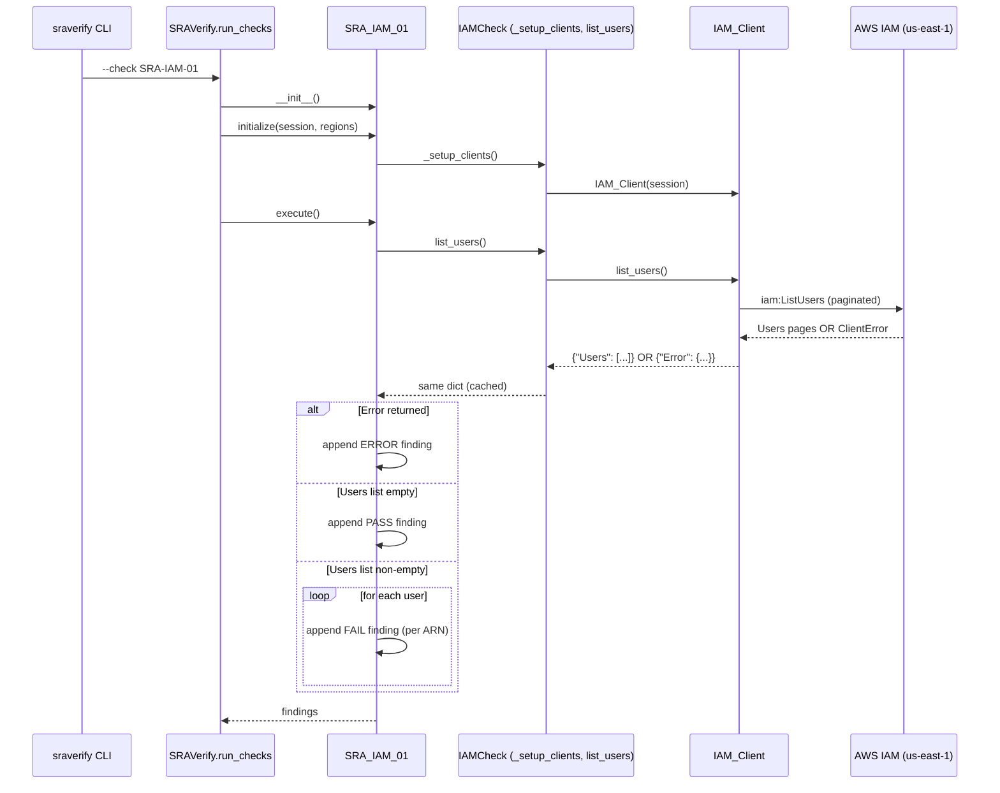

# Design Document

## Overview

This design introduces a new SRA Verify security check, `SRA-IAM-01`, that detects the presence of IAM users in an AWS account. AWS Security Reference Architecture (SRA) guidance directs customers to adopt federated identity through AWS IAM Identity Center and to assume IAM roles rather than provision long-lived IAM users. Any IAM user in an account is therefore a deviation worth reporting as a HIGH severity finding per user.

The check is the first check for the new IAM service module in SRA Verify. To accommodate it, this design also introduces the `services/iam/` package containing an `IAM_Client` wrapper, an `IAMCheck` service base class, and the `SRA_IAM_01` check class. The module is registered with the existing orchestrator so `sraverify --check SRA-IAM-01`, `sraverify --service IAM`, and `sraverify --list-*` commands all resolve correctly.

IAM is a global AWS service, so the check uses a single boto3 client targeted at the `us-east-1` endpoint and emits findings with `Region = "us-east-1"`. Behavior is:

- Paginated `ListUsers` call
- One FAIL finding per distinct IAM user ARN when users exist
- One PASS finding when zero users exist
- One ERROR finding when the API call fails, with no PASS or FAIL findings for that execution (mutual exclusion)

### Goals

- Faithful implementation of SRA best practice: warn on any IAM user in an application account.
- Follow the existing SRA Verify structural patterns (mirroring `services/accessanalyzer/` and `services/organizations/`) so reviewers and future contributors have a familiar mental model.
- Keep the check logic pure and deterministic so it can be covered by property-based tests driven by mock boto clients.

### Non-Goals

- Auditing IAM user policies, access keys, MFA, or last-used activity (future checks, e.g. `SRA-IAM-02`, `SRA-IAM-03`, can cover those).
- Remediating IAM users automatically.
- Supporting account types other than `application` in this check.

## Architecture

### Placement in the Existing Framework

SRA Verify organizes checks in a three-level class hierarchy (from `.kiro/steering/structure.md`):

```
SecurityCheck          (core/check.py)
    ↓ extends
ServiceCheck           (services/{service}/base.py)
    ↓ extends
SRA_{SERVICE}_##       (services/{service}/checks/sra_{service}_##.py)
```

This feature introduces the middle and leaf layers for IAM:

```
SecurityCheck
    └── IAMCheck                    (services/iam/base.py — new)
            └── SRA_IAM_01          (services/iam/checks/sra_iam_01.py — new)
```

A stateless API wrapper, `IAM_Client` (`services/iam/client.py`), sits alongside the base class and is used by it — identical in shape to `AccessAnalyzerClient` and `OrganizationsClient`.

### Module Layout

```
sraverify/sraverify/services/iam/
├── __init__.py              # Exposes CHECKS = {"SRA-IAM-01": SRA_IAM_01}
├── base.py                  # IAMCheck(SecurityCheck)
├── client.py                # IAM_Client wrapping boto3 iam.list_users
└── checks/
    ├── __init__.py          # empty marker
    └── sra_iam_01.py        # SRA_IAM_01(IAMCheck)
```

Registration in `sraverify/main.py`:

```python
from sraverify.services.iam import CHECKS as iam_checks
# ...
ALL_CHECKS = {
    # existing entries unchanged ...
    **iam_checks,
}
```

### Execution Flow



### Why a Single Global Client

The AWS IAM service is global; although `iam` clients can be constructed in any region, all `ListUsers` calls route to the global endpoint. Creating a per-region client would duplicate results and emit redundant findings across regions. The Organizations service in this repo already follows this pattern (`OrganizationsClient` pins to `us-east-1` and `OrganizationsCheck._setup_clients` creates exactly one client). `IAMCheck` does the same.

The `regions` argument that `SecurityCheck.initialize` receives from the CLI is deliberately ignored by the IAM client setup. Findings always carry `Region = "us-east-1"` to make the global nature of the result explicit in CSV output and dashboards.

## Components and Interfaces

### IAM_Client (`services/iam/client.py`)

A stateless wrapper around the boto3 `iam` client that performs a single responsibility: paginated `ListUsers` with structured success/error return values.

**Interface:**

```python
class IAM_Client:
    def __init__(self, session: Optional[boto3.Session] = None) -> None:
        """Construct an iam client pinned to us-east-1."""

    def list_users(self) -> Dict[str, Any]:
        """
        Paginate iam:ListUsers and return all users.

        Returns:
            On success: {"Users": [user_dict, ...]}
            On failure: {"Error": {"Code": str, "Message": str}}
        """
```

**Behavior:**

- Construction: `self.client = self.session.client("iam", region_name="us-east-1")`.
- `list_users()` uses `self.client.get_paginator("list_users")` and iterates over pages, accumulating the `Users` list. This satisfies Requirement 1 Acceptance Criterion 7 (continuation-token-driven pagination).
- On `botocore.exceptions.ClientError`, it logs at `warning` level and returns `{"Error": {"Code": code, "Message": message}}` so the caller does not have to catch exceptions.
- On any other exception it returns `{"Error": {"Code": "UnknownError", "Message": str(e)}}`.
- Returning an `Error` dict (rather than raising) matches the pattern already used by `OrganizationsClient` and by the best-practices guidance in `.kiro/steering/creating_checks_best_practices.md` (the `if "Error" in response:` pattern).

### IAMCheck (`services/iam/base.py`)

Service-level base class. Implements `_setup_clients`, exposes cached access to `list_users`, and centralizes the metadata validation required by Requirement 7.

**Interface:**

```python
class IAMCheck(SecurityCheck):
    # Class-level cache keyed by account_id to avoid duplicate ListUsers calls
    # when multiple IAM checks run in the same SRAVerify invocation.
    _users_cache: Dict[str, Dict[str, Any]] = {}

    # Fixed global region for IAM.
    GLOBAL_REGION: str = "us-east-1"

    def __init__(self) -> None:
        super().__init__(
            account_type="application",
            service="IAM",
            resource_type="AWS::IAM::User",
        )
        self._iam_client: Optional[IAM_Client] = None

    def _setup_clients(self) -> None: ...
    def get_iam_client(self) -> IAM_Client: ...
    def list_users(self) -> Dict[str, Any]: ...
    def _validate_metadata(self) -> None: ...
```

**Behavior:**

- `_setup_clients`: constructs a single `IAM_Client` from `self.session` and stores it in `self._iam_client`. Does not populate the per-region `self._clients` dict, matching `OrganizationsCheck`.
- `list_users`: checks `_users_cache[self.account_id]` first; on miss, calls `self._iam_client.list_users()`, caches the result, and returns it. Caching shields reruns within one invocation (e.g. when `--service IAM` runs multiple IAM checks in the future).
- `_validate_metadata`: called at the top of each subclass `execute()` (or alternatively at the end of `__init__`) — raises `ValueError` if any of `check_name`, `description`, `check_logic` is `None` or empty. Satisfies Requirement 7 Acceptance Criterion 4. The validation is implemented in the base so every IAM subclass inherits it.

### SRA_IAM_01 (`services/iam/checks/sra_iam_01.py`)

The concrete check.

**Interface:**

```python
class SRA_IAM_01(IAMCheck):
    def __init__(self) -> None: ...
    def execute(self) -> List[Dict[str, Any]]: ...
```

**Metadata (set in `__init__`):**

| Attribute       | Value                                                                                                           |
| --------------- | --------------------------------------------------------------------------------------------------------------- |
| `check_id`      | `"SRA-IAM-01"`                                                                                                  |
| `check_name`    | `"Account contains no IAM users."` (contains "IAM user", ≤200 chars, single sentence, period-terminated)        |
| `description`   | Multi-sentence string that contains "IAM user", "long-lived credential", "IAM Identity Center", and "IAM role". |
| `severity`      | `"HIGH"`                                                                                                        |
| `check_logic`   | String containing "ListUsers", stating that one FAIL finding is created for each IAM user returned.             |
| `account_type`  | `"application"` (inherited from `IAMCheck`)                                                                     |
| `service`       | `"IAM"` (inherited)                                                                                             |
| `resource_type` | `"AWS::IAM::User"` (inherited)                                                                                  |

**Execute logic (pseudocode):**

```python
def execute(self) -> List[Dict[str, Any]]:
    self._validate_metadata()
    region = self.GLOBAL_REGION  # "us-east-1"

    response = self.list_users()

    if "Error" in response:
        message = response["Error"].get("Message") or ""
        actual_value = (message[:1000] if message else "Unknown error")
        self.findings.append(self.create_finding(
            status="ERROR",
            region=region,
            resource_id=self.account_id,
            actual_value=actual_value,
            remediation="Verify the execution role has the iam:ListUsers permission attached.",
        ))
        return self.findings

    users = response.get("Users", [])
    # Deduplicate by ARN to guarantee one finding per distinct user ARN.
    seen_arns: Set[str] = set()
    distinct_users = []
    for u in users:
        arn = u.get("Arn")
        if arn and arn not in seen_arns:
            seen_arns.add(arn)
            distinct_users.append(u)

    if not distinct_users:
        self.findings.append(self.create_finding(
            status="PASS",
            region=region,
            resource_id=self.account_id,
            actual_value="0 IAM users found in the account.",
            remediation="No remediation needed.",
        ))
        return self.findings

    remediation = (
        "Replace the IAM user with federated access through AWS IAM Identity Center "
        "or assume an IAM role with temporary credentials, then delete the IAM user "
        "after migration is complete."
    )
    for user in distinct_users:
        self.findings.append(self.create_finding(
            status="FAIL",
            region=region,
            resource_id=user["Arn"],
            actual_value=f"IAM user '{user.get('UserName', '')}' exists in the account.",
            remediation=remediation,
        ))
    return self.findings
```

### Registration Components

**`services/iam/__init__.py`:**

```python
from sraverify.services.iam.checks.sra_iam_01 import SRA_IAM_01

CHECKS = {
    "SRA-IAM-01": SRA_IAM_01,
}
```

**`services/iam/checks/__init__.py`:** empty package marker (matches `services/accessanalyzer/checks/__init__.py`).

**`sraverify/main.py`:** add

```python
from sraverify.services.iam import CHECKS as iam_checks
# ...
ALL_CHECKS = {
    ...existing entries unchanged...
    **iam_checks,
}
```

`--list-services` already iterates `ALL_CHECKS` and collects `check.service`, so adding the entry automatically surfaces `"IAM"` in the output. `--list-checks` likewise surfaces `"SRA-IAM-01"`. This satisfies Requirement 6 Acceptance Criteria 4–5.

## Data Models

### IAM User (from `iam:ListUsers` response)

Only these fields are consumed by this check. Other fields returned by the API are ignored.

| Field      | Type  | Source                   | Used for                                |
| ---------- | ----- | ------------------------ | --------------------------------------- |
| `Arn`      | `str` | `iam:ListUsers` response | `ResourceId` of FAIL finding; dedup key |
| `UserName` | `str` | `iam:ListUsers` response | `ActualValue` substring of FAIL finding |

### Client Return Value

`IAM_Client.list_users` returns a dict in exactly one of two shapes:

```python
# Success
{"Users": [
    {"Arn": "arn:aws:iam::123456789012:user/alice", "UserName": "alice", ...},
    ...
]}

# Failure
{"Error": {"Code": "AccessDenied", "Message": "User is not authorized to perform iam:ListUsers"}}
```

Callers treat the presence of the `"Error"` key as the sole signal of failure.

### Finding Shape

`SecurityCheck.create_finding` already produces the canonical finding dict. For this check, the populated fields are:

| Field          | FAIL finding                                 | PASS finding                          | ERROR finding                                                            |
| -------------- | -------------------------------------------- | ------------------------------------- | ------------------------------------------------------------------------ |
| `CheckId`      | `"SRA-IAM-01"`                               | `"SRA-IAM-01"`                        | `"SRA-IAM-01"`                                                           |
| `Status`       | `"FAIL"`                                     | `"PASS"`                              | `"ERROR"`                                                                |
| `Region`       | `"us-east-1"`                                | `"us-east-1"`                         | `"us-east-1"`                                                            |
| `Severity`     | `"HIGH"`                                     | `"HIGH"`                              | `"HIGH"`                                                                 |
| `Title`        | `"SRA-IAM-01 <check_name>"`                  | same                                  | same                                                                     |
| `Description`  | check description                            | same                                  | same                                                                     |
| `ResourceId`   | IAM user ARN                                 | 12-digit account id                   | 12-digit account id                                                      |
| `ResourceType` | `"AWS::IAM::User"`                           | `"AWS::IAM::User"`                    | `"AWS::IAM::User"`                                                       |
| `AccountId`    | injected by base class                       | injected                              | injected                                                                 |
| `AccountName`  | injected by base class                       | injected                              | injected                                                                 |
| `CheckedValue` | `"IAM Configuration"` (default)              | same                                  | same                                                                     |
| `ActualValue`  | `"IAM user '<name>' exists in the account."` | `"0 IAM users found in the account."` | error message (≤1000 chars) or `"Unknown error"`                         |
| `Remediation`  | migrate-to-Identity-Center-or-role guidance  | `"No remediation needed."`            | `"Verify the execution role has the iam:ListUsers permission attached."` |
| `Service`      | `"IAM"`                                      | `"IAM"`                               | `"IAM"`                                                                  |
| `CheckLogic`   | check logic string                           | same                                  | same                                                                     |
| `AccountType`  | `"application"`                              | `"application"`                       | `"application"`                                                          |

### Finding Multiplicity per Execution

A single `execute()` invocation produces exactly one of the following:

| Condition                         | FAIL count | PASS count | ERROR count |
| --------------------------------- | ---------- | ---------- | ----------- |
| API success, 0 users              | 0          | 1          | 0           |
| API success, N ≥ 1 distinct users | N          | 0          | 0           |
| API failure at any point          | 0          | 0          | 1           |

This mutual-exclusion contract is central to Requirements 1.10, 3.6, and 4.6 and underpins the PBT strategy below.

## Correctness Properties

The check's behavior is small enough to pin down with a handful of executable invariants that hold for every possible input. These properties are the source-of-truth contract between the requirements and the test suite — each one maps directly to one or more acceptance criteria and is designed to be exercised by Hypothesis-driven property-based tests (PBT).

Let `F = execute()` be the list of findings returned for a given `ListUsers` response `R`. Let `U(R)` be the set of distinct `Arn` values present in `R["Users"]` when `R` is a success response. Let `|S|` denote set/list cardinality.

### P1 — Mutually exclusive outcomes (Req 1.10, 3.6, 4.6)

Every execution produces findings of exactly one status category:

```
∀ R :
    (∀ f ∈ F, f.Status = "PASS")
 ∨  (∀ f ∈ F, f.Status = "FAIL")
 ∨  (∀ f ∈ F, f.Status = "ERROR")
```

Equivalently: at most one of `{PASS, FAIL, ERROR}` contributes findings to `F`.

### P2 — Finding-count invariant (Req 1.8, 1.9, 2.1, 3.1, 4.1)

```
∀ R :
    "Error" ∈ R            ⇒ |F| = 1 ∧ F[0].Status = "ERROR"
    "Error" ∉ R ∧ U(R) = ∅ ⇒ |F| = 1 ∧ F[0].Status = "PASS"
    "Error" ∉ R ∧ U(R) ≠ ∅ ⇒ |F| = |U(R)| ∧ ∀ f ∈ F, f.Status = "FAIL"
```

This single invariant subsumes the PASS, FAIL, and ERROR count rules and makes the check's multiplicity deterministic in `R`.

### P3 — FAIL-finding ARN bijection (Req 2.1, 2.3)

When `"Error" ∉ R ∧ U(R) ≠ ∅`:

```
{ f.ResourceId | f ∈ F } = U(R)
∀ f ∈ F, f.ResourceId ∈ U(R)     (no spurious ARNs)
∀ a ∈ U(R), ∃! f ∈ F : f.ResourceId = a   (exactly one finding per ARN)
```

### P4 — Deduplication under duplicate input ARNs (Req 2.1, 1.9)

```
∀ R : |F_FAIL| = |U(R)|
```

Even when `R["Users"]` contains duplicates (the boto paginator may in theory emit the same user twice across pages), the check emits one FAIL finding per distinct ARN. This is the primary property PBT should exercise with `Hypothesis` shrinkers.

### P5 — Region constancy (Req 3.5, 4.5)

```
∀ R, ∀ f ∈ F : f.Region = "us-east-1"
```

The check never emits a finding in any other region, regardless of the `regions` argument passed to `initialize`.

### P6 — ActualValue truncation bound (Req 4.2, 4.3)

For any error response `R = {"Error": {"Message": m}}`:

```
m = ""   ⇒ F[0].ActualValue = "Unknown error"
m ≠ ""   ⇒ F[0].ActualValue = m[:1000]   ∧   len(F[0].ActualValue) ≤ 1000
```

And for the PASS finding:

```
1 ≤ len(F[0].ActualValue) ≤ 256   ∧   "0" ∈ F[0].ActualValue
```

### P7 — Metadata validation (Req 7.4)

For every subclass `C` of `IAMCheck`:

```
C.check_name, C.description, C.check_logic ∈ non-empty strings
⇔ C().execute()  does not raise ValueError for a metadata reason
```

Any of the three attributes being `None` or empty at `execute()` time raises `ValueError("<attr_name> is missing")` and produces zero findings.

### P8 — Metadata content predicates (Req 7.1, 7.2, 7.3)

```
"IAM user"   ∈ check_name   ∧ 1 ≤ len(check_name) ≤ 200    ∧ check_name.endswith(".")
{"IAM user", "long-lived credential", "IAM Identity Center", "IAM role"} ⊆ description   ∧ 1 ≤ len(description) ≤ 2000
"ListUsers"  ∈ check_logic  ∧ 1 ≤ len(check_logic) ≤ 1000
```

These are cheap string-level assertions that run without needing AWS mocks.

### P9 — Caching idempotence (Req 1.6 indirectly, execution efficiency)

```
∀ R : execute() called twice with the same underlying R
       ⇒ IAM_Client.list_users called ≤ 1 times
       ⇒ F identical on both calls (modulo list identity)
```

This is a behavioral guarantee the `_users_cache` provides and is testable by counting mock invocations.

### Property → Requirement traceability

| Property | Requirements covered                     |
| -------- | ---------------------------------------- |
| P1       | 1.10, 2.7, 3.6, 4.6                      |
| P2       | 1.8, 1.9, 2.1, 2.6, 3.1, 4.1             |
| P3       | 2.1, 2.3                                 |
| P4       | 1.7, 1.9, 2.1                            |
| P5       | 1.6, 3.5, 4.5                            |
| P6       | 3.4, 4.2, 4.3                            |
| P7       | 7.4                                      |
| P8       | 7.1, 7.2, 7.3                            |
| P9       | efficiency; indirectly protects 1.6, 2.1 |

## Error Handling

Error handling is layered so that failures at each level degrade gracefully without polluting downstream findings.

### AWS API Failures (client layer)

`IAM_Client.list_users` converts every exceptional outcome into a structured `{"Error": {...}}` dict:

| Source                                                                                   | Translation                                                                                   |
| ---------------------------------------------------------------------------------------- | --------------------------------------------------------------------------------------------- |
| `botocore.exceptions.ClientError` (e.g. `AccessDenied`, `Throttling`)                    | `{"Error": {"Code": e.response["Error"]["Code"], "Message": e.response["Error"]["Message"]}}` |
| `botocore.exceptions.EndpointConnectionError`, `ReadTimeoutError`, `ConnectTimeoutError` | `{"Error": {"Code": e.__class__.__name__, "Message": str(e)}}`                                |
| Any other `Exception`                                                                    | `{"Error": {"Code": "UnknownError", "Message": str(e)}}`                                      |

The client never re-raises. The check then maps the dict into one ERROR finding per Requirement 4 and returns early — this upholds P1 and P2.

Caching: an error response is cached in `_users_cache` under `self.account_id` the same way a success response is. This prevents cascading API calls when other IAM checks run later in the same invocation and would see the same failure.

### Metadata Validation Failures (check layer)

`IAMCheck._validate_metadata` runs at the top of `execute()`. If any of `check_name`, `description`, `check_logic` is `None` or an empty string, it raises `ValueError(f"{attr_name} is missing or empty on {self.__class__.__name__}")`. The subclass does not catch this — it propagates up to `SRAVerify.run_checks`.

Why raise rather than produce an ERROR finding? The requirement (7.4) explicitly calls for an initialization error. A misconfigured check is a programming defect, not an operational failure, and should surface loudly in logs and exit codes rather than quietly as a per-account ERROR finding.

### Unhandled Exceptions in `execute()` (framework layer)

Requirement 6.8 requires the CLI to convert unhandled exceptions into ERROR findings and continue processing remaining accounts. The existing `SRAVerify.run_checks` orchestrator wraps each check's `execute()` in `try/except` and appends a synthetic ERROR finding when the call raises — this design relies on that existing behavior rather than reimplementing it in `SRA_IAM_01`. The check itself is written so that, in normal operation, the only code path that could raise is the metadata validation; once validated, the body only exercises pure dict/list operations on data returned by the client layer.

### Never Emit Empty Findings

`execute()` always appends at least one finding before returning (PASS, FAIL×N, or ERROR). This is asserted by P2 and double-checked by a unit test that asserts `len(findings) ≥ 1` for every branch.

## Testing Strategy

Tests live at `sraverify/tests/services/iam/` and mirror the source layout. Three tiers:

### Tier 1 — Unit tests (pytest)

One test file per source file. Uses `unittest.mock.MagicMock` for `boto3.Session` and `botocore.exceptions.ClientError` for AWS-side errors.

**`tests/services/iam/test_client.py`** — exercises `IAM_Client.list_users`:

| Test                              | Asserts                                                                             | Req      |
| --------------------------------- | ----------------------------------------------------------------------------------- | -------- |
| `test_single_page_success`        | Returns `{"Users": [...]}` for a single-page response                               | 1.6      |
| `test_multi_page_pagination`      | Paginator iterates all pages; final result contains union                           | 1.7      |
| `test_empty_page`                 | Returns `{"Users": []}` when the paginator yields no users                          | 3.1      |
| `test_client_error_access_denied` | ClientError is mapped to `{"Error": {"Code": "AccessDenied", ...}}` without raising | 4.1      |
| `test_client_error_throttling`    | Throttling ClientError mapped structurally                                          | 4.1      |
| `test_unexpected_exception`       | Generic `Exception` mapped to `{"Error": {"Code": "UnknownError", ...}}`            | 4.1      |
| `test_region_pinned_us_east_1`    | `session.client("iam", region_name="us-east-1")` called                             | 1.6, 3.5 |

**`tests/services/iam/test_base.py`** — exercises `IAMCheck`:

| Test                                                 | Asserts                                                 | Req |
| ---------------------------------------------------- | ------------------------------------------------------- | --- |
| `test_setup_clients_creates_single_client`           | Single `IAM_Client` constructed; `_clients` dict unused | 1.6 |
| `test_list_users_caches_success`                     | Second call does not re-invoke `IAM_Client.list_users`  | P9  |
| `test_list_users_caches_error`                       | Error responses are cached too                          | P9  |
| `test_validate_metadata_raises_on_missing_name`      | `ValueError` when `check_name = None`                   | 7.4 |
| `test_validate_metadata_raises_on_empty_description` | `ValueError` when `description = ""`                    | 7.4 |
| `test_validate_metadata_passes`                      | No exception when all three attributes are non-empty    | 7.4 |

**`tests/services/iam/checks/test_sra_iam_01.py`** — exercises `SRA_IAM_01.execute()`:

| Test                                       | Scenario                                                                  | Asserts                                                                                                                                                              | Req     |
| ------------------------------------------ | ------------------------------------------------------------------------- | -------------------------------------------------------------------------------------------------------------------------------------------------------------------- | ------- |
| `test_metadata_attributes`                 | Instantiate check                                                         | `check_id = "SRA-IAM-01"`, `severity = "HIGH"`, `service = "IAM"`, `resource_type = "AWS::IAM::User"`, `account_type = "application"`                                | 1.1–1.5 |
| `test_metadata_content`                    | Instantiate check                                                         | P8 string predicates                                                                                                                                                 | 7.1–7.3 |
| `test_pass_on_zero_users`                  | `list_users` → `{"Users": []}`                                            | 1 finding; Status=PASS; ResourceId=account_id; Region="us-east-1"; ActualValue contains "0" and "IAM user"; 1 ≤ len ≤ 256                                            | 3.1–3.5 |
| `test_fail_per_user`                       | `list_users` → 3 distinct users                                           | 3 findings; all Status=FAIL; ResourceIds match user ARNs; ActualValue contains each UserName; Remediation mentions "IAM Identity Center" and "IAM role" and "delete" | 2.1–2.5 |
| `test_dedup_duplicate_arns`                | `list_users` returns same ARN twice                                       | Only 1 FAIL finding                                                                                                                                                  | P4      |
| `test_error_maps_to_error_finding`         | `list_users` → `{"Error": {"Code": "AccessDenied", "Message": "denied"}}` | 1 finding; Status=ERROR; ActualValue="denied"; Remediation mentions "iam:ListUsers"                                                                                  | 4.1–4.5 |
| `test_error_empty_message_becomes_unknown` | `{"Error": {"Code": "Unknown", "Message": ""}}`                           | ActualValue == "Unknown error"                                                                                                                                       | 4.3     |
| `test_error_message_truncated_1000`        | `{"Error": {"Message": "x" * 5000}}`                                      | len(ActualValue) == 1000                                                                                                                                             | 4.2     |
| `test_no_pass_or_fail_when_error`          | Error response                                                            | All findings have Status=="ERROR"                                                                                                                                    | 4.6, P1 |
| `test_region_always_us_east_1`             | Any branch                                                                | All findings have Region=="us-east-1"                                                                                                                                | P5, 3.5 |

### Tier 2 — Property-based tests (Hypothesis)

A single file `tests/services/iam/checks/test_sra_iam_01_properties.py` that uses `@given` strategies to generate `ListUsers` response dicts and asserts P1–P6 and P9.

```python
from hypothesis import given, strategies as st, settings

# Strategy: a plausible IAM user dict.
arn_strategy = st.from_regex(r"arn:aws:iam::\d{12}:user/[A-Za-z0-9_+=,.@-]{1,64}", fullmatch=True)
user_strategy = st.builds(
    lambda arn, name: {"Arn": arn, "UserName": name},
    arn_strategy,
    st.text(alphabet=st.characters(whitelist_categories=("L", "N"), whitelist_characters="_-."), min_size=1, max_size=64),
)
response_success = st.builds(
    lambda users: {"Users": users},
    st.lists(user_strategy, max_size=50),
)
response_error = st.builds(
    lambda code, msg: {"Error": {"Code": code, "Message": msg}},
    st.sampled_from(["AccessDenied", "Throttling", "UnknownError", "EndpointConnectionError"]),
    st.text(max_size=5000),
)
response = st.one_of(response_success, response_error)

@given(response)
@settings(max_examples=500)
def test_property_mutual_exclusion(response_dict):
    """P1: findings share a single Status value."""

@given(response)
@settings(max_examples=500)
def test_property_count_invariant(response_dict):
    """P2: finding count matches error/empty/N-distinct-users cases."""

@given(response_success)
def test_property_arn_bijection(response_dict):
    """P3: FAIL ResourceIds equal distinct user ARNs."""

@given(st.lists(user_strategy, min_size=1, max_size=20))
def test_property_dedup(users):
    """P4: duplicates collapse to one FAIL per distinct ARN."""

@given(response)
def test_property_region_constant(response_dict):
    """P5: Region == 'us-east-1' for every finding."""

@given(response_error)
def test_property_error_truncation(error_response):
    """P6: ActualValue ≤ 1000 chars; empty message → 'Unknown error'."""

@given(response)
def test_property_caching_idempotent(response_dict):
    """P9: execute() called twice → list_users called once; same findings."""
```

A shared `make_check(response_dict)` fixture constructs an `SRA_IAM_01` with a mocked `IAM_Client` whose `list_users()` returns the response dict and stubs `account_info` with a deterministic account id.

### Tier 3 — Integration/smoke guidance (manual)

These are not automated (they require live AWS credentials) but are documented for reviewers:

| Scenario                                                       | Setup                                 | Expected output                                                                              | Req                           |
| -------------------------------------------------------------- | ------------------------------------- | -------------------------------------------------------------------------------------------- | ----------------------------- |
| `sraverify --list-services`                                    | Package installed                     | Output contains token "IAM"; exit code 0                                                     | 6.4                           |
| `sraverify --list-checks`                                      | Package installed                     | Output contains token "SRA-IAM-01"; exit code 0                                              | 6.5                           |
| `sraverify --check SRA-IAM-01` in an account with 0 IAM users  | Live account                          | One PASS finding in CSV                                                                      | 3.1, 6.6                      |
| `sraverify --check SRA-IAM-01` in an account with N IAM users  | Live account                          | N FAIL findings in CSV, ResourceIds match user ARNs                                          | 2.1, 6.6                      |
| `sraverify --check SRA-IAM-01` with role missing iam:ListUsers | IAM role without `iam:ListUsers`      | One ERROR finding; ActualValue contains "AccessDenied"; Remediation mentions `iam:ListUsers` | 4.1–4.4                       |
| `sraverify --account-type audit --check SRA-IAM-01`            | Audit account                         | Explicit `--check` selection overrides filter; check still runs                              | 5.3 (negative case carve-out) |
| `sraverify --account-type audit`                               | Audit account (no explicit `--check`) | SRA-IAM-01 not in execution set; no IAM findings                                             | 5.3                           |

### Test → Property → Requirement Matrix

| Test tier | Test                                         | Property  | Requirements            |
| --------- | -------------------------------------------- | --------- | ----------------------- |
| Unit      | `test_metadata_attributes`                   | —         | 1.1–1.5                 |
| Unit      | `test_metadata_content`                      | P8        | 7.1–7.3                 |
| Unit      | `test_pass_on_zero_users`                    | P1–P3, P5 | 3.1–3.5                 |
| Unit      | `test_fail_per_user`                         | P1–P3, P5 | 2.1–2.5                 |
| Unit      | `test_dedup_duplicate_arns`                  | P4        | 2.1                     |
| Unit      | `test_error_*`                               | P1, P6    | 4.1–4.6                 |
| Unit      | `test_region_always_us_east_1`               | P5        | 3.5, 4.5                |
| Unit      | `test_validate_metadata_*`                   | P7        | 7.4                     |
| PBT       | `test_property_mutual_exclusion`             | P1        | 1.10, 3.6, 4.6          |
| PBT       | `test_property_count_invariant`              | P2        | 1.8, 1.9, 2.1, 3.1, 4.1 |
| PBT       | `test_property_arn_bijection`                | P3        | 2.1, 2.3                |
| PBT       | `test_property_dedup`                        | P4        | 2.1                     |
| PBT       | `test_property_region_constant`              | P5        | 3.5, 4.5                |
| PBT       | `test_property_error_truncation`             | P6        | 4.2, 4.3                |
| PBT       | `test_property_caching_idempotent`           | P9        | efficiency              |
| Integ.    | `--list-services` / `--list-checks`          | —         | 6.4, 6.5                |
| Integ.    | `--check SRA-IAM-01` (PASS/FAIL/ERROR paths) | P1, P2    | 6.6, 5.1, 5.2           |
| Integ.    | Account-type filter negative case            | —         | 5.3                     |

Adding Hypothesis as a test-only dependency is a one-line change to `requirements.txt` (or a new `requirements-dev.txt`) — see Implementation Considerations.

## Implementation Considerations

### Dependencies

- Runtime: no new dependencies. `boto3` already covers the `iam` client and `botocore.exceptions`.
- Test-only: `hypothesis` (for PBT) and `pytest` (already used in the repo). Pin in a test-only requirements file to avoid bloating the installed package.

### Ordering of Changes

1. Create `services/iam/client.py` with `IAM_Client`.
2. Create `services/iam/base.py` with `IAMCheck`.
3. Create `services/iam/checks/sra_iam_01.py` with `SRA_IAM_01`.
4. Create `services/iam/__init__.py` exposing `CHECKS`.
5. Create `services/iam/checks/__init__.py` (empty marker).
6. Register in `sraverify/main.py` (`ALL_CHECKS`).
7. Add entry to `docs/checks.txt` for `SRA-IAM-01`.
8. Add unit tests (Tier 1), then PBT tests (Tier 2).
9. Smoke-run `sraverify --list-checks`, `--list-services`, `--check SRA-IAM-01 --debug` against a sandbox account.

### Open Questions

- **Should the check also flag inline/managed policies attached directly to the user?** Out of scope for SRA-IAM-01; this is a `SRA-IAM-02` follow-up.
- **Does `create_finding` need a new `checked_value` override?** Current default (`"IAM Configuration"`) is acceptable; a more specific value (e.g. `"IAM Users"`) is a cosmetic improvement and can be added without affecting behavior.
- **Dashboard filtering on Region == "us-east-1":** because IAM is global, some dashboards may prefer `Region = "global"`. Deferring to the existing convention (`us-east-1`, per Organizations) keeps CSV consumers consistent.
