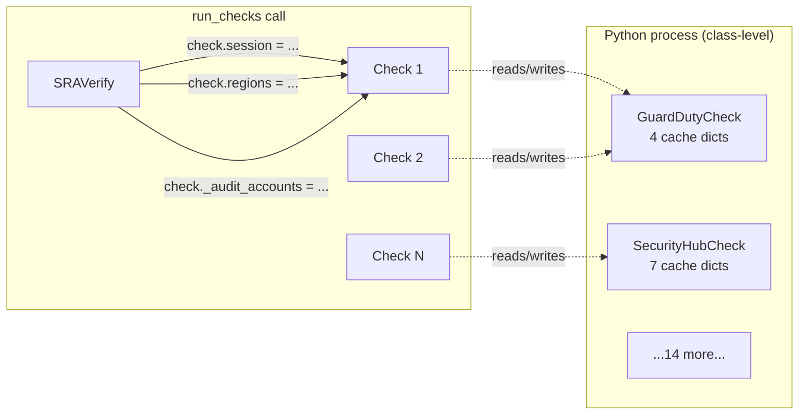
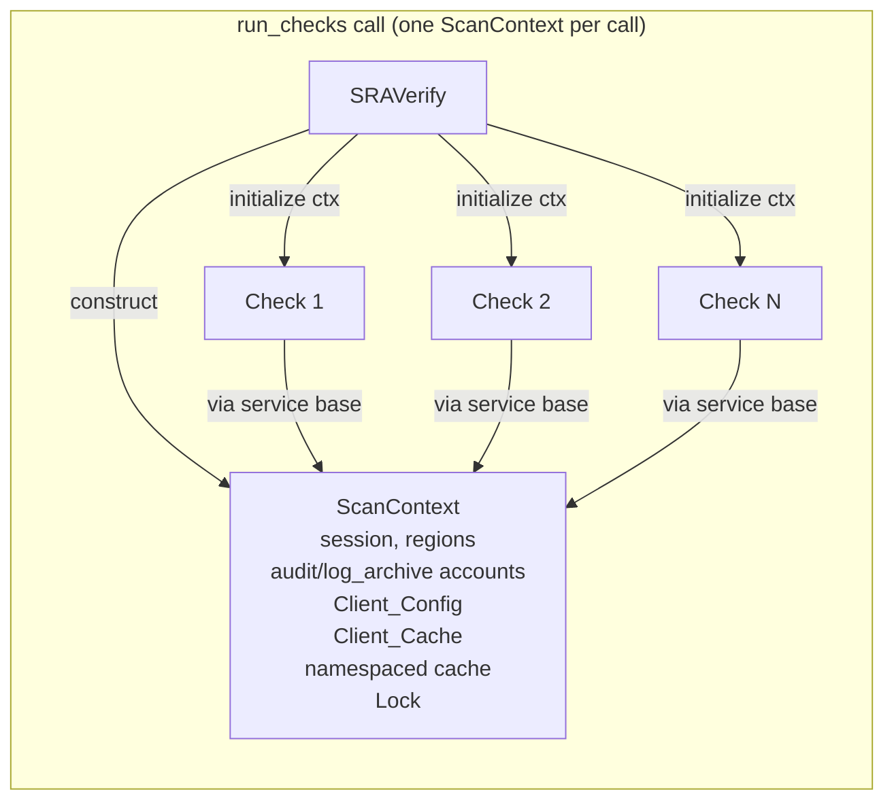
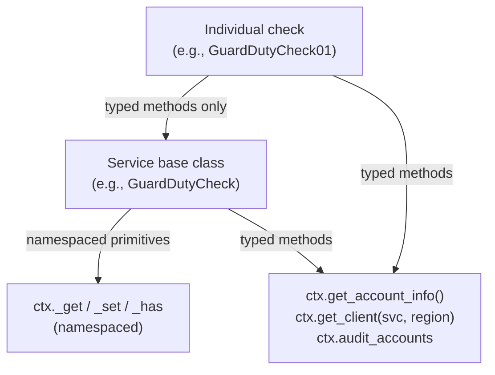

# Design Document

## Overview

This refactor introduces a `ScanContext` object that owns all per-scan state for a single `run_checks` invocation: the boto3 `Session`, the region list, audit and log-archive account lists, cached AWS API responses, the `botocore.config.Config` applied to every boto3 client, and the per-scan boto3 client cache. Each call to `SRAVerify.run_checks` constructs a fresh `ScanContext`, hands it to every check it runs, and lets it go out of scope when the call returns. This gives us three things in one shape:

1. **Per-scan isolation.** All cached AWS API responses and constructed boto3 clients live on the `ScanContext`. When the scan finishes, the context goes out of scope, the caches and clients become unreachable, and the next call to `run_checks` starts from a clean state. This eliminates the stale-cache bug observed in the long-running MCP server today and lets us delete the `_clear_sra_caches` workaround.

2. **Bounded boto3 timeouts and shared clients.** The context owns one `botocore.config.Config` (default: 10s connect, 30s read, 3 retries, 50 pool connections) and one `(service, region) → client` cache. Every service-level client wrapper goes through `ctx.get_client(...)` instead of calling `session.client(...)` directly. Calls to disabled or unreachable regions fail in tens of seconds instead of stalling for minutes, and a service+region pair is constructed at most once per scan instead of once per check.

3. **Concurrency-readiness.** The internal namespaced cache, the client cache, and the cached account info are all guarded by a single `threading.Lock`. The future Phase 3.1 `ThreadPoolExecutor` work can fan checks out across threads without a second refactor and without per-thread cache duplication.

The design preserves the public `SRAVerify.__init__` and `SRAVerify.run_checks` signatures and the finding format. CLI flags `--connect-timeout`, `--read-timeout`, `--max-attempts`, and `--max-pool-connections` are added; the MCP `run_check` tool gains the same four optional arguments and drops its `_clear_sra_caches` workaround.

The migration is staged so that the ~140 individual check files do not have to change. `SecurityCheck.initialize` keeps a deprecated two-argument shim during the migration; service base classes are updated one service at a time; check files only need to change when their subclass tree is touched for an unrelated reason.

## Architecture

### Current architecture (simplified)

Today, per-scan state is scattered across three different lifetimes:

- **Process-level (class variables)** — every service base class declares its caches as class variables (e.g., `GuardDutyCheck._detector_ids_cache = {}`). These dicts live for the lifetime of the Python process. In the long-running MCP server they outlive any single scan, which is the stale-data bug.
- **Instance-level (per check)** — `WAFCheck.__init__` sets nine `self._*_cache = {}` dicts. Each individual WAF check (one per finding type) gets its own copy, so two WAF checks running back-to-back cannot share data.
- **Per-scan but mutated in place** — `SecurityCheck.session`, `SecurityCheck.regions`, `check._audit_accounts`, `check._log_archive_accounts` are set on the check instance from outside (`SRAVerify.run_checks` literally writes `check._audit_accounts = audit_accounts`).

Every service client wrapper (`services/<svc>/client.py`) calls `self.session.client(svc, region_name=region)` with no `Config`, so connection and read timeouts default to ~60s each with exponential retry, which is where the 5-minute stalls come from.



### Target architecture

`ScanContext` becomes the single owner of per-scan state. `SRAVerify.run_checks` constructs one and passes it to every check via `check.initialize(ctx)`. Service base classes go through namespaced primitives on the context (`ctx._get("guardduty", key)` / `ctx._set(...)`) instead of class variables. Service client wrappers obtain their underlying boto3 clients from `ctx.get_client(service, region)`.



When `run_checks` returns, `SRAVerify` releases its reference to the context. There are no class variables holding cached data and no module globals holding boto3 clients, so the context, its cache, and its boto3 clients all become unreachable and eligible for garbage collection.

### Layering and access rules

The design enforces a strict layering so that check authors never touch stringly-typed cache keys:

- **`ScanContext` typed public API** — `get_account_info()`, `get_management_account_id()`, `get_enabled_regions()`, `get_client(service, region)`, plus the audit/log-archive account list properties. Anyone can call these.
- **`ScanContext` namespaced primitives** — `_get(namespace, key)`, `_set(namespace, key, value)`, `_has(namespace, key)`. Underscore-prefixed. **Service base classes only.** Individual check files never call these.
- **Service base class typed methods** — `GuardDutyCheck.get_detector_id(region)`, `SecurityHubCheck.get_organization_configuration(region)`, etc. These are the only thing individual check files see. They internally call the namespaced primitives.
- **Cross-service reads** — when one service base class needs another's cached data (e.g., SecurityHub needs the Organizations describe-organization result), it reads from the other namespace through the same primitives. This is allowed because both readers are service base classes.



### Concurrency model

`ScanContext` is designed to be safe to share across threads. A single `threading.Lock` (acquired briefly inside `_get` / `_set` / `_has` / `get_client` / `get_account_info` / `get_management_account_id` / `get_enabled_regions`) protects the four mutable structures: the namespaced cache, the client cache, the cached account info, and the cached enabled-regions list. We use a single lock rather than per-namespace locks because:

- The work inside the critical section is dict access plus, on miss, a boto3 client construction or an AWS API call. The client construction releases the GIL during socket setup, but the lock is released before any AWS API call is issued in `get_account_info` / `get_management_account_id` / `get_enabled_regions` (see "Cache miss flow" below). So the lock is held for microseconds, not seconds.
- A single lock is correct under all access patterns and easy to reason about. Per-namespace locks would create the risk of deadlock if cross-service reads ever nest.
- The future Phase 3.1 fan-out is "one check per thread," not "thousands of cache reads per thread." A single lock with microsecond critical sections is not the bottleneck.

**Cache miss flow** (the subtle part): for the typed methods that issue AWS API calls on miss (`get_account_info`, `get_management_account_id`, `get_enabled_regions`, `get_client`), we do **not** hold the lock across the AWS call. The flow is:

1. Acquire lock, check cache, if hit return cached value, release lock.
2. (Lock not held) Issue AWS call / construct boto3 client.
3. Acquire lock, double-check cache (another thread may have populated it while we were calling AWS), if now-populated discard our result and return the cached one, otherwise store ours and return it.

This is the standard double-checked locking pattern. It guarantees that all callers see the same cached object (Requirement 2.10, 2.11) without serializing AWS calls, but it does mean two threads racing to populate a missing cache entry may both make the AWS call — only one of the results will be retained. This is acceptable because the cache is per-scan and the AWS call is idempotent.

### Bounded timeouts

The default `Client_Config` is constructed once per `ScanContext` and applied to every boto3 client built by `get_client`:

```python
botocore.config.Config(
    connect_timeout=10,
    read_timeout=30,
    retries={"max_attempts": 3, "mode": "standard"},
    max_pool_connections=50,
)
```

Numbers chosen for the failure mode we are fixing: 10s connect / 30s read / 3 attempts means a fully unreachable region fails in roughly `3 * (10 + 30) = 120s` worst case, more typically tens of seconds, instead of the ~5 minutes seen today. `max_pool_connections=50` is sized for the future Phase 3.1 fan-out (one connection pool entry per concurrent check; 50 is comfortably above the largest service's check count).

### Override precedence

`ScanContext.__init__` accepts both an explicit `client_config` and individual override fields (`connect_timeout`, `read_timeout`, `max_attempts`, `max_pool_connections`). Per Requirement 2.5, when both are supplied, `client_config` wins and the individual parameters are ignored. Order of precedence:

1. Explicit `client_config` parameter (caller fully owns the `Config`).
2. Default `Config` with individual fields overridden where supplied.
3. Default `Config` (no overrides).

This precedence is documented in the `ScanContext.__init__` docstring and reflected in the test plan.

### Backward compatibility and migration shim

The 16 service base classes plus WAF cover ~140 individual check files. Migrating all of them in a single PR would be unreviewable and high-risk. The migration shim is the trick that lets us avoid that:

`SecurityCheck.initialize` keeps two callable signatures during the migration:

- **New signature (preferred):** `initialize(ctx: ScanContext)` — used by `SRAVerify.run_checks` going forward.
- **Old signature (deprecated shim):** `initialize(session, regions=None)` — wraps the inputs into a temporary `ScanContext` and calls the new path. Emits a `DeprecationWarning`.

The shim lets us migrate service base classes one at a time without touching the individual check files. Once all service base classes are migrated and all callers go through the new signature, the shim is removed in a follow-up PR. Individual check files only need to change if their subclass tree is touched for an unrelated reason; this is intentional.

## Components and Interfaces

### `sraverify/core/scan_context.py` — new module

```python
class ScanContext:
    """Owns all per-scan state for a single SRAVerify.run_checks call.

    A fresh ScanContext is constructed per scan and goes out of scope when
    the scan finishes. Cached AWS API responses, cached boto3 clients, and
    the bounded Client_Config all live here. The context is safe to share
    across threads.
    """

    def __init__(
        self,
        session: boto3.Session,
        regions: Optional[List[str]] = None,
        audit_accounts: Optional[List[str]] = None,
        log_archive_accounts: Optional[List[str]] = None,
        client_config: Optional[botocore.config.Config] = None,
        connect_timeout: Optional[float] = None,
        read_timeout: Optional[float] = None,
        max_attempts: Optional[int] = None,
        max_pool_connections: Optional[int] = None,
    ) -> None: ...

    # ----- typed public API -----

    @property
    def session(self) -> boto3.Session: ...

    @property
    def regions(self) -> List[str]:
        """Explicit region list passed in, or [] if none. Use get_enabled_regions()
        to lazily discover the enabled regions when no list was supplied."""

    @property
    def audit_accounts(self) -> List[str]: ...

    @property
    def log_archive_accounts(self) -> List[str]: ...

    @property
    def client_config(self) -> botocore.config.Config: ...

    def get_account_info(self) -> Dict[str, str]:
        """{'account_id': str, 'account_name': str}. Cached for the scan.
        Issues STS GetCallerIdentity and Account GetAccountInformation on first call."""

    def get_management_account_id(self) -> str:
        """Cached for the scan. Issues Organizations DescribeOrganization on first call."""

    def get_enabled_regions(self) -> List[str]:
        """If an explicit region list was supplied at construction, returns it.
        Otherwise issues EC2 DescribeRegions on first call and caches the result."""

    def get_client(self, service_name: str, region: Optional[str] = None) -> Any:
        """Returns a boto3 client for (service_name, region) constructed from
        self.session and self.client_config. Cached for the scan; the same
        (service_name, region) pair returns the same instance every call.
        Thread-safe."""

    # ----- private namespaced primitives (service base classes only) -----

    def _get(self, namespace: str, key: str, default: Any = None) -> Any: ...
    def _set(self, namespace: str, key: str, value: Any) -> None: ...
    def _has(self, namespace: str, key: str) -> bool: ...
```

**Construction details.** The `Client_Config` is built in `__init__` once and stored. If `client_config` is supplied, it is used as-is and the individual override parameters are ignored (with a debug-level log if any are supplied alongside). Otherwise the default `Config` is constructed and any of `connect_timeout` / `read_timeout` / `max_attempts` / `max_pool_connections` that are not `None` override the corresponding default field.

**`get_client` thread-safety.** Uses double-checked locking as described in the concurrency model section. The `(service_name, region)` tuple is the cache key. When `region is None`, the key uses the literal string `"__global__"` to distinguish from any specific region (relevant for global services like IAM and Organizations).

**`audit_accounts` / `log_archive_accounts` empty-list defaults.** Per Requirements 1.8 and 1.9, both default to `[]` when not provided, never `None`. Service base classes can iterate them safely without a `None` check.

### `sraverify/core/check.py` — `SecurityCheck` migration

```python
class SecurityCheck:
    # _account_info_cache class variable is REMOVED.

    def __init__(self, account_type="application", service=None, resource_type=None):
        # Same metadata fields as today (check_id, check_name, etc.).
        # No longer holds session, regions, _clients, account_info as
        # mutable per-scan state — those flow through self._ctx.
        self._ctx: Optional[ScanContext] = None
        self._clients: Dict[str, Any] = {}  # kept for service-level client wrappers
        ...

    def initialize(self, ctx_or_session, regions=None):
        """New signature: initialize(ctx). Deprecated shim accepts (session, regions=None)."""
        if isinstance(ctx_or_session, ScanContext):
            self._ctx = ctx_or_session
        else:
            warnings.warn(
                "SecurityCheck.initialize(session, regions) is deprecated; "
                "pass a ScanContext instead.",
                DeprecationWarning, stacklevel=2,
            )
            self._ctx = ScanContext(session=ctx_or_session, regions=regions)
        self._setup_clients()  # service base classes populate self._clients via ctx.get_client

    # ----- properties that delegate to ctx -----

    @property
    def session(self) -> boto3.Session:
        return self._ctx.session

    @property
    def regions(self) -> List[str]:
        return self._ctx.get_enabled_regions() if not self._ctx.regions else self._ctx.regions

    @property
    def account_info(self) -> Dict[str, str]:
        return self._ctx.get_account_info()

    @property
    def account_id(self) -> str:
        return self.account_info["account_id"]

    @property
    def account_name(self) -> str:
        return self.account_info["account_name"]

    @property
    def audit_accounts(self) -> List[str]:
        return self._ctx.audit_accounts

    @property
    def log_archive_accounts(self) -> List[str]:
        return self._ctx.log_archive_accounts

    def get_management_accountId(self, session=None) -> str:
        # session arg kept for backward compatibility but ignored; the ctx owns the session.
        return self._ctx.get_management_account_id()
```

The current `_get_account_info` and `_get_enabled_regions` private methods are removed; their logic moves into `ScanContext`. `audit_accounts` and `log_archive_accounts` are read-only properties that delegate to `ctx`. Today's `check._audit_accounts = audit_accounts` mutation pattern in `run_checks` goes away (Requirement 3.4).

### `sraverify/main.py` — `SRAVerify` migration

`__init__` signature is unchanged. `run_checks` keeps the same parameters but its body changes:

```python
def __init__(
    self,
    profile=None, role_arn=None, regions=None, session=None, debug=False,
    # new optional timeout overrides — forwarded to ScanContext per Req 2.6
    connect_timeout=None, read_timeout=None, max_attempts=None, max_pool_connections=None,
):
    configure_logging(debug)
    self.regions = regions
    self.session = session if session else get_session(profile=profile, role_arn=role_arn)
    self._connect_timeout = connect_timeout
    self._read_timeout = read_timeout
    self._max_attempts = max_attempts
    self._max_pool_connections = max_pool_connections
    self.progress = None

def run_checks(self, account_type='all', service=None, check_id=None,
               audit_accounts=None, log_archive_accounts=None, show_progress=False):
    # ...filtering logic unchanged...

    ctx = ScanContext(
        session=self.session,
        regions=self.regions,
        audit_accounts=audit_accounts or [],
        log_archive_accounts=log_archive_accounts or [],
        connect_timeout=self._connect_timeout,
        read_timeout=self._read_timeout,
        max_attempts=self._max_attempts,
        max_pool_connections=self._max_pool_connections,
    )
    try:
        for service_name, checks in service_checks.items():
            for check_id, check_class in checks:
                check = check_class()
                check.initialize(ctx)  # new signature
                # NOTE: no more `check._audit_accounts = ...` mutation.
                # The check reads ctx.audit_accounts via its property.
                findings = check.execute()
                all_findings.extend(findings)
        return all_findings
    finally:
        # Drop the reference so the ctx (and its boto3 clients) become collectible.
        del ctx
```

The `ctx` is local to `run_checks` and is the only thing holding the per-scan boto3 clients. When `run_checks` returns, the local goes out of scope, the clients are unreachable, and the next call starts fresh (Requirements 2.13, 3.3).

### CLI plumbing — `parse_args` and `main`

Four flags are added to `parse_args`:

```python
parser.add_argument('--connect-timeout', type=float, default=None,
    help='Boto3 connect timeout in seconds (default: 10)')
parser.add_argument('--read-timeout', type=float, default=None,
    help='Boto3 read timeout in seconds (default: 30)')
parser.add_argument('--max-attempts', type=int, default=None,
    help='Boto3 max retry attempts (default: 3)')
parser.add_argument('--max-pool-connections', type=int, default=None,
    help='Boto3 max connection pool size (default: 50)')
```

`main()` forwards them to `SRAVerify(...)`:

```python
sra = SRAVerify(
    profile=args.profile, role_arn=args.role, regions=regions, debug=args.debug,
    connect_timeout=args.connect_timeout,
    read_timeout=args.read_timeout,
    max_attempts=args.max_attempts,
    max_pool_connections=args.max_pool_connections,
)
```

All other CLI behavior, output format, and exit codes are unchanged (Requirement 8.4).

### Service base class migration pattern

Every service base class follows the same five-step pattern. Concrete examples for `GuardDutyCheck` and `WAFCheck` follow.

**Pattern:**

1. Drop all class-level cache dict declarations.
2. Pick a namespace string (the lowercased service name; matches Requirement 5).
3. Replace each `ClassName._foo_cache[key] = value` with `self._ctx._set(NAMESPACE, key, value)`.
4. Replace each `if key in ClassName._foo_cache: return ClassName._foo_cache[key]` with `if self._ctx._has(NAMESPACE, key): return self._ctx._get(NAMESPACE, key)`.
5. Update `_setup_clients` to obtain underlying boto3 clients from `self._ctx.get_client(...)` via the service-level wrapper.

**Example: `GuardDutyCheck` (before, abridged):**

```python
class GuardDutyCheck(SecurityCheck):
    _detector_details_cache = {}
    _detector_ids_cache = {}
    _org_config_cache = {}
    _admin_accounts_cache = {}

    def get_detector_id(self, region):
        cache_key = f"{self.session.region_name}:{region}"
        if cache_key in GuardDutyCheck._detector_ids_cache:
            return GuardDutyCheck._detector_ids_cache[cache_key]
        client = self.get_client(region)
        ...
        GuardDutyCheck._detector_ids_cache[cache_key] = detector_id
        return detector_id
```

**`GuardDutyCheck` (after):**

```python
class GuardDutyCheck(SecurityCheck):
    NAMESPACE = "guardduty"
    # No class-level cache dicts.

    def _setup_clients(self):
        self._clients.clear()
        for region in self.regions:
            self._clients[region] = GuardDutyClient(region, ctx=self._ctx)

    def get_detector_id(self, region):
        cache_key = f"detector_id:{region}"
        if self._ctx._has(self.NAMESPACE, cache_key):
            return self._ctx._get(self.NAMESPACE, cache_key)
        client = self.get_client(region)
        if not client:
            return None
        detector_id = client.get_detector_id()
        # ...error handling unchanged...
        self._ctx._set(self.NAMESPACE, cache_key, detector_id)
        return detector_id
```

Note the cache key change: today's keys include `self.session.region_name` to disambiguate across sessions, which only mattered because the cache was process-wide. With the per-scan context the cache is already scoped to one session, so the prefix is dropped and the key simplifies to just the region (or whatever logical key the method is keyed on).

**Example: `WAFCheck` (before, abridged):**

```python
class WAFCheck(SecurityCheck):
    def __init__(self):
        super().__init__(...)
        self._distributions_cache = {}
        self._load_balancers_cache = {}
        # ...7 more...

    def get_load_balancers(self, region):
        if region not in self._load_balancers_cache:
            client = self.get_client(region)
            if client:
                self._load_balancers_cache[region] = client.describe_load_balancers()
        return self._load_balancers_cache.get(region, {})
```

**`WAFCheck` (after):**

```python
class WAFCheck(SecurityCheck):
    NAMESPACE = "waf"

    def __init__(self):
        super().__init__(...)
        # No instance-level cache dict assignments.

    def _setup_clients(self):
        self._clients.clear()
        self._clients["us-east-1"] = WAFClient("us-east-1", ctx=self._ctx)
        for region in self.regions:
            if region not in self._clients:
                self._clients[region] = WAFClient(region, ctx=self._ctx)

    def get_load_balancers(self, region):
        cache_key = f"load_balancers:{region}"
        if self._ctx._has(self.NAMESPACE, cache_key):
            return self._ctx._get(self.NAMESPACE, cache_key)
        client = self.get_client(region)
        if not client:
            return {}
        result = client.describe_load_balancers()
        self._ctx._set(self.NAMESPACE, cache_key, result)
        return result
```

Two consequences: WAF's nine instance-level dicts collapse to nine namespaced cache keys under `"waf"` (Requirement 5.17), and two WAF checks running back-to-back in the same scan now share data (which is actually what was wanted — the fact that they didn't before was an accident of where the cache lived).

### Cross-service cache sharing

Requirement 6 calls for service base classes to be able to read each other's namespaces without re-fetching from AWS. Worked example: `SecurityHubCheck` needs the AWS Organizations describe-organization result, which `OrganizationsCheck` may have already cached.

```python
class SecurityHubCheck(SecurityCheck):
    NAMESPACE = "securityhub"
    ORGANIZATIONS_NAMESPACE = "organizations"

    def get_organization(self):
        # First check the organizations namespace — another check may have populated it.
        org_cache_key = f"organization:{self.account_id}"
        if self._ctx._has(self.ORGANIZATIONS_NAMESPACE, org_cache_key):
            return self._ctx._get(self.ORGANIZATIONS_NAMESPACE, org_cache_key)
        # Fall back to fetching it ourselves and write into the organizations namespace
        # so a later OrganizationsCheck call can pick it up.
        org_client = self._ctx.get_client("organizations")
        response = org_client.describe_organization()
        self._ctx._set(self.ORGANIZATIONS_NAMESPACE, org_cache_key, response)
        return response
```

This is allowed because the reader (`SecurityHubCheck`) is a service base class, not an individual check. Individual check files never call `_get` / `_set` / `_has` directly (Requirement 6.3).

### Service client wrapper migration

Every `services/<svc>/client.py` constructor changes from `(region, session=None)` to `(region, ctx)`, and the underlying boto3 client comes from `ctx.get_client`:

**Before:**

```python
class GuardDutyClient:
    def __init__(self, region, session=None):
        self.region = region
        self.session = session or boto3.Session()
        self.client = self.session.client('guardduty', region_name=region)
```

**After:**

```python
class GuardDutyClient:
    def __init__(self, region, ctx):
        self.region = region
        self.ctx = ctx
        self.client = ctx.get_client('guardduty', region=region)
```

For multi-AWS-service wrappers like `WAFClient` (which constructs nine boto3 clients across CloudFront, ELBv2, WAFv2, API Gateway, AppSync, Cognito, App Runner, EC2, and Amplify), each `self.session.client(svc, region_name=...)` call becomes `ctx.get_client(svc, region=...)`. This both applies the bounded `Config` and lets two checks that need, say, an EC2 client in `us-east-1` share the same boto3 instance.

A subtle benefit: `WAFClient` itself is still constructed once per region per scan, but the nine underlying boto3 clients it holds are shared across `WAFClient` instances because `ctx.get_client` deduplicates them.

### MCP server changes

Three changes to `sra-verify-mcp/awslabs/sraverify_mcp_server/server.py`:

1. **Drop `_clear_sra_caches`.** Per-scan isolation is now provided by `ScanContext`, so the workaround is not needed (Requirement 7.1). The function and its call inside `run_check` are deleted.
2. **Pass timeout overrides through `_get_sra_instance`.** Add the four optional kwargs and forward them to `SRAVerify(...)`.
3. **Add tool args to `run_check`.** The tool accepts `connect_timeout`, `read_timeout`, `max_attempts`, `max_pool_connections` as optional `int | float | None` arguments; absent → library default (Requirements 7.3, 7.4).

```python
@mcp.tool(name='run_check')
async def run_check(
    check_id: str,
    audit_accounts: list[str] | None = None,
    log_archive_accounts: list[str] | None = None,
    role_arn: str | None = None,
    region: str | None = None,
    connect_timeout: float | None = None,
    read_timeout: float | None = None,
    max_attempts: int | None = None,
    max_pool_connections: int | None = None,
) -> dict[str, Any]:
    ...
    sra_instance = _get_sra_instance(
        role_arn=role_arn, region=region,
        connect_timeout=connect_timeout, read_timeout=read_timeout,
        max_attempts=max_attempts, max_pool_connections=max_pool_connections,
    )
    findings = sra_instance.run_checks(
        check_id=check_id,
        audit_accounts=audit_accounts,
        log_archive_accounts=log_archive_accounts,
    )
    ...
```

The four read-only tools (`list_checks_by_account_type`, `list_services`, `list_checks_by_service`, `describe_check`) are unchanged — they only read static metadata from the `ALL_CHECKS` registry and never construct a session (Requirement 7.2).

## Data Models

### `ScanContext` internal state

| Field                    | Type                         | Lifetime       | Notes                                                                             |
| ------------------------ | ---------------------------- | -------------- | --------------------------------------------------------------------------------- |
| `_session`               | `boto3.Session`              | Per scan       | Provided at construction; never replaced.                                         |
| `_explicit_regions`      | `Optional[List[str]]`        | Per scan       | What the caller passed in. May be `None`.                                         |
| `_resolved_regions`      | `Optional[List[str]]`        | Per scan, lazy | Filled by `get_enabled_regions()` on first call when `_explicit_regions is None`. |
| `_audit_accounts`        | `List[str]`                  | Per scan       | Defaults to `[]`.                                                                 |
| `_log_archive_accounts`  | `List[str]`                  | Per scan       | Defaults to `[]`.                                                                 |
| `_client_config`         | `botocore.config.Config`     | Per scan       | Built once in `__init__` per the precedence rules.                                |
| `_clients`               | `Dict[Tuple[str, str], Any]` | Per scan       | Key: `(service_name, region or "__global__")`.                                    |
| `_cache`                 | `Dict[str, Dict[str, Any]]`  | Per scan       | Outer key: namespace. Inner key: service-base-class-defined.                      |
| `_account_info`          | `Optional[Dict[str, str]]`   | Per scan, lazy | Filled by `get_account_info()` on first call.                                     |
| `_management_account_id` | `Optional[str]`              | Per scan, lazy | Filled by `get_management_account_id()` on first call.                            |
| `_lock`                  | `threading.Lock`             | Per scan       | Guards all mutable fields above.                                                  |

### Cache key conventions

Service base classes own their key conventions inside their namespace. Recommended forms (consistent with what we replace today):

- Per-region data: `"<resource_type>:<region>"` — e.g., `"detector_id:us-west-2"`.
- Per-account data: `"<resource_type>:<account_id>"` — e.g., `"users:123456789012"`.
- Per-account-and-region: `"<resource_type>:<account_id>:<region>"` — e.g., `"enabled_standards:123456789012:us-west-2"`.

We drop today's `f"{self.session.region_name}:{region}"` prefix because the cache is already scoped to a single session.

### Finding format

Unchanged. `create_finding` still produces a dict with the same keys (`CheckId`, `Status`, `Region`, `Severity`, `Title`, `Description`, `ResourceId`, `ResourceType`, `AccountId`, `AccountName`, `CheckedValue`, `ActualValue`, `Remediation`, `Service`, `CheckLogic`, `AccountType`). `account_id` and `account_name` come from `ctx.get_account_info()` instead of `SecurityCheck._account_info_cache`. Output is byte-for-byte compatible (Requirement 8.3, 8.4).

## Correctness Properties

*A property is a characteristic or behavior that should hold true across all valid executions of a system — essentially, a formal statement about what the system should do. Properties serve as the bridge between human-readable specifications and machine-verifiable correctness guarantees.*

After the prework analysis, the testable acceptance criteria reduce to nine consolidated properties. Criteria that are structural (e.g., "the public API only exposes typed accessors"), single-example plumbing checks (e.g., "the CLI flag is forwarded"), or pure code-shape requirements (e.g., "_clear_sra_caches has been removed") are not properties; they live in unit tests. See the Testing Strategy section for the unit-test allocation.

### Property 1: Namespaced cache primitives are correct

*For any* sequence of `_set(namespace, key, value)` calls on a fresh `ScanContext`, every subsequent `_get(namespace, key)` returns the most recently `_set` value for that exact `(namespace, key)` pair, `_has(namespace, key)` returns `True` if and only if `_set` was called for that pair, writes to one namespace do not affect reads from any other namespace, and a fresh `ScanContext` returns `_has = False` and `_get = default` for all `(namespace, key)` pairs that have not been written.

**Validates: Requirements 1.5, 1.10, 6.1**

### Property 2: Lazy typed accessors call AWS at most once per scan

*For any* `ScanContext` and any number `N ≥ 1` of repeated calls to a lazy typed accessor (`get_account_info`, `get_management_account_id`, `get_enabled_regions` when no explicit region list was supplied), all calls return the same object, and the underlying boto3 client method is invoked exactly once across all `N` calls.

**Validates: Requirements 1.2, 1.3, 1.4**

### Property 3: Account-list defaults and read-only delegation

*For any* construction of `ScanContext` with `audit_accounts` and `log_archive_accounts` set to either `None`, `[]`, or an arbitrary list of account IDs, both `ctx.audit_accounts` and `ctx.log_archive_accounts` return a list (never `None`) equal to the supplied list when supplied or `[]` when absent or `None`; and for any `SecurityCheck` initialized with that context, `check.audit_accounts` and `check.log_archive_accounts` are equal to the corresponding `ctx` lists, and any attempt to assign to `check.audit_accounts` or `check.log_archive_accounts` raises `AttributeError`.

**Validates: Requirements 1.8, 1.9, 4.7**

### Property 4: Client_Config override precedence

*For any* combination of construction inputs `(client_config, connect_timeout, read_timeout, max_attempts, max_pool_connections)` where `client_config` is either `None` or a sentinel `botocore.config.Config`, and each individual override is either `None` or an arbitrary numeric value, the resulting `ctx.client_config` is exactly the supplied `client_config` when it is not `None` (regardless of any individual override values), and otherwise is a `Config` whose fields equal the supplied individual override values for fields that were supplied and equal the documented defaults (`connect_timeout=10`, `read_timeout=30`, `retries={"max_attempts":3,"mode":"standard"}`, `max_pool_connections=50`) for fields that were `None`.

**Validates: Requirements 2.4, 2.5**

### Property 5: Client cache contract

*For any* sequence of `ctx.get_client(service_name, region)` calls (including repeats and including concurrent calls from multiple threads), every call with the same `(service_name, region)` pair returns the identical boto3 client object; the underlying `session.client(...)` is invoked exactly once per unique `(service_name, region)` pair across the entire call sequence; every constructed boto3 client is built with `config=ctx.client_config`; and after `del ctx; gc.collect()`, no boto3 client previously returned by `get_client` remains reachable (`weakref` to each is dead).

**Validates: Requirements 2.1, 2.10, 2.11, 2.13**

### Property 6: Per-scan isolation across run_checks

*For any* sequence of two or more `SRAVerify.run_checks(...)` calls on the same `SRAVerify` instance, each call constructs and uses a distinct `ScanContext` instance, no cached AWS API response written during call `i` is visible to any check in call `i+1`, and after each `run_checks` call returns the `ScanContext` for that call is unreachable (the `weakref` taken before return is dead after `gc.collect()`).

**Validates: Requirements 3.1, 3.3, 7.5**

### Property 7: All checks in a single run share the same ScanContext

*For any* `SRAVerify.run_checks` call that runs `N ≥ 1` checks, every check's `initialize` method is called with the same `ScanContext` instance, and every check's `_ctx` attribute after initialization is identical to that single instance.

**Validates: Requirements 3.2**

### Property 8: Migrated service base classes have no cache attrs and route through ctx

*For any* migrated service base class in the documented set (`GuardDutyCheck`, `CloudTrailCheck`, `AccessAnalyzerCheck`, `ConfigCheck`, `SecurityHubCheck`, `S3Check`, `InspectorCheck`, `EC2Check`, `MacieCheck`, `ShieldCheck`, `AccountCheck`, `AuditManagerCheck`, `FirewallManagerCheck`, `SecurityLakeCheck`, `OrganizationsCheck`, `IAMCheck`, `WAFCheck`), none of the documented removed cache attribute names exists as a class attribute on the class or as an instance attribute on a default-constructed instance, and any cache write performed by the class's typed methods routes through `ctx._set` with the namespace string documented for that service in Requirement 5.

**Validates: Requirements 5.1, 5.2, 5.3, 5.4, 5.5, 5.6, 5.7, 5.8, 5.9, 5.10, 5.11, 5.12, 5.13, 5.14, 5.15, 5.16, 5.17, 5.18**

### Property 9: Finding format invariant

*For any* finding produced by any check via `SecurityCheck.create_finding`, the resulting dictionary contains exactly the documented key set (`CheckId`, `Status`, `Region`, `Severity`, `Title`, `Description`, `ResourceId`, `ResourceType`, `AccountId`, `AccountName`, `CheckedValue`, `ActualValue`, `Remediation`, `Service`, `CheckLogic`, `AccountType`) — no extra keys, no missing keys.

**Validates: Requirements 8.3**

## Error Handling

The refactor changes how state is owned, not what failures the library handles. The error surface is mostly preserved with three small additions tied to bounded timeouts.

**Network and timeout errors.** With the new `Client_Config`, calls to disabled or unreachable regions now surface as `botocore.exceptions.ConnectTimeoutError`, `ReadTimeoutError`, or `EndpointConnectionError` after seconds rather than minutes. Service base classes catch these the same way they catch `ClientError` today: log a debug or warning message, return an empty result, and let the check's `execute` method produce a finding with `Status="ERROR"` and the error message in `ActualValue`. The existing per-finding error handling in `run_checks` (the `except Exception as e:` block that synthesizes an ERROR finding) is unchanged.

**ScanContext lazy accessor failures.** `get_account_info` (STS), `get_management_account_id` (Organizations), and `get_enabled_regions` (EC2) all issue AWS calls. If they fail:

- `get_account_info` failure to call STS is fatal — re-raises today and continues to re-raise. The fallback to a blank account name when the Account API fails is preserved.
- `get_management_account_id` failure is propagated to the caller (today's `get_management_accountId` re-raises). Behavior unchanged.
- `get_enabled_regions` failure is propagated. Behavior unchanged.

These three accessors do **not** cache failure results; a transient failure on the first call followed by a retry on a subsequent call will retry the AWS call. This matches today's behavior for STS/Organizations/EC2 lookups.

**Override-parameter validation.** When a caller supplies both `client_config` and individual override parameters, the `ScanContext` constructor logs a debug message (`"client_config supplied; ignoring connect_timeout/read_timeout/..."`) and proceeds. We do not raise; the precedence rule (Requirement 2.5) is "client_config wins" and a strict raise would break callers who legitimately want to pass through overrides only when no explicit config is supplied.

**Migration shim warnings.** `SecurityCheck.initialize(session, regions)` (the deprecated two-argument form) emits a `DeprecationWarning` once per call site. Once the migration is complete and all internal callers go through `initialize(ctx)`, the shim is removed in a follow-up PR.

**Thread-safety failure modes.** Two threads racing to populate a missing cache entry both make the AWS call (see "Cache miss flow" in Architecture). The result is that one of the two AWS-returned objects is discarded — both are correct, the cache ends up holding one of them, and both threads see the same cached object on subsequent reads. We do not treat this as an error condition; it is documented behavior.

## Testing Strategy

PBT is appropriate for this refactor. The `ScanContext` is a pure-Python library with clear input/output behavior, the cache primitives and override precedence are pure functions over their inputs, and the per-scan isolation invariant is a universal statement over arbitrary sequences of `run_checks` calls. AWS calls in `get_client` and the lazy accessors are mocked, which keeps PBT cost-effective. The migration shape (Property 8) is a code-structure invariant testable as a parameterized property over the table of migrated services.

We use **Hypothesis** as the property-based testing library for Python. Each property test runs a minimum of 100 iterations (Hypothesis default `max_examples=100`).

### Test layout

```
sraverify/tests/
  unit/
    core/
      test_scan_context_unit.py        # examples for 1.1, 1.6, 1.7, 1.11 stress, 2.2, 2.3, 2.6, 2.9, 2.12
      test_check_unit.py               # examples for 4.1-4.6, 3.4
    services/
      test_service_migration_grep.py   # 6.3 (no _get/_set/_has under services/*/checks/)
      test_<svc>_base.py               # one per service for 6.2 worked examples
    cli/
      test_cli_args.py                 # 2.7 plumbing
    mcp/
      test_mcp_run_check.py            # 7.1, 7.3, 7.4 plumbing
  property/
    test_scan_context_properties.py    # P1, P2, P3, P4, P5
    test_run_checks_properties.py      # P6, P7, P9
    test_service_migration_property.py # P8 (table-driven)
```

### Property test configuration

- Library: Hypothesis (`pip install hypothesis`).
- Iterations: minimum 100 per property; achieved via Hypothesis default `max_examples=100`. For Property 5's thread-safety sub-property and the isolation property, we cap at 50 iterations because each iteration spawns threads.
- Each property test has a docstring of the form: `Feature: scan-context-refactor, Property {N}: {property text}` so the link from test to design is grep-able.
- AWS calls are always mocked (via `unittest.mock.patch` or `moto` where appropriate). No property test makes real AWS calls.

### Per-property test sketches

**P1 — Namespaced cache primitives.** Use `hypothesis.strategies.lists(tuples(text(), text(), one_of(integers(), text(), lists(integers()))))` to generate random `(namespace, key, value)` write sequences. After replaying the sequence, assert: every written `(ns, key)` returns the last-written value; `_has` matches presence; reads from a different namespace return the default; a fresh ctx has `_has = False` for every key.

**P2 — Lazy typed accessors.** Parameterized over `(method_name, mocked_client_method)` for `(get_account_info, sts.get_caller_identity + account.get_account_information)`, `(get_management_account_id, organizations.describe_organization)`, `(get_enabled_regions, ec2.describe_regions)`. For random `N` in `[1, 50]`, call the accessor `N` times, assert all results are the same object and the mock was called exactly once.

**P3 — Account list defaults and read-only.** Generate random pairs of `audit_accounts`/`log_archive_accounts` from `one_of(none(), just([]), lists(account_id_strategy))`. Construct `ScanContext`, build a `SecurityCheck` against it, assert delegation and assignment-raises behaviors.

**P4 — Client_Config override precedence.** Generate `(client_config_or_none, overrides_dict)` pairs. Assert the resulting config equals `client_config` when supplied; otherwise equals a config with overrides applied to the documented default fields.

**P5 — Client cache contract.** Four sub-properties parameterized as one Hypothesis test: random sequence of `(service, region)` calls (with duplicates and `None` regions); patch `session.client` to return a fresh mock per call; assert (a) same key → same returned object across calls; (b) `session.client` called exactly once per unique key; (c) every call to `session.client` received `config=ctx.client_config`; (d) after `del ctx; gc.collect()`, all `weakref.ref` to returned clients are dead. The thread-safety sub-property uses `concurrent.futures.ThreadPoolExecutor(max_workers=10)` to issue 100 concurrent `get_client` calls for the same key and asserts (a)+(b) hold.

**P6 — Per-scan isolation.** Mock the boto3 layer to return a different detector ID per `run_checks` call. Run `run_checks` `N` times in sequence. Assert each call constructs a distinct `ScanContext` (patch `ScanContext.__init__` to record); assert the `weakref` to the previous ctx is dead after the next call returns; assert findings from call `i` reflect the response active during call `i`, never the one from call `i-1`.

**P7 — All checks share one ctx.** Register `M` fake check classes whose `initialize` records the received `ctx`. For random `M` in `[1, 20]`, call `run_checks` and assert all `M` checks received the same ctx and that their `_ctx` attributes are identical.

**P8 — Service migration table-driven.** Build a table:

```python
MIGRATED_SERVICES = [
    (GuardDutyCheck, "guardduty",
     ["_detector_details_cache","_detector_ids_cache","_org_config_cache","_admin_accounts_cache"]),
    (CloudTrailCheck, "cloudtrail",
     ["_describe_trails_cache","_trail_status_cache","_delegated_admin_account_id_cache"]),
    # ...all 16 services + WAF...
]
```

Iterate; for each row assert (a) no `cls.<attr>` exists for any removed attr name; (b) `cls(...)` instance has no `<attr>` instance attr (covers WAF); (c) calling a typed method that should write to cache (with mocked underlying client) results in exactly one `ctx._set(<expected_namespace>, ...)` call. This is a property quantified over the set of services.

**P9 — Finding format invariant.** Generate random check metadata and finding inputs; call `create_finding`; assert `set(result.keys()) == EXPECTED_KEYS` exactly. Run for every concrete migrated service base class to catch any service that overrides `create_finding` and adds keys.

### Unit (example) tests allocation

Tests that are not properties — single-example structural or plumbing checks — are allocated as follows:

- **Public API shape (1.1):** introspect `ScanContext` non-underscore attributes; assert allowlist.
- **Constructor identity (1.6, 1.7, 2.3):** sentinel-object identity assertions.
- **Default Config values (2.2):** one assertion per documented default.
- **SRAVerify and CLI plumbing (2.6, 2.7, 8.1, 8.2):** `inspect.signature` checks plus argparse round-trip.
- **MCP plumbing (7.1, 7.3, 7.4):** module attribute absence test for `_clear_sra_caches`, mock-based forwarding tests for `run_check` args.
- **Read-only tools work without session (7.2):** call each read-only tool with no AWS env; assert it returns.
- **CLI output format (8.4):** snapshot test of CSV header.
- **Cross-service worked example (6.2):** populate Organizations namespace, call `SecurityHubCheck.get_organization`, assert no Organizations boto3 call.
- **Code-organization grep (6.3):** ripgrep test over `services/*/checks/` for forbidden direct primitive calls; assert empty.
- **SecurityCheck shape (4.1-4.6, 3.4):** small example tests asserting `_ctx` attribute, deprecation warning on the shim, no external mutation of audit/log-archive on check instances.
- **Concurrency stress (1.11):** spawn 50 threads doing mixed `_set`/`_get`/`_has` against shared and disjoint keys; assert no exceptions and consistent final state. This is run once, not parameterized.

### Validating per-scan isolation end-to-end

Beyond P6 (which uses mocks), one integration-style test exercises the full MCP `run_check → SRAVerify.run_checks → ScanContext` stack with `moto` providing fake AWS. Two consecutive `run_check` invocations target the same check ID with different mocked AWS state between them; the test asserts that the second invocation's findings reflect the second AWS state. This confirms the `_clear_sra_caches` workaround can safely be removed.

### Validating bounded timeouts

One unit test patches `botocore.config.Config.__init__` to record arguments; constructs a `ScanContext` with default settings; calls `ctx.get_client('s3', 'us-east-1')`; asserts the recorded `Config` was constructed with `connect_timeout=10, read_timeout=30, retries={"max_attempts":3,"mode":"standard"}, max_pool_connections=50`. Combined with Property 5's "every constructed client receives `ctx.client_config`," this validates that the bounded timeouts reach every boto3 client in the scan.

### What we do not test as properties

Per the prework analysis, the following are **not** suitable for PBT and are tested as examples only:
- The MCP server's `_clear_sra_caches` removal (single structural assertion).
- The CLI flag wiring (single argparse round-trip).
- The deprecation warning on the migration shim (single warning capture).
- The MCP read-only tools' independence from a session (single example per tool).

These don't have a meaningful "for all inputs" formulation; they are one-shot wiring or structural facts.
