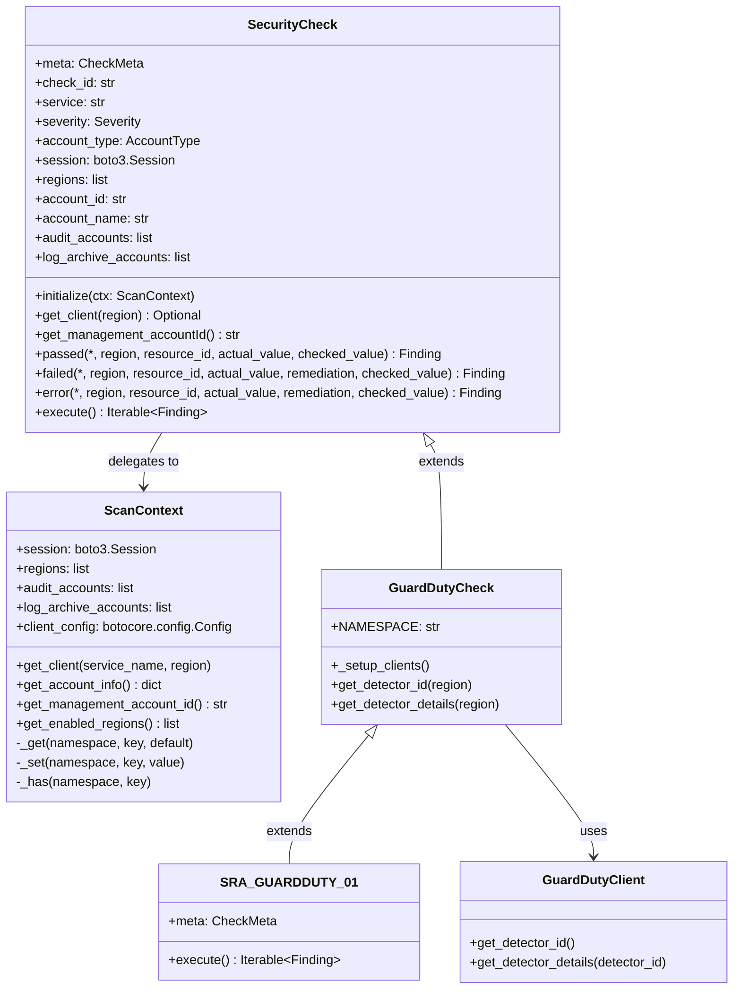

# SRA Verify — developer guide

SRA Verify is a Python security auditing tool that assesses AWS configurations against the
AWS Security Reference Architecture (SRA). This document covers using it as a library and
writing new checks. For deployment and operator instructions, see the [top-level README](../README.md).

The tool is **read-only**. Checks call `Describe*` / `Get*` / `List*` only. Remediation is
emitted as text in the finding, never performed.

Current catalog: **158 checks across 18 services**. Run `sraverify --list-checks` for the
inventory; [`docs/checks.txt`](../docs/checks.txt) is a checked-in copy of that output.

## Project structure

```
sra-verify/
├── 1-sraverify-member-roles.yaml       # StackSet: SRAMemberRole + managed policies
├── 2-sraverify-codebuild-deploy.yaml   # CodeBuild project + findings bucket
├── docs/checks.txt                     # verbatim `sraverify --list-checks` output
├── util/generate_iam_policy.py         # derives the least-privilege member policy
└── sraverify/                          # pip project root (setup.py lives here)
    ├── setup.py, requirements.txt
    └── sraverify/                      # the Python package
        ├── main.py                     # SRAVerify class, _select, CLI, exit codes
        ├── core/
        │   ├── check.py                # SecurityCheck: registration, finding helpers
        │   ├── metadata.py             # CheckMeta, Remediation (validated, frozen)
        │   ├── finding.py              # Finding, Finding.FIELDS, GLOBAL_REGION
        │   ├── enums.py                # Status, Severity, AccountType (StrEnum)
        │   ├── errors.py               # SRAVerifyError hierarchy
        │   ├── registry.py             # _REGISTRY, register, all_checks
        │   ├── discovery.py            # import_check_modules, import_service_packages
        │   ├── scan_context.py         # ScanContext: all per-scan state
        │   ├── logging.py              # shared stderr-only logger
        │   └── session.py              # profile + assume-role session builder
        ├── utils/outputs.py            # write_csv_output
        ├── services/
        │   ├── __init__.py             # import_service_packages(__name__)
        │   └── <service>/
        │       ├── __init__.py         # import_check_modules(f"{__name__}.checks")
        │       ├── base.py             # <Service>Check: NAMESPACE + cached accessors
        │       ├── client.py           # <Service>Client: raw boto3 calls
        │       └── checks/sra_<service>_NN.py
        └── tests/
            ├── unit/{core,cli}/
            └── property/               # hypothesis modules + strategies.py
```

Note the doubled directory name: the pip project root is `sra-verify/sraverify/` and the
package itself is `sra-verify/sraverify/sraverify/`.

## Architecture

Three layers, plus a per-scan context and a registry:

```
SecurityCheck            core/check.py                      meta, registration, passed/failed/error,
    ↑ extends                                               context delegation
<Service>Check           services/<svc>/base.py             _setup_clients + cached typed accessors
    ↑ extends
SRA_<SERVICE>_NN         services/<svc>/checks/…            meta = CheckMeta(...) + execute()
                              ↓ uses
<Service>Client          services/<svc>/client.py           raw boto3, paginators, error normalization
```



### ScanContext owns all per-scan state

A fresh `ScanContext` is built per `run_checks()` call and dropped in a `finally` block, so
its boto3 clients become collectible when the scan returns. That is what gives a
long-running host (such as the MCP server) per-scan isolation without an explicit
cache-clear step. Never stash per-scan state anywhere else.

The context owns the boto3 `Session`, the region list, the audit and log-archive account
lists, the bounded `botocore.config.Config`, a `(service, region)` client cache, a
two-level namespaced response cache, and one `threading.Lock`. Public accessors use
double-checked locking; execution is single-threaded today and the thread safety is
deliberate headroom.

**Never cache a failure.** If an AWS call raises, leave the cache slot empty so a retry
re-issues the call.

Client tuning defaults live as module constants in `core/scan_context.py` and are what the
CLI help text quotes:

| Constant                       | Value        |
| ------------------------------ | ------------ |
| `DEFAULT_CONNECT_TIMEOUT`      | `10`         |
| `DEFAULT_READ_TIMEOUT`         | `30`         |
| `DEFAULT_MAX_ATTEMPTS`         | `3`          |
| `DEFAULT_RETRY_MODE`           | `"standard"` |
| `DEFAULT_MAX_POOL_CONNECTIONS` | `50`         |

### Data flow

```
[AWS Account] --> [SRAVerify] --> [ScanContext] --> [Checks] --> [list[Finding]] --> [CSV]
      |                |                |               |               |
      v                v                v               v               v
 [IAM Roles] --> [boto3 Session] --> [cached clients] --> [service clients] --> [16-column report]
```

`run_checks` returns a concrete `list[Finding]`, never a generator: a lazy return value
would defer `del ctx` until the caller finished consuming it, moving the client leak up one
layer instead of removing it. Each check's findings are materialized with
`list(check.execute())` inside the per-check guard for the same reason.

## Registration is automatic

**A check module's presence on disk is the whole of its registration.** There is no
`CHECKS` dict in any service `__init__.py`, no `ALL_CHECKS` in `main.py`, and no decorator.

- `services/<svc>/__init__.py` is one call: `import_check_modules(f"{__name__}.checks")`.
- `services/__init__.py` is one call: `import_service_packages(__name__)`.
- `import sraverify.services` therefore registers the whole catalog. `main.py` carries that
  import purely for its side effect, with a `# noqa: F401` — it looks removable and is not.
- Importing a check module executes its class body, which fires
  `SecurityCheck.__init_subclass__`, which cross-checks identity and registers the class.
- Only modules whose file name starts with `sra_` are discovered. Subpackages under
  `checks/` are skipped.
- `all_checks()` is the only read path. It returns a `MappingProxyType` over a sorted copy,
  so the catalog is ordered by ascending check ID and a caller cannot mutate it.

Because a defective declaration raises at import, **the catalog is validated by importing
it**: a mis-filed or malformed check is a boot failure, not a silent skip. Nothing on the
discovery or registration path opens a file or issues an AWS call, which makes
`--list-checks` a credential-free, I/O-free validation pass over all 158 checks.

### Identity is cross-checked four ways

The **module file stem is the authority**. `__init_subclass__` derives the expected check ID
from it and validates everything else against that. Each rule below raises
`CheckIdentityError`:

1. The stem fullmatches `sra_([a-z][a-z0-9]*)_(0[1-9]|[1-9][0-9])`. The `01`–`99` range
   caps one service at 99 checks.
2. `meta` is declared in the class's **own** body, read via `vars(cls)` rather than
   `getattr`, so a class cannot register under an inherited ID.
3. `meta.check_id` equals the ID derived from the stem.
4. The class name equals `expected_id.replace("-", "_")`.
5. `cls.__module__` is `...services.<svc>.checks.sra_<svc>_NN` with `<svc>` matching the
   stem's service segment. This is the rule that catches a *filing* mistake, e.g.
   `services/guardduty/checks/sra_shield_01.py`, which would otherwise inherit
   `GuardDutyCheck` while reporting `Service=Shield`.
6. No check inherits another check.
7. No class attribute shadows a metadata property (`check_id`, `service`, `severity`,
   `account_type`). These are read-only properties delegating to `meta`; a same-named class
   attribute would shadow the property and silently win.

`register()` runs last, so any failure leaves the registry byte-identical.

Two conditions leave a subclass unregistered **silently and without error**: a class whose
module has no `sys.modules` record or no `__file__` (built by `exec`, `type()`, a REPL, or a
doctest), and a class in a module whose stem does not start with `sra_` — which is how
service base classes like `GuardDutyCheck` stay out of the catalog. The discriminator is
the file name, never the presence of `meta`; keying on `meta` would conflate "this is not a
check" with "this check's author forgot the metadata".

## Writing a check

There is no registration step. Writing the file registers it.

1. **Research the AWS API first.** Confirm method names, parameters, and response shape
   against the AWS documentation. Do not assume.
2. New service? Create `services/<svc>/` with `__init__.py` (the discovery call), `base.py`,
   `client.py`, and `checks/__init__.py`.
3. **`client.py`** — add the raw call. Paginate where a paginator exists. Wrap in
   `try/except ClientError`, log, and return the error sentinel rather than raising.
4. **`base.py`** — add a cached typed accessor under the class `NAMESPACE`. Reuse an
   existing accessor if one already fetches the data.
5. **`checks/sra_<svc>_NN.py`** — the check class with `meta = CheckMeta(...)` and a
   yielding `execute()`.
6. Verify: `sraverify --check SRA-<SERVICE>-NN --debug`.
7. New AWS API call? Regenerate the IAM policy with `util/generate_iam_policy.py` and
   update `1-sraverify-member-roles.yaml`.
8. Regenerate `docs/checks.txt` from `sraverify --list-checks`.

### Naming

| Thing                | Pattern                                         | Example                      |
| -------------------- | ----------------------------------------------- | ---------------------------- |
| Check ID             | `SRA-<SERVICE>-NN` (`NN` in `01`–`99`)          | `SRA-GUARDDUTY-01`           |
| Check class          | `SRA_<SERVICE>_NN` (screaming snake, not PEP 8) | `SRA_ORGANIZATIONS_01`       |
| Check file           | `sra_<service>_NN.py`                           | `sra_securitylake_17.py`     |
| Service base class   | `<Service>Check`                                | `GuardDutyCheck`             |
| Client class         | `<Service>Client`                               | `OrganizationsClient`        |
| Cache namespace      | lowercase service directory name                | `NAMESPACE = "guardduty"`    |
| `meta.service`       | AWS display name, mixed case                    | `"GuardDuty"`                |
| `meta.resource_type` | CloudFormation type string                      | `"AWS::GuardDuty::Detector"` |

Legacy short IDs (`SRA-GD-1`, `SRA-CT-1`, `SRA-IAA-1`) are stale. No such check exists.

### The check module

`services/guardduty/checks/sra_guardduty_01.py` is the canonical example, and this is the
whole file:

```python
"""
Check if GuardDuty detector exists.
"""
from collections.abc import Iterable

from sraverify.core.enums import AccountType, Severity
from sraverify.core.finding import Finding
from sraverify.core.metadata import CheckMeta, Remediation
from sraverify.services.guardduty.base import GuardDutyCheck


class SRA_GUARDDUTY_01(GuardDutyCheck):
    """Check if GuardDuty detector exists."""

    meta = CheckMeta(
        check_id="SRA-GUARDDUTY-01",
        title="GuardDuty detector exists",
        description=(
            "This check verifies that an GuardDuty detector exists in the AWS Region. "
            "A detector is a resource that represents the GuardDuty service and should "
            "be present in all AWS member account and AWS Region."
        ),
        check_logic="Get detector_id in each Region. Check fails if there is no detector_id",
        severity=Severity.HIGH,
        account_type=AccountType.APPLICATION,
        service="GuardDuty",
        resource_type="AWS::GuardDuty::Detector",
        remediation=Remediation(
            text="Enable GuardDuty in every enabled Region.",
            cli="aws guardduty create-detector --enable --region <region>",
            console="GuardDuty console, Get started, Enable GuardDuty. Repeat per Region.",
        ),
        sra_sections=("Security Tooling account", "Amazon GuardDuty"),
        additional_urls=(
            "https://docs.aws.amazon.com/guardduty/latest/ug/guardduty_settingup.html",
        ),
    )

    def execute(self) -> Iterable[Finding]:
        """Execute the check.

        Yields:
            One Finding per Region.
        """
        for region in self.regions:
            detector_id = self.get_detector_id(region)

            if not detector_id:
                yield self.failed(
                    region=region,
                    resource_id=None,
                    actual_value="No GuardDuty detector in this Region",
                    remediation=f"Enable GuardDuty in {region}",
                )
            else:
                yield self.passed(
                    region=region,
                    resource_id=f"guardduty:{region}:{detector_id}",
                    actual_value=f"Detector {detector_id} present",
                )
```

Note what is **not** there. Check classes define no `__init__`:
`SecurityCheck.__init__(self)` takes no arguments beyond `self`, so a leftover
`super().__init__(account_type=...)` raises `TypeError` naming the argument. There is no
`CHECKS` dict edit and no `main.py` edit.

### `CheckMeta`

`meta` is a class-level `CheckMeta` — frozen, slotted, hashable, holding only literal
strings, tuples, and enum members. Nothing derived from an AWS response and nothing derived
from the invocation. It is constructed while the class body executes, so a defective
declaration raises `MetadataError` at import time.

| Field             | Type              | Notes                                             |
| ----------------- | ----------------- | ------------------------------------------------- |
| `check_id`        | `str`             | Must fullmatch `SRA-[A-Z0-9]+-\d{2}` (ASCII)      |
| `title`           | `str`             | Max 120                                           |
| `description`     | `str`             | Max 1200                                          |
| `check_logic`     | `str`             | Max 400                                           |
| `severity`        | `Severity`        | Enum member, not a string                         |
| `account_type`    | `AccountType`     | Enum member, not a string                         |
| `service`         | `str`             | AWS display name, max 60                          |
| `resource_type`   | `str`             | Must fullmatch `AWS::[A-Za-z0-9]+::[A-Za-z0-9]+`  |
| `remediation`     | `Remediation`     | `text` required and non-blank                     |
| `sra_sections`    | `tuple[str, ...]` | Default `()`, max 20 elements, each max 200 chars |
| `additional_urls` | `tuple[str, ...]` | Default `()`, max 20 elements, each max 500 chars |

`Remediation(text=..., cli="", console="")`. `text` is capped at 1000; `cli` and `console`
at 2000 each.

Validation runs in a fixed order and stops at the first failure, so a declaration breaking
two rules always reports the same one. Two rules deserve attention:

**The title states the control as a fact.** The first token of `title`, lowercased with
trailing punctuation stripped, must not be `ensure`, `ensures`, `check`, or `checks`. One
title has to read correctly on a PASS row and on a FAIL row: "GuardDuty detector exists"
works both ways, while "Ensure GuardDuty detector exists" reads as an instruction on a row
reporting success. The comparison is token-level, so `"Checkpoint …"` passes and
`"Checks, …"` does not.

**Whitespace is normalized, and it is enforced.** `title`, `description`, `check_logic`,
`service`, and `remediation.text` must each equal `" ".join(value.split())`. Use
parenthesized implicit string concatenation for multi-line text — a backslash continuation
leaking indentation into a `Description` cell is an import failure, not a style note.
`remediation.cli` and `remediation.console` are exempt, since a command example needs its
line breaks and neither field reaches the CSV.

### `execute()` yields Findings

`execute()` is the only abstract method and the only source of findings. `SecurityCheck` is
an `ABC`, so a missing or misspelled `execute` fails at *instantiation*, not only when that
check happens to run.

`Iterable[Finding]` accepts a generator or a plain `return [...]`. Generators are the
convention, because then no accumulator variable exists in the check body at all. A bare
`return` is the early-exit idiom for a guard clause. A check that yields nothing is legal
and produces zero rows.

**`findings`, `create_finding`, and `get_findings` are gone.** They are listed in
`_REMOVED_ATTRS`, and both reading *and assigning* them raises `AttributeError` pointing at
the replacement. Assignment has to fail too: a migrated check that re-creates
`self.findings = []` and appends to it would collect rows nobody reads and report zero
findings while exiting 0.

### The three finding helpers

Three status-specific public helpers over one private `_finding` builder. **Every parameter
of all three is keyword-only.**

```python
def passed(self, *, region: str, resource_id: Optional[str],
           actual_value: str, checked_value: Optional[str] = None) -> Finding

def failed(self, *, region: str, resource_id: Optional[str],
           actual_value: str, remediation: Optional[str] = None,
           checked_value: Optional[str] = None) -> Finding

def error(self, *, region: str, resource_id: Optional[str],
          actual_value: str, remediation: str,
          checked_value: Optional[str] = None) -> Finding
```

Keyword-only is the point, not a style preference. With positional arguments allowed,
`yield self.failed(region, "No detector in this Region", "Enable GuardDuty")` would be
well-formed: the sentence lands in `resource_id`, the advice lands in `actual_value`, and
`Remediation` silently takes the metadata default. Every value is a legal non-empty string
in a legal field, so nothing downstream can catch it. Keyword-only turns that whole class
of wrong-cell defect into a `TypeError` at the call site.

`resource_id` is **required** in all three even though it accepts `None`. Required-but-
nullable forces the author to decide whether this row identifies a resource and to say so.

The signatures encode the remediation rules, and the asymmetry is deliberate:

- **`passed()` has no `remediation` parameter at all**, not even one defaulting to `""`.
  Passing one is a `TypeError`. A PASS has nothing to remediate, so the empty cell is
  structural rather than conventional, and the three spellings of "nothing to do" that used
  to fill 178 arguments are unrepresentable.
- **`failed()` falls back to `meta.remediation.text`** when `remediation` is omitted *and*
  when it is supplied blank, so no FAIL row can carry an empty `Remediation` cell. Pass an
  override only for genuinely dynamic text.
- **`error()` requires a non-blank `remediation`** and raises `ValueError` naming the check
  ID otherwise. There is no metadata default here on principle: a FAIL's remediation is by
  construction the remediation for the control, whereas an ERROR reports that the control
  could not be evaluated, so its remediation concerns fixing the **scan environment** —
  grant a permission, pass `--audit-account`. Emitting "Enable GuardDuty in every enabled
  Region" against an `AccessDeniedException` would be confidently wrong.

`checked_value` defaults to `f"{service} Configuration"` in all three. Everything else on
the row comes from `meta`; `account_id` and `account_name` are copied by value, and `title`
is composed as `f"{check_id} {title}"` in exactly one place. Never pass account identity.
All three raise `RuntimeError` if `initialize(ctx)` has not run.

### Initialization and the delegating properties

`initialize(ctx: ScanContext)` is the single initialization path. It assigns `self._ctx`,
then calls `self._setup_clients()`. `def initialize` appears in exactly one file in the
package — `core/check.py`. A service base class or check that overrides it, or that reads
`**kwargs`, is a defect.

Seven read-only properties delegate to the context, each routed through `_require_ctx` so a
read before `initialize(ctx)` raises `RuntimeError` naming the property and the check ID:

`session`, `regions`, `account_info`, `account_id`, `account_name`, `audit_accounts`,
`log_archive_accounts`

Four more delegate to `meta`: `check_id`, `service`, `severity`, `account_type`. None of
the eleven has a setter, so assignment raises `AttributeError`.

`self.regions` returns the explicit `--regions` list when one was supplied, and otherwise
lazily resolves enabled regions via `ctx.get_enabled_regions()` — one `ec2:DescribeRegions`
per scan, cached. `self.get_management_accountId()` takes no argument; the legacy `session`
parameter is accepted and ignored. `get_client(region)` can return `None`; always handle it.

### Account lists

Always `self.audit_accounts` and `self.log_archive_accounts`. Both delegate to the context
and both return `[]` when the flag was not supplied. **Never** the underscore attributes on
the context, never a `hasattr` / `getattr` probe, and never an `initialize` override reading
`**kwargs`.

This is a fixed defect, not a hypothetical: 22 modules used the `hasattr` probe and
silently ignored both CLI flags, because `SecurityCheck.__getattr__` raises `AttributeError`
for those names, making the branch dead code that never fired. Both flags are documented as
lists, so prefer iterating over resolving a verdict from element `[0]`.

### Service base class

```python
class GuardDutyCheck(SecurityCheck):
    """Base class for all GuardDuty security checks."""

    NAMESPACE = "guardduty"          # required class constant

    def _setup_clients(self):
        self._clients.clear()
        if hasattr(self, 'regions') and self.regions:
            for region in self.regions:
                self._clients[region] = GuardDutyClient(region, ctx=self._ctx)

    def get_detector_id(self, region: str) -> Optional[str]:
        cache_key = f"detector_id:{region}"
        if self._ctx._has(self.NAMESPACE, cache_key):
            return self._ctx._get(self.NAMESPACE, cache_key)
        client = self.get_client(region)
        if not client:
            logger.warning(f"GuardDuty: No client available for region {region}")
            return None
        detector_id = client.get_detector_id()
        if detector_id:
            self._ctx._set(self.NAMESPACE, cache_key, detector_id)
        return detector_id
```

No `__init__`. Metadata belongs to the check subclass; a base class declaring `meta` — or a
class attribute named `check_id`, `service`, `severity`, or `account_type` — fails the
shadowing rule at import.

For a **global** service, build a single client and pin the region inside the wrapper:

```python
def _setup_clients(self):
    # Organizations is global: one client pinned to us-east-1 inside the wrapper.
    self._org_client = OrganizationsClient(ctx=self._ctx)
    self._clients.clear()
```

### Client method

```python
def list_roots(self) -> Dict[str, Any]:
    try:
        roots = []
        for page in self.client.get_paginator('list_roots').paginate():
            roots.extend(page.get('Roots', []))
        return {"Roots": roots}
    except ClientError as e:
        error_code = e.response.get('Error', {}).get('Code', '')
        error_message = e.response.get('Error', {}).get('Message', str(e))
        logger.error(f"Error listing roots: {error_message}")
        return {"Error": {"Code": error_code, "Message": error_message}}
```

Clients take `ctx` and never raise. They return either a named-key success dict or
`{"Error": {"Code", "Message"}}`. Always obtain the boto3 client from `ctx.get_client(...)`
so the bounded config and client cache apply.

## Caching

Every service base class declares a `NAMESPACE` class constant and stores cached AWS
responses on the per-scan context via `self._ctx._has/_get/_set`. There are no class-level
cache dicts; a class-level cache would leak across scans, which is exactly what the context
exists to prevent.

- `_has` / `_get` / `_set` are for **service base classes only**. A check class never
  touches them; it calls the typed accessor on its base class.
- Cache keys are `"<thing>:<discriminator>"` with no account or session-region prefix — the
  context is already per-scan and per-account. `IAMCheck` is the exception and keys on
  `account_id`, because an assumed-role session can in principle cross account boundaries.
- **Never cache a failure.**

## Error handling: three tiers

1. **Client** — catch `ClientError`, log, return `{"Error": {...}}`. Clients never raise.
2. **Check** — inspect for the `"Error"` key and decide FAIL vs ERROR.
3. **Orchestrator** — one guarded block per check in `run_checks`, spanning construction,
   `initialize`, and consumption of `execute()`. Anything escaping it is logged with
   `exc_info=True` and converted by `_synthetic_error` into a single ERROR row built from
   `check_class.meta` — never from an instance, since construction is one of the things
   that can fail. That row carries `region=GLOBAL_REGION`, `resource_id=None`, the check's
   real `severity`, the scan's account identity, and an `actual_value` naming the exception
   type as well as its message. A broken check degrades one row, not the whole scan.
   `except Exception`, deliberately not `BaseException`: a Ctrl-C must not produce a
   full-looking report from an aborted scan.

A check that raises midway contributes one synthetic ERROR row **and nothing else** — the
rows it yielded before failing go with the discarded generator.

### FAIL vs ERROR

This is the most load-bearing rule in the project. **FAIL** means AWS told us the control is
not in place. **ERROR** means we could not determine whether it is.

- A semantic AWS code meaning "the thing isn't configured", such as
  `AWSOrganizationsNotInUseException`, is a **FAIL**.
- A permission or transport failure is an **ERROR**.
- **Missing required input is an ERROR, not a FAIL.** A missing `--audit-account` means the
  control could not be evaluated; reporting it as FAIL asserts a negative the scan never
  established, and the cost is double — the dashboards count a FAIL as a finding, so a
  phantom FAIL sends someone chasing a misconfiguration that does not exist *and* hides the
  fact that the control was never evaluated.

```python
if "Error" in response:
    error_code = response["Error"].get("Code", "")
    error_message = response["Error"].get("Message", "Unknown error")
    if error_code == "AWSOrganizationsNotInUseException":
        yield self.failed(
            region="global",
            resource_id=self.account_id,
            actual_value="No organization exists",
        )
    else:
        yield self.error(
            region=region,
            resource_id=self.account_id,
            actual_value=f"Error: {error_message}",
            remediation="Grant the member role organizations:DescribeOrganization",
        )
    return
```

`WARN` was never a legal `Status`. `Status` has exactly `PASS`, `FAIL`, and `ERROR`; a
partially configured control is a FAIL.

### Region labelling

Non-regional rows use `GLOBAL_REGION` from `core/finding.py`, whose value is `"global"`.

**A non-regional condition gets one row, not one per region.** A missing `--audit-account`
is not a property of us-west-2, and fanning it across a 17-region scan produces 17
identical rows that say nothing about any region. Put the missing-input guard **before** the
region loop, which also avoids AWS calls whose result cannot change the outcome:

```python
def execute(self) -> Iterable[Finding]:
    if not self.audit_accounts:
        yield self.error(
            region="global",
            resource_id=None,
            actual_value="Audit account ID not provided",
            remediation="Re-run the check with the --audit-account parameter so the "
                        "delegated administrator can be compared against the audit account",
        )
        return

    for region in self.regions:
        ...
```

The rule is about what the row *says*, not loop position for its own sake. A guard stays
inside the loop when its row reports a genuinely per-region fact — `sra_inspector_06`
interpolates the region-specific delegated admin into `actual_value`, and that row could
not be written outside the loop.

## Findings and CSV

`Finding` (`core/finding.py`) is a frozen, slotted dataclass and the only row type. It is
built exclusively through `passed()` / `failed()` / `error()`. `__post_init__` coerces the
three enum fields, type-checks the twelve required string fields, allows `resource_id` to be
`str | None`, and enforces that `title` starts with `f"{check_id} "`.

A `Finding` holds no reference to the check or to the `ScanContext` — `account_id` and
`account_name` are copied by value — so findings outlive `del ctx`.

The authoritative 16-column order is `Finding.FIELDS`, a `ClassVar[tuple[str, ...]]`:

```python
FIELDS: ClassVar[tuple[str, ...]] = (
    "AccountId", "AccountName", "Region", "CheckId", "Status", "Severity",
    "Title", "Description", "ResourceId", "ResourceType", "CheckedValue",
    "ActualValue", "Remediation", "Service", "CheckLogic", "AccountType",
)
```

`Finding.to_row()` renders one row keyed by `FIELDS`, in `FIELDS` order. Enum fields are
rendered with an explicit `.value` so output does not depend on `StrEnum.__str__` behavior,
and `resource_id=None` renders as `""`. Quoting and escaping belong to the CSV writer.

`write_csv_output` always creates the file, even for an empty findings list, so a consumer
can tell "scan ran, nothing found" from "scan did not run". The dialect is pinned
explicitly (UTF-8, `\r\n`, `QUOTE_MINIMAL`, doubled quotes) so the emitted bytes do not vary
by platform or locale. An unopenable path raises `OSError`; no directory is created.

**The 16 names and their order are a public contract** parsed by `sra-verify-dashboard.html`
and `sra-verify-comparison-dashboard.html`. Do not reorder.

## Account types

`AccountType` (`core/enums.py`) has exactly four members, and their values are exactly the
`--account-type` choices:

| Member        | Value         | Where it runs                                           |
| ------------- | ------------- | ------------------------------------------------------- |
| `APPLICATION` | `application` | Every member account. Account-local configuration.      |
| `AUDIT`       | `audit`       | The Audit / Security Tooling account (delegated admin). |
| `LOG_ARCHIVE` | `log-archive` | The Log Archive account.                                |
| `MANAGEMENT`  | `management`  | The Organizations management account.                   |

The CodeBuild buildspec is the canonical execution model: `--account-type management`
against the management account, `audit` per audit account, `log-archive` per log-archive
account, then `application` for every ACTIVE org account, fanned out with GNU `parallel`.
Parallelism is process-level — one `sraverify` process per account — not threads inside a
single scan.

## Logging

Use the single shared logger. **Never call `print()`** from check, base, or client code:
`core/logging.py` strips the root logger's handlers at import and installs a stderr-only
handler, because stdout must stay clean for the MCP server.

```python
from sraverify.core.logging import logger
```

Conventions: `logger.debug(f"ServiceName: <message>")` in service base classes,
`logger.warning` for a missing client, `logger.error` for an API failure.

## Library usage

### Installation

```bash
pip install -e ./sraverify        # from the repo root, for development
```

### Public surface

`sraverify` exports exactly one name, `SRAVerify`, plus `__version__`. Everything else is
imported from its module — `sraverify.core.finding`, `sraverify.core.enums`,
`sraverify.utils.outputs`.

```python
class SRAVerify:
    def __init__(self, profile: Optional[str] = None, role_arn: Optional[str] = None,
                 regions: Optional[List[str]] = None, session: Optional[Session] = None,
                 debug: bool = False,
                 connect_timeout: Optional[float] = None,
                 read_timeout: Optional[float] = None,
                 max_attempts: Optional[int] = None,
                 max_pool_connections: Optional[int] = None): ...

    def get_available_checks(self, account_type: str = 'all') -> Dict[str, Dict[str, str]]: ...
    def get_available_services(self) -> List[str]: ...
    def run_checks(self, account_type: str = 'all', service: Optional[str] = None,
                   check_id: Optional[str] = None, audit_accounts: Optional[List[str]] = None,
                   log_archive_accounts: Optional[List[str]] = None,
                   show_progress: bool = False) -> List[Finding]: ...
```

The four boto3 tuning knobs are **constructor** parameters, not `run_checks` parameters;
they are forwarded into every `ScanContext` the instance builds. `None` means "keep the
context default".

`get_available_checks` returns a dict keyed by check ID whose values hold `name`, `service`,
`account_type`, `description`, and `severity`, all strings. `get_available_services`
returns a sorted `list[str]`. Both read `cls.meta` only, construct nothing, and issue no AWS
call.

`run_checks` returns a `list[Finding]`. **Findings are dataclasses, not dicts** — access
them by attribute. Call `finding.to_row()` yourself if you want CSV-shaped dicts.

### Example

```python
#!/usr/bin/env python3
"""Using SRA Verify as a library."""

from sraverify import SRAVerify
from sraverify.core.enums import Status
from sraverify.core.errors import NoChecksSelectedError, UnknownCheckError
from sraverify.utils.outputs import write_csv_output

sra = SRAVerify(
    profile='my-profile',
    regions=['us-east-1', 'us-west-2'],
    debug=True,
)

# Inventory. Credential-free and I/O-free.
print(f"{len(sra.get_available_checks())} checks across "
      f"{len(sra.get_available_services())} services")

for check_id, info in sorted(sra.get_available_checks('management').items()):
    print(f"  {check_id}: {info['name']} [{info['severity']}]")

# Run a scan. A fresh ScanContext is built and dropped inside this call.
try:
    findings = sra.run_checks(
        account_type='all',
        audit_accounts=['111122223333'],
        log_archive_accounts=['444455556666'],
        show_progress=True,
    )
except UnknownCheckError as exc:
    raise SystemExit(f"{exc} Suggestions: {exc.suggestions}")
except NoChecksSelectedError as exc:
    raise SystemExit(f"No checks matched those filters: {exc}")

# Findings are Finding dataclasses. Attribute access, and enum-valued status.
for f in findings:
    if f.status is Status.FAIL:
        print(f"{f.check_id} {f.region}: {f.actual_value} -> {f.remediation}")

print(f"pass={sum(1 for f in findings if f.status is Status.PASS)} "
      f"fail={sum(1 for f in findings if f.status is Status.FAIL)} "
      f"error={sum(1 for f in findings if f.status is Status.ERROR)}")

write_csv_output(findings, 'findings.csv')
```

`run_checks` raises `UnknownCheckError` for a `check_id` absent from the registry (carrying
up to three near-miss suggestions) and `NoChecksSelectedError` for a filter combination that
matches nothing. Neither returns an empty list, so a usage error cannot masquerade as a
clean scan that found nothing. The CLI turns both into exit 2.

## Tests

The suite lives at `sraverify/tests/` and collects **3026 tests**. None of them needs AWS
credentials or issues an AWS call.

From the pip project root:

```bash
cd sraverify && pytest -q
```

From the workspace root, point `PYTHONPATH` at the pip project root:

```bash
PYTHONPATH=sraverify python -m pytest sraverify/sraverify/tests/ -q
```

- `tests/unit/core/` — registration, enums, `Finding`, `CheckMeta`, registry, selection
- `tests/unit/cli/` — exit codes, including the scan paths
- `tests/property/` — hypothesis modules covering metadata validation, `Finding`
  immutability and value types, the row contract, CSV round-trip, helper signatures, the
  accumulator ban, context isolation, registry bijection, and selection

Several property modules are **catalog-wide**: they enumerate all 158 registered checks with
`pytest.mark.parametrize` rather than sampling, so a failure names the offending check ID in
the test ID.

## Data-structure gotchas

- An empty dict `{}` is truthy. Use `"key" in config` for existence checks, not
  `if config.get("key")`.
- Prefer `config.get("field")` over `config.get("field", {})` so a missing field stays
  distinguishable from an empty one.
- AWS responses omit fields entirely when a feature is disabled. Do not assume a key is
  present.
- Do not build an `ActualValue` by joining a `set` — the cell's ordering varies across runs
  and the CSV stops being diffable.
- Filter resources early to cut downstream work and API calls.
